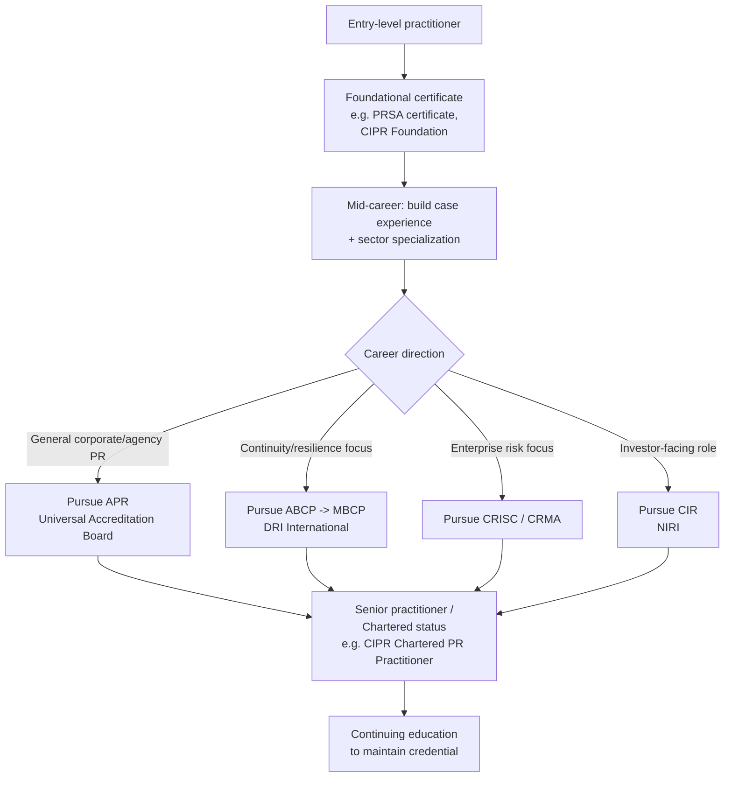

## Professional Certifications and Accreditation

### Overview

Professional certifications and accreditation in crisis and reputation management provide external validation of competency, ethical grounding, and methodological rigor. Unlike more mature fields (law, accounting, medicine), crisis communications lacks a single universal licensing body — instead, credibility is built through a patchwork of professional-body certifications, academic credentials, and specialized practitioner designations. Understanding this landscape matters for career progression, client/employer trust signaling, and access to professional networks and continuing education.

**Key Points**

- No single mandatory license governs crisis/reputation management practice (unlike, e.g., the CPA or bar exam)
- Credibility is built through a combination of: professional-body certification, academic credentials, sector-specific accreditation, and demonstrated case experience
- Certifications vary widely in rigor, recognition, and cost — evaluating them requires checking accreditation body legitimacy, renewal/CE requirements, and industry recognition
- Adjacent fields (public relations, risk management, business continuity, investor relations) each have their own certification tracks that overlap with crisis management

---

### The Certification Landscape by Domain

#### 1. Public Relations & Communications Certifications

- **Accreditation in Public Relations (APR)** — offered jointly by the Universal Accreditation Board (a consortium including the Public Relations Society of America, PRSA). Requires several years of professional experience, a panel review, and a comprehensive exam covering ethics, strategy, and crisis response. Widely regarded as the senior-practitioner credential in U.S. PR.
- **PRSA Business & Professional Development certificates** — shorter, non-accreditation certificate programs (including ones specifically on crisis communications) for practitioners not yet eligible for or not pursuing the APR.
- **Chartered Institute of Public Relations (CIPR) qualifications** (UK-based) — offers a tiered structure (Foundation, Diploma, Advanced Certificate) with modules specifically addressing issues and crisis management; the CIPR also awards Chartered PR Practitioner status for senior members.
- **Global Alliance for Public Relations and Communication Management** — coordinates recognition of accreditation across national PR bodies for practitioners working internationally.

#### 2. Risk, Business Continuity & Resilience Certifications

These are highly relevant because crisis management increasingly overlaps with formal enterprise risk and continuity disciplines.

- **Certified Business Continuity Professional (CBCP)** and related tiers (ABCP, MBCP) — administered by DRI International; focused on business continuity planning, disaster recovery, and crisis response protocols at an operational/technical level.
- **Certification in Risk Management Assurance (CRMA)** and **Certified in Risk and Information Systems Control (CRISC)** — administered by IIA and ISACA respectively; relevant for practitioners whose crisis work intersects with enterprise risk management and internal audit functions.
- **Business Continuity Institute (BCI) Certifications** (UK/international) — tiered membership (AMBCI, MBCI, FBCI) tied to demonstrated competency in continuity and resilience, including crisis management modules.

#### 3. Investor Relations & Financial Communications

- **Certified in Investor Relations (CIR)** — offered by NIRI (National Investor Relations Institute) in the U.S.; relevant for crisis scenarios with securities-disclosure or shareholder-communication dimensions.

#### 4. Academic and Executive Education Credentials

- Graduate degrees or executive certificates in **crisis and emergency management**, **strategic communications**, or **organizational resilience** from universities with dedicated programs. These are not "certifications" in the licensing sense but function as strong credibility signals, particularly for roles bridging communications and public policy or homeland-security-adjacent work.
- Executive education short courses (e.g., from business schools) on crisis leadership — valuable for network access and case-method learning, though generally non-accrediting.

#### 5. Sector-Specific and Regional Accreditation

- Regulatory or sector bodies in specific industries (healthcare risk management, financial services compliance, aviation safety) often maintain their own crisis-adjacent certifications (e.g., **Certified Professional in Healthcare Risk Management (CPHRM)**). Practitioners working in a specific vertical should check whether a sector-specific credential outweighs a generalist one for that industry's hiring managers.
- National or regional professional bodies outside the U.S./UK (e.g., in Asia-Pacific, Latin America, or the Middle East) may have their own accreditation tracks; [Unverified] the degree of mutual recognition between these regional bodies and the U.S./UK-centric bodies listed above varies and should be checked directly with the relevant institute for current reciprocity arrangements.

---

### Evaluating Certification Legitimacy and Value

Not all certifications carry equal weight. A practitioner or hiring manager should evaluate a credential along these dimensions:

| Evaluation Criterion | What to Check |
| --- | --- |
| Accrediting body legitimacy | Is it issued by an established, non-profit professional association (PRSA, CIPR, DRI, BCI) or a for-profit training vendor with no peer governance? |
| Experience prerequisites | Does it require verified years of practice (signal of rigor) or is it open to anyone who pays a fee? |
| Assessment rigor | Panel review + exam (APR) vs. course-completion certificate only |
| Continuing education requirement | Credentials requiring periodic CE (APR, CBCP) signal ongoing currency; one-time certificates do not |
| Industry recognition | Is the credential referenced in job postings and recognized by hiring managers in the target sector/region? |
| Renewal/revocation process | Legitimate bodies have an ethics code and a process for revoking credentials for violations |

**Example — comparing two credentials:**

- *APR (PRSA/UAB):* multi-year experience requirement, panel presentation, comprehensive exam, mandatory renewal — high rigor, high recognition in U.S. corporate/agency PR.
- *A generic online "Certified Crisis Manager" badge from an unaccredited training vendor:* [Inference] likely useful for foundational knowledge acquisition but carries limited external signaling value absent a governing professional body, peer review, or renewal requirement — should be weighed accordingly rather than presented as equivalent to APR-tier credentials.

---

### How Certification Fits Into a Career Pathway

**Next Steps**

- Identify which vertical (general PR, business continuity, risk management, investor relations, or a sector-specific niche) best matches target career direction, since credential choice should follow specialization rather than precede it
- Verify current eligibility requirements and exam content directly with the issuing body (PRSA/UAB, CIPR, DRI International, BCI, NIRI), as prerequisites and exam structures are updated periodically
- Cross-check job postings in the target sector/region for which credentials are explicitly named or preferred by employers
- Build the verified professional-experience record early, since most higher-tier credentials (APR, MBCP) gate on years of demonstrated practice rather than coursework alone

**Related Topics**

- Building a crisis case portfolio for accreditation panel review
- Continuing education requirements and credential maintenance
- Comparing U.S., UK, and international professional-body recognition
- Sector-specific risk and compliance credentials (healthcare, financial services, aviation)
- Academic vs. professional-body credentials: how hiring managers weigh each