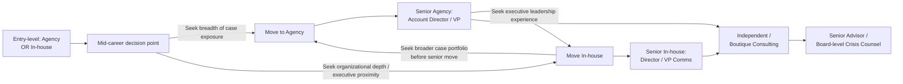

## Agency versus In-House Career Paths

### Overview

Crisis and reputation management practitioners typically build careers along one of two structural tracks — agency-side (working within a PR/communications consultancy serving multiple clients) or in-house (embedded within a single organization's communications, legal, or executive function). A smaller but growing third track, independent/boutique consulting, borrows characteristics from both. The choice shapes day-to-day work, skill development, compensation structure, and long-term career optionality, and many practitioners move between tracks over a career rather than committing permanently to one.

**Key Points**

- Agency work optimizes for breadth: multiple clients, industries, and crisis types in parallel, at the cost of institutional depth in any one organization
- In-house work optimizes for depth: deep institutional knowledge, stakeholder relationships, and long-term reputation stewardship, at the cost of exposure to varied case types
- Compensation, hours, and advancement structures differ meaningfully between the two tracks
- Mobility between tracks is common and often strategically used to fill skill gaps (e.g., in-house practitioners moving agency-side to broaden case exposure, or vice versa to gain organizational leadership experience)

---

### Structural Comparison

| Dimension | Agency-Side | In-House |
| --- | --- | --- |
| Client/employer relationship | Multiple clients simultaneously, often across industries | Single organization, deep embedded knowledge |
| Crisis exposure | High volume, varied crisis types, but often shorter engagement per crisis | Fewer crises per year, but full lifecycle involvement from prevention through recovery |
| Speed of skill acquisition | Faster exposure to diverse scenarios; accelerated pattern recognition | Slower breadth, but deeper mastery of one organization's stakeholder ecosystem, culture, and risk profile |
| Decision authority | Advisory; final decisions rest with client leadership | Closer proximity to executive decision-making; may hold direct authority during a crisis |
| Institutional memory | Limited — knowledge often leaves with the account team when engagement ends | High — practitioner retains organizational history, prior incidents, and relationship capital |
| Compensation structure | Often billable-hour or retainer-linked; bonus tied to client retention/new business | Typically salaried with equity/bonus tied to company performance |
| Hours and pacing | Can be highly variable — multiple client fire drills simultaneously | More predictable day-to-day, but crisis periods can be extremely intense and sustained |
| Career advancement path | Account Executive → Account Director → VP/Partner, often tied to new business generation | Communications Specialist → Director → VP/Chief Communications Officer, tied to organizational tenure and trust |
| Network breadth | Broad — exposure to many industries, journalists, and cross-sector contacts | Deep but narrower — strong relationships within one sector/organization's stakeholder map |
| Job security dynamics | Tied to client retention and agency financial health | Tied to organizational health and internal politics |

---

### Agency-Side Career Path in Detail

**Typical structure and progression:**

- **Entry level (Coordinator/Associate):** Media monitoring, drafting materials, supporting senior staff during live crises
- **Mid-level (Account Executive/Senior AE):** Direct client contact, crisis-response drafting, day-to-day account management
- **Senior (Account Director/VP):** Client relationship ownership, strategic counsel during crises, new business development responsibilities
- **Leadership (Partner/Managing Director):** P&L responsibility for a practice area, thought leadership, agency-wide crisis practice development

**Skills disproportionately developed:**

- Rapid situational assessment across unfamiliar industries and stakeholder maps
- Pattern recognition across many crisis types (faster development of the "precedent library" described in case-study methodology work)
- Client management and persuasion — since agency practitioners must earn authority with client leadership, not draw on standing organizational trust
- New business/proposal skills, which become increasingly important at senior levels

**Trade-offs:**

- Time pressure from serving multiple accounts simultaneously can limit depth of engagement with any single crisis
- Advisory role only — agency practitioners typically do not have final decision authority, which can be professionally frustrating during a badly managed client crisis
- [Inference] Agency compensation upside at senior/partner level can exceed in-house VP compensation at comparable seniority in some markets, though this varies significantly by agency size, geography, and practice area and should not be assumed as a general rule

---

### In-House Career Path in Detail

**Typical structure and progression:**

- **Entry level (Communications Specialist/Coordinator):** Internal communications support, media monitoring, drafting under supervision
- **Mid-level (Communications Manager):** Owns specific channels or issue areas; may lead response for lower-severity incidents
- **Senior (Director of Communications/Head of Crisis Communications):** Owns the crisis communication plan, leads the crisis response team, direct line to executive leadership and legal counsel
- **Executive (VP Communications/Chief Communications Officer):** Sits on or advises the executive crisis team, holds direct accountability to the CEO and board during major incidents

**Skills disproportionately developed:**

- Deep organizational and stakeholder knowledge — understanding of internal politics, prior incident history, and institutional risk tolerance
- Cross-functional coordination with legal, HR, security, investor relations, and operations — a defining feature of in-house crisis work that agency practitioners are typically less embedded in
- Long-term reputation stewardship — in-house practitioners often live with the consequences of crisis decisions for years, which shapes a more conservative, precedent-aware decision style
- Direct executive/board communication skills

**Trade-offs:**

- Narrower crisis exposure — an in-house practitioner may go years without a major incident, which can slow pattern-recognition development relative to agency peers
- Career advancement is often tied to organizational tenure and internal trust-building rather than portable, demonstrable case wins
- Job security is coupled to the organization's own health, creating potential conflicts of interest during crises that involve leadership itself (e.g., executive misconduct scandals)

---

### The Boutique/Independent Consulting Track

A hybrid track worth noting: senior practitioners (often after both agency and in-house experience) moving into independent crisis-consulting practice.

- Typically requires an established reputation and referral network — rarely a viable entry point for early-career practitioners
- Combines agency-style breadth (multiple clients) with greater autonomy over engagement scope and often higher per-engagement compensation
- Carries higher business-development burden and income variability than either agency or in-house employment

---

### Career Mobility Patterns

**Common strategic moves:**

- Early agency experience → in-house move to gain organizational leadership exposure before an executive-track promotion
- Early in-house experience → agency move to broaden the case portfolio and build an external professional network before returning in-house at a more senior level
- Senior practitioners from either track → independent consulting once reputation and referral network are established

---

### Decision Factors for Practitioners Choosing a Path

**Key Points**

- Preference for breadth vs. depth of engagement
- Tolerance for compensation/hours variability (agency) vs. organizational-health-linked stability (in-house)
- Desire for direct decision authority (favors in-house, especially at senior levels) vs. advisory influence across many organizations (favors agency)
- Long-term goal: Chief Communications Officer-track roles are almost exclusively in-house at the executive level, even when the practitioner's earlier career was agency-based
- Risk tolerance regarding job security tied to a single organization's fortunes versus an agency's client-retention cycles

**Next Steps**

- Map personal career goals against the breadth/depth trade-off before choosing an entry point
- Seek informational interviews with practitioners who have made cross-track moves to understand real transition friction
- Track which relevant certifications (see Professional Certifications and Accreditation) are more heavily weighted by agency vs. in-house hiring managers in the target sector

**Related Topics**

- Building a crisis case portfolio across employer types
- Compensation benchmarking: agency vs. in-house crisis communications roles
- Cross-functional coordination skills (legal, HR, IR) for in-house practitioners
- Transitioning to independent crisis consulting
- Executive-track progression to Chief Communications Officer