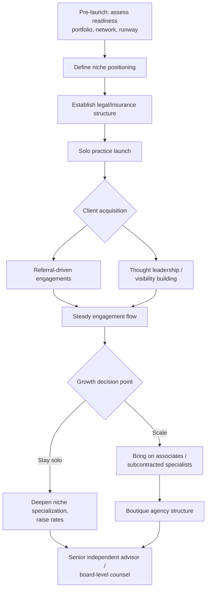

## Building a Crisis Consulting Practice

### Overview

Building an independent or boutique crisis consulting practice involves transitioning from employed practitioner (agency or in-house) to principal of one's own advisory business. This path combines the subject-matter expertise developed over a prior career with an entirely separate skill set: business development, positioning, pricing, legal/operational structuring, and reputation-building as an independent brand rather than as a representative of an employer's brand. It is generally a senior-career move rather than an entry point, since it depends on an existing reputation and referral network to generate initial engagements.

**Key Points**

- Technical crisis-management competence is necessary but not sufficient — the limiting factor for most new consultants is business development, not subject-matter expertise
- Positioning (a defined niche) matters more in solo/boutique practice than in agency life, where a firm's broader portfolio can absorb generalist positioning
- Legal structure, insurance, and engagement-scoping decisions carry more personal risk exposure than in employed roles
- Referral networks and prior case credibility are typically the primary — sometimes only — early client-acquisition channel

---

### Pre-Launch Readiness Assessment

Before formal launch, an aspiring consultant should honestly assess:

| Readiness Factor | Why It Matters |
| --- | --- |
| Demonstrable case portfolio | Prospective clients hire based on evidence of prior handled crises, not credentials alone |
| Referral network strength | Cold outreach rarely generates crisis-consulting engagements; most early work comes through former colleagues, journalists, and client relationships |
| Financial runway | Crisis consulting income is inherently lumpy (retainer gaps between incidents); 6–12 months of runway is a commonly cited planning baseline |
| Non-compete/non-solicitation constraints | Prior employment agreements may restrict which former clients or colleagues can be approached immediately after departure |
| Specialization clarity | A clear answer to "what specifically do you handle that others don't" strengthens positioning versus generalist competition |
| Risk tolerance for income variability | Independent practice trades income stability for autonomy and unlimited upside — a genuine trade-off, not simply an upgrade |

---

### Defining a Practice Niche

Given a fragmented and competitive market, undifferentiated general "crisis communications" positioning is difficult to compete on. Common differentiation approaches:

1. **Industry vertical specialization** — e.g., healthcare, financial services, higher education, or technology/AI-specific crises, where regulatory and stakeholder knowledge from a prior in-house or agency career becomes the core asset.
2. **Crisis-type specialization** — e.g., executive misconduct response, cybersecurity/data-breach communications, product recall and safety incidents, or misinformation/synthetic-media response.
3. **Service-type specialization** — e.g., pure strategic counsel vs. hands-on crisis-team embedding vs. crisis simulation/training and preparedness work (a distinct, often steadier revenue line separate from live-incident response).
4. **Stage specialization** — pre-crisis preparedness and vulnerability audits (steadier, plannable revenue) versus live incident response (higher-value, unpredictable timing) versus post-crisis reputation recovery and monitoring.

**Example positioning statement structure:**

"I help [industry/stakeholder type] navigate [crisis type] through [service model], drawing on [X years/cases] of experience at [credibility marker]."

---

### Business Structure and Operational Setup

**Key Points**

- Legal entity formation (LLC, S-corp, or equivalent in relevant jurisdiction) to separate personal and business liability
- Professional liability / errors-and-omissions insurance — particularly important given the high-stakes, high-visibility nature of crisis advisory work where a client may later claim inadequate counsel contributed to damages
- Engagement letter and scope-of-work templates, since crisis engagements can expand rapidly in scope under time pressure without clear boundaries
- Conflict-of-interest screening process for new engagements, especially when working across competing organizations within one industry vertical
- Retainer vs. project-based vs. on-call ("crisis hotline") pricing models, each with different cash-flow and availability implications

**Example: On-call retainer structure**

A common model for smaller/boutique crisis practices:

- Monthly retainer fee that reserves priority availability (e.g., guaranteed response within X hours) without guaranteeing a fixed number of billable hours
- Separate hourly or project-based billing once an actual incident triggers active engagement
- Annual preparedness work (audits, simulations, plan development) billed separately as fixed-fee projects

This structure smooths the "feast or famine" cash-flow pattern inherent to reactive crisis work, since preparedness/training revenue is plannable while incident-response revenue is not.

---

### Client Acquisition Channels

Ranked roughly by typical effectiveness for new independent crisis consultants, based on how referral-driven this field tends to be:

1. **Former colleague and client referrals** — the dominant channel; reputation carried over from prior agency/in-house roles
2. **Legal counsel referrals** — law firms handling litigation, regulatory, or employment matters frequently need aligned crisis-communications counsel and refer trusted practitioners
3. **Insurance broker/carrier referrals** — cyber-liability and D&O insurance policies increasingly include crisis-communications response as a covered service, and carriers maintain approved-vendor panels
4. **Speaking, writing, and visible thought leadership** — publishing case analyses, speaking at industry conferences, and visible commentary on live crises (handled carefully, without appearing opportunistic) build inbound recognition over time
5. **Professional association involvement** — active participation in bodies discussed under Professional Certifications and Accreditation (PRSA, CIPR, DRI International, BCI) provides both credibility signaling and networking access
6. **Direct outreach/cold business development** — [Inference] generally the least effective channel for this specific service line, since crisis engagements are trust-dependent and rarely initiated through unsolicited pitches, though it may work better for adjacent, lower-trust-barrier services like preparedness training

---

### Practice Growth Trajectory

**Growth-stage considerations:**

- Many practitioners deliberately remain solo indefinitely, prioritizing autonomy and direct client relationships over scale
- Scaling to a boutique firm introduces employer responsibilities (hiring, quality control, delegation of live-crisis judgment calls) that mirror agency management challenges
- A common intermediate model is a network of trusted independent associates engaged per-project rather than formal employees, preserving flexibility while allowing larger engagements to be staffed

---

### Risk Considerations Specific to Independent Practice

- **Availability pressure:** Unlike agency or in-house roles with backup staff, a solo consultant's unavailability during a live crisis (illness, competing engagement, travel) directly affects client outcomes — many practitioners address this through informal backup arrangements with trusted peers
- **Reputational exposure is personal, not institutional:** A poorly handled engagement affects the consultant's own brand directly, with no employer brand to absorb or diffuse the impact
- **Scope creep during live incidents:** Crisis engagements often expand rapidly beyond the original engagement letter under real-time pressure; clear check-in points and change-order practices help manage this, though [Inference] some scope expansion during genuine emergencies is difficult to avoid entirely and should be planned for rather than assumed away
- **Conflict-of-interest management:** Particularly acute in narrow industry-vertical specialization, where competing clients may approach the same consultant during overlapping timeframes

**Next Steps**

- Draft a niche positioning statement and test it against 3–5 trusted former colleagues for clarity and credibility
- Consult with a business attorney on entity structure and liability insurance appropriate to the jurisdiction and client base
- Build an initial engagement-letter and scope-of-work template before accepting the first independent client
- Map existing professional network to identify the 10–15 most likely referral sources for launch-phase client acquisition

**Related Topics**

- Engagement scoping and change-order practices for live crisis work
- Professional liability insurance considerations for communications consultants
- Crisis simulation and preparedness training as a revenue line
- Building thought leadership without appearing opportunistic during live crises
- Transitioning from solo practice to boutique agency structure
- Conflict-of-interest screening frameworks for industry-vertical specialists