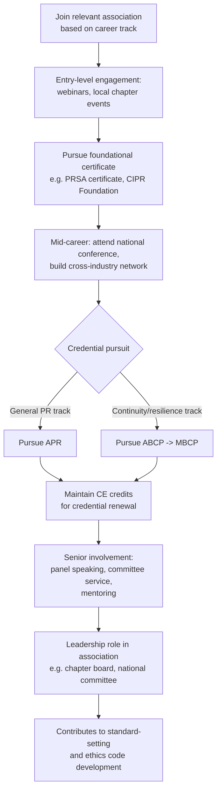

## Professional Associations and Continuing Education

### Overview

Professional associations and continuing education form the infrastructure that keeps crisis and reputation management practitioners current, connected, and credentialed throughout a career. Because the field lacks a single mandatory licensing body, associations function as the primary mechanism for standard-setting, peer benchmarking, ethical codes, and skill renewal — filling a role that formal licensure plays in more regulated professions. Sustained engagement with these bodies is often what separates practitioners who stay current with evolving media, legal, and technological conditions from those whose practice calcifies around outdated precedent.

**Key Points**

- Associations provide four core functions: credentialing (see Professional Certifications and Accreditation), continuing education, peer network access, and ethical/professional standards
- Continuing education (CE) requirements attached to senior credentials (APR, MBCP) create an ongoing obligation, not a one-time achievement
- Association involvement is a primary channel for referral-based business development, particularly for independent consultants (see Building a Crisis Consulting Practice)
- The field's fast-changing risk landscape (synthetic media, platform algorithm shifts, regulatory change) makes continuing education functionally necessary even without a formal CE mandate attached to a given role

---

### Major Professional Associations Relevant to Crisis Practice

| Association | Primary Focus | Relevant Crisis-Specific Offerings |
| --- | --- | --- |
| Public Relations Society of America (PRSA) | General PR/communications | APR credential, crisis communications certificate programs, national conference sessions on crisis case studies |
| Chartered Institute of Public Relations (CIPR) | UK/international PR | Tiered qualifications with crisis/issues management modules, Chartered Practitioner status |
| Global Alliance for Public Relations and Communication Management | International coordination body | Cross-national recognition of accreditation, global ethics standards |
| DRI International | Business continuity and resilience | ABCP/CBCP/MBCP credentials, continuity-focused crisis response training |
| Business Continuity Institute (BCI) | Continuity and resilience (UK/international) | AMBCI/MBCI/FBCI tiers, crisis management modules, annual World Conference |
| National Investor Relations Institute (NIRI) | Investor relations | CIR credential, crisis-adjacent disclosure and shareholder communication guidance |
| International Association of Business Communicators (IABC) | Broader organizational communications | Crisis and change communications resources, Gold Quill awards program with crisis-case submissions |
| Institute for Crisis Management (ICM) | Crisis-specific research and analysis | Annual crisis reports and trend analysis (a useful source of aggregate case data for precedent research) |
| Sector-specific bodies (e.g., healthcare risk management, financial compliance associations) | Vertical specialization | Sector-specific crisis protocols and regulatory update briefings |

---

### Continuing Education Formats

**Key Points**

- Formal CE credit programs — required for maintaining credentials like APR or MBCP, typically tracked in credit-hour units over a renewal cycle
- Conference attendance — annual national/international conferences (PRSA International Conference, BCI World, IABC World Conference) combine CE credit with case-study sessions and networking
- Webinars and short courses — lower time-commitment CE format, often free or low-cost for association members, addressing emerging topics between major conference cycles
- Executive education programs — university-affiliated short courses on crisis leadership, often not formal CE credit but valuable for case-method learning and cross-industry peer cohorts
- Self-directed study — reading aggregate crisis-trend reports (e.g., from ICM), post-mortem case analyses, and regulatory updates; not credentialed but essential for staying current on precedent (see Case Study Methodology and Historical Analysis)
- Internal/employer-provided training — in-house practitioners often receive crisis-simulation and tabletop-exercise training as part of organizational preparedness programs, which can double as informal continuing education

---

### Continuing Education Requirements by Credential

Renewal cycles and CE requirements vary by issuing body and are updated periodically, so practitioners should verify current requirements directly with the credentialing organization. As a structural pattern:

- **APR (PRSA/UAB):** Requires ongoing maintenance activity to retain accredited status, reflecting the credential's positioning as a career-long professional standard rather than a one-time exam pass
- **MBCP/CBCP (DRI International):** Requires periodic CE credit accumulation and recertification to maintain active status, given the fast-evolving nature of continuity and resilience practice
- **MBCI/FBCI (BCI):** Membership tiers require maintained professional development activity for continued standing
- **CIR (NIRI):** [Unverified] Specific renewal/CE requirements should be confirmed directly with NIRI, as investor-relations regulatory requirements are updated periodically and mandate currency on disclosure rules

**General principle:** Any credential tied to a regulatory-adjacent or high-stakes advisory function (continuity planning, investor relations, healthcare risk) tends to carry stricter CE enforcement than general communications certificates, reflecting the higher consequence of outdated practice in those domains.

---

### The Association Engagement Lifecycle

---

### Why Continuing Education Matters Structurally in This Field

Unlike domains where the underlying knowledge base is comparatively stable, crisis and reputation management operates in an environment where several load-bearing variables shift continuously:

1. **Media and platform ecosystems change** — response-time benchmarks, channel priorities, and misinformation dynamics shift as platforms and algorithms evolve, directly affecting which precedents remain applicable (see Applying Precedent to Novel Crisis Scenarios)
2. **Regulatory environments evolve** — disclosure requirements, data-breach notification laws, and sector-specific compliance obligations are updated by legislators and regulators on an ongoing basis
3. **Technology introduces new crisis categories** — synthetic media, AI-generated misinformation, and algorithmic bias incidents are recent categories with limited historical precedent, requiring practitioners to actively update their frameworks rather than rely on legacy case studies alone
4. **Ethical standards are periodically revised** — professional bodies update codes of ethics in response to new practice areas (e.g., guidance on AI-assisted content, influencer disclosure, synthetic media authentication)

**Example — CE as risk mitigation:**

A practitioner relying solely on training from a decade prior might apply an outdated "24-hour response window" standard in an environment where information now spreads within minutes, or fail to recognize disclosure obligations under newly enacted data-breach notification laws. [Inference] Continuing education functions less as a credentialing formality in this field and more as a direct risk-mitigation practice, since specific regulatory and technological facts genuinely become stale over a practitioner's career — though the degree of staleness varies by sub-specialty and should be assessed against current developments rather than assumed uniformly.

---

**Next Steps**

- Identify the primary association aligned with current or target career track (general PR, continuity/resilience, investor relations, or sector-specific) and review current membership tiers
- Confirm CE/renewal requirements directly with any credentialing body relevant to a currently held or pursued certification
- Build a recurring habit of reviewing aggregate crisis-trend reports (e.g., from the Institute for Crisis Management) as low-cost, high-value self-directed continuing education
- Identify one annual conference or major CE event to attend consistently for sustained network-building rather than one-off attendance

**Related Topics**

- Professional Certifications and Accreditation (credential prerequisites and structure)
- Building a Crisis Consulting Practice (association involvement as a referral channel)
- Emerging technology risk categories requiring updated frameworks (synthetic media, algorithmic bias)
- Ethics code evolution in professional communications bodies
- Aggregate crisis-trend research as a precedent-research input