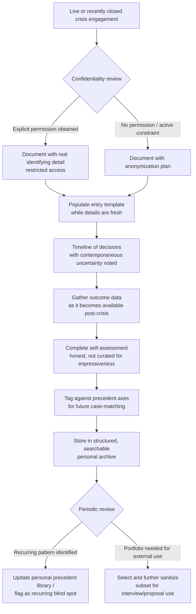

## Building a Personal Crisis Response Portfolio

### Overview

A personal crisis response portfolio is a structured, maintained body of documentation — distinct from a resume or case-study anecdotes told in interviews — that records a practitioner's actual crisis engagements in a form that can be selectively shared, defended under scrutiny, and used as a living reference for future decision-making. Where prior discussions of "case portfolios" in this syllabus (see Agency versus In-House Career Paths and Building a Crisis Consulting Practice) treated the portfolio as a career-mobility and business-development asset, this item focuses on the *construction methodology*: what to capture, how to structure it, how to handle confidentiality constraints, and how to keep it usable rather than becoming an unstructured archive.

**Key Points**

- A portfolio is not a highlight reel; it should include contained/managed-adequately cases and clear failures alongside standout successes, since the analytical value comes disproportionately from documented reasoning, not outcome quality alone
- Confidentiality constraints (NDAs, client agreements, employer policy) shape what can be retained and in what form — this must be resolved at the documentation stage, not retroactively when the portfolio is needed
- A well-built portfolio functions simultaneously as: an interview/credibility asset, a personal precedent library (feeding directly into the case-study/precedent-application skill set), and a self-audit tool for identifying one's own recurring blind spots
- Structure and consistency across entries matter more than volume — a portfolio of 15 well-documented cases is more useful than 50 inconsistent ones

---

### What Distinguishes a Portfolio Entry from a War Story

Practitioners naturally accumulate anecdotes told informally in interviews or over drinks with colleagues. A portfolio entry differs in that it is:

- **Structured** — follows a consistent template across all entries, enabling comparison
- **Dated and time-stamped at each decision point**, not just summarized after the fact
- **Explicit about uncertainty at the time** — documenting what was unknown or ambiguous *during* the crisis, not only what became clear in hindsight
- **Reviewed against outcome data**, where available (media sentiment shifts, stakeholder retention, regulatory outcome), rather than relying on subjective impression of how it went
- **Sanitized or generalized appropriately** for confidentiality, with a clear record of what has been altered and why

---

### Recommended Entry Template

| Field | Content |
| --- | --- |
| Case identifier | Internal code/alias (especially important if client-identifying details must be removed) |
| Role and scope | Practitioner's specific role — advisory, lead, embedded team member — and decision authority held |
| Crisis classification | Harm type, harm status (ongoing/contained), information control posture (see axes in Applying Precedent to Novel Crisis Scenarios) |
| Timeline of key decisions | Dated entries capturing what was decided, when, and what was known/unknown at that moment |
| Stakeholder map | Key stakeholder groups involved and their information needs/positions |
| Actions taken | Concrete actions, statements, or interventions, in sequence |
| Outcome data | Measurable outcomes where available: media sentiment tracking, stakeholder trust surveys, regulatory resolution, financial impact |
| Self-assessment | Honest post-hoc evaluation — what worked, what didn't, what would be done differently |
| Precedent tags | Which prior cases informed the response, and which axes had no prior coverage (directly reusable in future precedent-application work) |
| Confidentiality status | What has been altered/generalized, and what confidentiality obligations remain active |

---

### Confidentiality and Ethical Handling

**Key Points**

- Client and employer confidentiality obligations generally survive the end of an engagement or employment — portfolio construction must not violate NDAs or client agreements
- The safest default is to generalize identifying details (industry sector rather than named company, altered timeline specifics that don't affect the analytical lesson) while preserving the structural/decision-making content that has analytical value
- Some organizations and clients explicitly permit anonymized case documentation for professional development; this should be requested and documented in writing at engagement close, when leverage and goodwill are highest, rather than assumed retroactively
- Legally sensitive cases (active litigation, ongoing regulatory investigation) may require portfolio entries to be held in a restricted, non-shareable form indefinitely, or excluded entirely until formally resolved
- [Unverified] Specific confidentiality survival periods and permissible disclosure scope vary by jurisdiction, contract language, and case type — a qualified attorney should be consulted before including any client-identifying material, particularly for cases involving litigation or regulatory action

**Practical anonymization approach:**

Replace organization name and identifying market position with a generic descriptor ("a mid-sized regional healthcare provider" rather than the actual name), alter or round non-material dates, and remove any financial figures or stakeholder names not essential to the decision-making lesson. Retain the decision logic, timeline structure, and outcome pattern in full, since that is where the reusable value resides.

---

### Portfolio Construction Workflow

---

### Using the Portfolio for Self-Audit, Not Just Presentation

A frequently underused function of a well-built portfolio is identifying a practitioner's own recurring patterns — including recurring mistakes — which is uncomfortable but high-value.

**Example self-audit questions to run periodically across entries:**

- Do certain crisis types consistently show a documented gap between initial assessment and outcome (suggesting a persistent blind spot in that category)?
- Is there a pattern of consistently underestimating or overestimating the speed of information spread across cases?
- Does the self-assessment field reveal a recurring tension between legal counsel's advice and the practitioner's own communications instinct, and how has that tension typically resolved?
- Are precedent tags clustering around a narrow set of past cases, suggesting an over-reliance on a small analogical toolkit (a risk directly discussed in Applying Precedent to Novel Crisis Scenarios)?

This self-audit function is what separates a portfolio used purely for external credibility signaling from one that actively improves practice over time.

---

### Timing and Maintenance Discipline

- **Document contemporaneously where possible** — waiting months after a crisis resolves introduces hindsight bias into the "what was known at the time" field, which undermines the portfolio's analytical value
- **Set a recurring review cadence** (e.g., quarterly) to update outcome data fields as longer-term effects become measurable (reputation recovery often plays out over a longer horizon than the acute crisis period)
- **Version-control sanitized vs. full-detail entries separately**, so that a single accidental disclosure doesn't expose confidential detail meant only for restricted internal use

**Next Steps**

- Draft the entry template and apply it retroactively to 2–3 past cases as a calibration exercise before adopting it going forward
- Establish a standing practice of requesting anonymized-documentation permission in writing at the close of every future engagement
- Set a recurring calendar reminder for portfolio review and outcome-data updates
- Cross-reference completed entries against the axes framework from precedent-application work to build a personal, taggable case index

**Related Topics**

- Applying Precedent to Novel Crisis Scenarios (portfolio entries as raw material for precedent tagging)
- Confidentiality and NDA considerations in professional case documentation
- Outcome measurement methods for crisis communications (media sentiment tracking, stakeholder trust surveys)
- Self-audit and blind-spot identification techniques for practitioners
- Building a Crisis Consulting Practice (using a sanitized portfolio subset in business development)