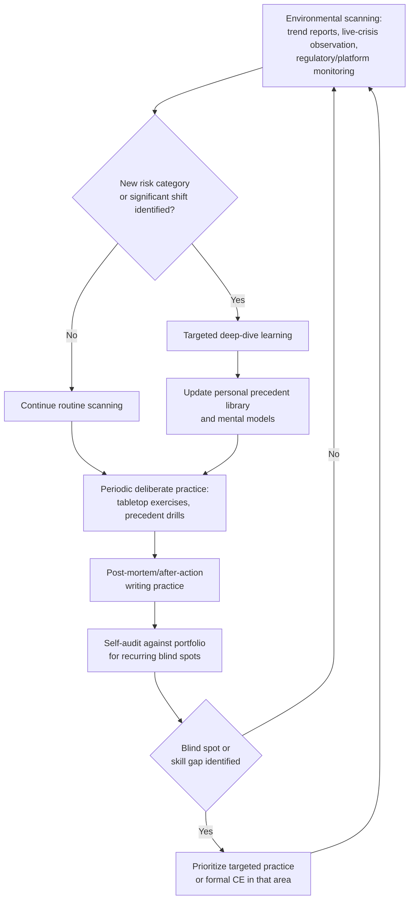

## Ongoing Skill Development in a Changing Field

### Overview

Ongoing skill development in crisis and reputation management is the practice of deliberately maintaining and extending professional competency in a field where the underlying operating environment — media technology, platform governance, regulatory regimes, and stakeholder expectations — changes faster than any single credential or training program can fully capture. This differs from continuing education in the formal, credential-linked sense (see Professional Associations and Continuing Education) in that it addresses the self-directed, ongoing practice of staying current: monitoring emerging risk categories, updating mental models, and deliberately practicing skills that atrophy without use.

**Key Points**

- Formal CE requirements are necessary but insufficient; the pace of change in media/technology/regulatory environments regularly outstrips credential renewal cycles (often 1–3 years)
- Skill decay in crisis work is asymmetric: judgment and stakeholder-relationship skills decay slowly, while technical/procedural knowledge (platform policies, regulatory specifics, emerging technology risk) decays quickly
- Deliberate practice — not just passive exposure to new information — is required to maintain crisis-response readiness, since real crises are infrequent for any single practitioner
- A practitioner's personal precedent library (see Building a Personal Crisis Response Portfolio) and case-study literacy (see Case Study Methodology and Historical Analysis) require active maintenance, not one-time construction

---

### What Changes Fastest in This Field

| Domain | Rate of Change | Why It Matters |
| --- | --- | --- |
| Social/media platform policies and algorithms | High — can shift within months | Directly affects information-spread speed assumptions baked into response-time benchmarks |
| Synthetic media / AI-generated content capability | High — new capability classes emerging on a rolling basis | Creates crisis categories with limited historical precedent (see the AI-misinformation example in Applying Precedent to Novel Crisis Scenarios) |
| Data privacy and breach-notification regulation | Moderate — new laws and amendments enacted periodically across jurisdictions | Determines mandatory disclosure timelines and legal exposure calculus |
| Investor disclosure requirements | Moderate — updated by regulators periodically | Affects crisis communications involving securities-adjacent exposure |
| Core stakeholder psychology and trust dynamics | Low | The underlying logic of why transparency, timeliness, and accountability build or erode trust is comparatively stable, which is why older case studies remain instructive at the mechanism level even as surface details age |
| Organizational crisis governance structures | Low-to-moderate | Best practices around cross-functional crisis teams evolve gradually |

This asymmetry is the central planning fact for skill development: practitioners should treat foundational judgment and stakeholder-theory knowledge as durable, while treating platform-specific, technology-specific, and regulation-specific knowledge as having a short half-life requiring active refresh.

---

### A Structured Approach to Staying Current

#### 1. Environmental scanning (ongoing, low-effort, high-frequency)

- Subscribe to aggregate crisis-trend reports (e.g., from the Institute for Crisis Management) and review on a regular cadence
- Monitor a curated set of live crises as they unfold in real time as "free" case studies — observing decision-making, timing, and outcomes without the cost of having lived through them personally
- Track platform policy changes and major regulatory announcements relevant to disclosure and content moderation

#### 2. Deliberate skill practice (periodic, higher-effort)

- **Tabletop exercises and simulations** — since real crises are infrequent for any individual practitioner, simulated scenarios are the primary mechanism for maintaining decision-speed and cross-functional coordination skills between actual incidents
- **Precedent-application drills** — periodically taking a hypothetical novel scenario and running it through the structural decomposition framework (harm type, information control, reversibility, etc.) as practice, independent of any live crisis
- **Post-mortem writing practice** — writing structured after-action reviews, even for observed (not personally handled) crises, to keep the analytical muscle active

#### 3. Deep-dive learning (occasional, targeted)

- Formal courses or executive education when an emerging category (e.g., AI governance, a new regulatory regime) requires foundational knowledge acquisition rather than incremental update
- Cross-disciplinary study — behavioral economics, sociology of trust, misinformation research — feeding the more durable, mechanism-level understanding of crisis dynamics rather than surface pattern-matching

---

### Skill Development Cycle

---

### Distinguishing Durable Judgment from Perishable Knowledge

**Key Points**

- Durable (slow-decay) skills: stakeholder empathy and trust psychology, structural decomposition/precedent-application reasoning, cross-functional coordination and negotiation, ethical judgment under pressure
- Perishable (fast-decay) knowledge: specific platform moderation policies, current regulatory text and disclosure deadlines, the current technical capability of synthetic media/AI tools, currently trending misinformation vectors and formats
- A practical implication: skill-development time budgets should weight perishable-knowledge refresh more heavily in frequency (e.g., quarterly scanning) while durable-judgment development can be pursued at a slower, deeper cadence (e.g., annual deep-dive study or executive education)
- [Inference] Practitioners who over-invest in perishable knowledge at the expense of durable judgment risk becoming reactive technicians rather than strategic advisors, while those who neglect perishable knowledge risk giving confidently wrong tactical advice (e.g., misstating a current legal disclosure deadline) — the balance point depends on role seniority and should skew toward durable judgment as a practitioner advances into strategic advisory roles

---

### Common Failure Modes in Skill Maintenance

- **Credential complacency** — treating a certification's renewal cycle as a sufficient proxy for currency, when the field moves faster than most renewal cycles
- **Passive information consumption without practice** — reading about emerging risks without ever running a decomposition or simulation exercise, leaving analytical muscles undeveloped when a real crisis hits
- **Precedent library staleness** — relying on the same 3–5 formative case studies from early career without incorporating more recent, structurally comparable cases into the working precedent set
- **Siloed learning** — focusing only on communications-specific development while ignoring adjacent shifts (legal/regulatory, technology capability) that materially affect crisis response constraints
- **Neglecting durable-skill practice during quiet periods** — treating the absence of a live crisis as time off from skill maintenance, rather than the primary window for tabletop practice and post-mortem writing

---

**Next Steps**

- Set a recurring (e.g., monthly) environmental-scanning block dedicated to trend reports and live-crisis observation
- Schedule at least one tabletop exercise or precedent-application drill per quarter, independent of whether a live crisis has occurred
- Periodically audit the personal precedent library (see Building a Personal Crisis Response Portfolio) for staleness — are the same formative cases being cited years later without newer additions?
- Identify one emerging risk category (e.g., synthetic media, a specific new regulatory regime) warranting a targeted deep-dive this year

**Related Topics**

- Professional Associations and Continuing Education (formal CE as one input among several)
- Applying Precedent to Novel Crisis Scenarios (the decomposition framework used in deliberate practice drills)
- Building a Personal Crisis Response Portfolio (source material for self-audit and precedent-library maintenance)
- Tabletop exercise and crisis simulation design
- Cross-disciplinary inputs to crisis judgment (behavioral economics, misinformation research, sociology of trust)