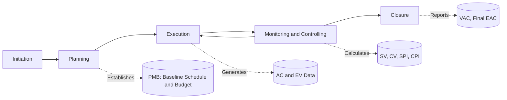

## Project Life Cycle and Phases

### Definition and Purpose

The project life cycle is the series of sequential (and sometimes overlapping) phases a project passes through from initiation to closure. It provides a structured framework for organizing project work, allocating resources, controlling scope, and integrating scheduling (CPM) and cost control (EVM) activities at appropriate points. Every project, regardless of industry, follows some variant of this structure, though the depth and formality of each phase scale with project size, complexity, and risk.

The life cycle matters directly to CPM/EVM practice because:

- The **schedule baseline** and **cost baseline** are established during specific life cycle phases (typically Planning).
- Earned Value measurement is only meaningful once a **Performance Measurement Baseline (PMB)** exists, which is a Planning-phase deliverable.
- Network logic (CPM) evolves in fidelity across phases — from rough order-of-magnitude sequencing in Initiation to detailed activity networks in Planning/Execution.

### Standard Phases

Most frameworks (PMI's *PMBOK Guide*, PRINCE2, and general engineering practice) describe four to five generic phases.

#### 1. Initiation

- **Key Points**
  - Project charter developed and approved
  - High-level feasibility, business case, and objectives defined
  - Key stakeholders identified
  - Preliminary scope and rough budget/schedule estimates (order-of-magnitude, typically -25%/+75% accuracy per AACE classification)
- **Example**: A construction firm receives a request for a new warehouse; the charter defines the business justification (capacity shortage), high-level budget ceiling, and a sponsor is assigned.

#### 2. Planning

- **Key Points**
  - Scope baseline finalized (WBS — Work Breakdown Structure)
  - CPM network diagram developed: activity definition, sequencing, duration estimating, and critical path calculation
  - Cost estimates refined to budgetary/definitive accuracy (-10%/+25% or better)
  - Performance Measurement Baseline (PMB) established — this is the integrated scope-schedule-cost baseline against which EVM metrics (PV, EV, AC) will later be measured
  - Risk register, resource plan, procurement plan, communication plan developed
- **Example**: The warehouse project team builds a WBS decomposing the work into foundation, structural steel, MEP, and finishing packages; each package is scheduled with dependencies (Finish-to-Start, Start-to-Start, etc.) to compute the critical path and total project duration.

#### 3. Execution

- **Key Points**
  - Actual work performed according to the plan
  - Resources mobilized and directed
  - Quality assurance activities carried out
  - Actual Cost (AC) accrues and Earned Value (EV) is measured periodically against the PMB
  - Schedule updates feed back into the CPM network (progress tracking, remaining duration re-estimation)
- **Example**: Foundation work begins; at the end of each reporting period, the project controls team records AC (invoices/timesheets) and calculates EV using an agreed method (e.g., 0/100, 50/50, or percent-complete).

#### 4. Monitoring and Controlling

- **Key Points**
  - Runs concurrently with Execution (not strictly sequential)
  - Variance analysis performed: Schedule Variance ($SV = EV - PV$), Cost Variance ($CV = EV - AC$)
  - Performance indices calculated: $SPI = EV / PV$, $CPI = EV / AC$
  - Change control: baseline changes are formally evaluated and approved/rejected
  - Critical path re-verified periodically as actual progress may shift the critical sequence (near-critical paths can become critical)
- **Example**: At month 3, CPI = 0.87 indicates cost overrun; root cause analysis traces it to unplanned rework in the MEP package, triggering a corrective action plan.

#### 5. Closure

- **Key Points**
  - Final deliverables handed over and formally accepted
  - Contracts closed out
  - Final EVM report generated: Variance at Completion ($VAC = BAC - EAC$), final performance indices
  - Lessons learned documented
  - Resources released
- **Example**: The warehouse is turned over to operations; a closeout report shows final CPI = 0.95 and SPI = 0.98, archived for organizational process assets and future estimating.

### Phase Overlap and Iteration

In practice, phases are rarely purely sequential:

- **Progressive elaboration**: Planning is revisited iteratively as Execution reveals new information (rolling wave planning).
- **Overlapping phases**: Execution of early work packages may begin before Planning is 100% complete for later packages (fast-tracking).
- **Predictive vs. adaptive life cycles**: CPM/EVM as classically defined assumes a largely **predictive (plan-driven)** life cycle. Adaptive (agile) life cycles use different progress measurement techniques (e.g., story points, velocity), though hybrid EVM approaches exist for hybrid life cycles. [Inference: the applicability of classical EVM formulas to adaptive life cycles depends on organizational tailoring and is not universally standardized.]

### Relationship to CPM and EVM Artifacts by Phase

| Phase | CPM Artifact | EVM Artifact |
| --- | --- | --- |
| Initiation | Milestone-level rough schedule | Rough order-of-magnitude budget |
| Planning | Detailed network diagram, critical path, float calculations | PMB (time-phased budget, BAC) |
| Execution | Progress updates, remaining duration | AC, EV data collection |
| Monitoring & Controlling | Schedule variance, critical path re-verification | SV, CV, SPI, CPI, EAC, ETC |
| Closure | As-built schedule | VAC, final EAC, archived performance data |

### Diagram: Generic Project Life Cycle with CPM/EVM Touchpoints

### Cost and Effort Distribution Across the Life Cycle

Cost incurrence and stakeholder influence follow a well-documented general pattern:

<svg viewBox="0 0 640 380" xmlns="http://www.w3.org/2000/svg">
<text x="320" y="24" text-anchor="middle" font-size="16" font-weight="bold" fill="#1a1a1a">Cost and Influence Across Project Life Cycle (svg_diagram)</text>
<line x1="70" y1="320" x2="600" y2="320" stroke="#333" stroke-width="2"/>
<line x1="70" y1="320" x2="70" y2="50" stroke="#333" stroke-width="2"/>

<text x="335" y="355" text-anchor="middle" font-size="13" fill="#333">Project Timeline</text>

<text x="30" y="190" text-anchor="middle" font-size="13" fill="#333" transform="rotate(-90 30 190)">Relative Level</text>

<path d="M 70 310 C 200 310, 250 90, 350 70 C 450 60, 550 200, 600 300" fill="none" stroke="#2563eb" stroke-width="3"/>
<text x="420" y="55" font-size="12" fill="#2563eb">Cost/Staffing Level</text>
<path d="M 70 70 C 150 75, 250 150, 350 260 C 450 300, 550 315, 600 318" fill="none" stroke="#dc2626" stroke-width="3"/>
<text x="90" y="65" font-size="12" fill="#dc2626">Stakeholder Influence &amp; Cost of Changes</text>
<line x1="140" y1="330" x2="140" y2="50" stroke="#999" stroke-dasharray="4,4"/>
<line x1="330" y1="330" x2="330" y2="50" stroke="#999" stroke-dasharray="4,4"/>
<line x1="470" y1="330" x2="470" y2="50" stroke="#999" stroke-dasharray="4,4"/>

<text x="105" y="340" font-size="12" fill="`#1a1a1a`">Initiation</text>

<text x="230" y="340" font-size="12" fill="`#1a1a1a`">Planning</text>

<text x="380" y="340" font-size="12" fill="`#1a1a1a`">Execution / M&C</text>

<text x="530" y="340" font-size="12" fill="`#1a1a1a`">Closure</text>

</svg>

This pattern underscores why CPM/EVM planning quality matters: decisions made cheaply in early phases (schedule logic, WBS structure, baseline assumptions) become progressively more expensive to change once Execution begins, since the cost of change rises while stakeholder influence over outcomes declines.

### Common Pitfalls

- Treating Planning as a one-time event rather than a baseline subject to formal, controlled updates
- Beginning EVM measurement before the PMB is properly baselined, producing meaningless variance data
- Skipping re-validation of the critical path during Monitoring and Controlling, missing a shift to a previously near-critical path
- Closing out phases without capturing lessons learned, degrading future estimating accuracy

**Related Topics**

- Work Breakdown Structure (WBS) development
- Performance Measurement Baseline (PMB) establishment
- CPM network diagramming techniques (AON, AOA)
- Rolling wave planning and progressive elaboration
- Predictive vs. adaptive vs. hybrid life cycles
- Earned Value fundamentals: PV, EV, AC
- Schedule and cost variance analysis (SV, CV, SPI, CPI)
- Change control and baseline management