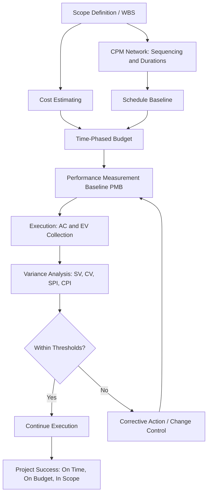

## Role of Schedule and Cost Management in Project Success

### Overview

Schedule and cost management are two of the three classical constraints of the "iron triangle" (scope, time, cost), and empirically they are the two dimensions most frequently used to judge whether a project is "successful" in execution terms. Critical Path Method (CPM) provides the mechanism for planning and controlling time; Earned Value Management (EVM) provides the mechanism for integrating scope, schedule, and cost into a single objective performance measurement system. Neither discipline operates in isolation — their integration is what allows early detection of problems and defensible forecasting.

### Why Schedule Management Matters

- **Key Points**
  - Establishes the sequence, logic, and duration of work via the CPM network
  - Identifies the **critical path** — the longest sequence of dependent activities determining the minimum project duration
  - Surfaces **float/slack** (total float, free float) so resources can be prioritized toward schedule-driving activities
  - Enables **what-if analysis**: compression techniques (crashing, fast-tracking) when facing delays
  - Supports contractual and regulatory milestones (e.g., liquidated damages clauses tied to completion dates)
  - Provides the time-phased structure that cost management depends on for EVM's Planned Value (PV) curve

Without a validated schedule network, there is no defensible basis for the "S-curve" against which cost performance is later measured — cost management would be flying blind on timing.

### Why Cost Management Matters

- **Key Points**
  - Establishes the budget baseline (BAC — Budget at Completion) and its time-phased distribution
  - Tracks Actual Cost (AC) against the plan
  - Combines with schedule progress to produce Earned Value (EV) — the objective value of work actually completed, expressed in budget terms
  - Enables forecasting: Estimate at Completion (EAC), Estimate to Complete (ETC), To-Complete Performance Index (TCPI)
  - Supports funding/cash-flow planning and financial reporting obligations to stakeholders or regulators

### The Integration Point: Why Neither Works Alone

A project can be "on schedule" while badly over budget, or "on budget" while badly behind schedule — tracking either dimension alone is misleading. EVM's core innovation is measuring **Earned Value**, which ties physical progress to both time and cost simultaneously:

$$SV = EV - PV$$

$$CV = EV - AC$$

$$SPI = \frac{EV}{PV}$$

$$CPI = \frac{EV}{AC}$$

- $SV$ and $SPI$ describe schedule performance in cost-equivalent terms (not calendar days) — this is a known limitation of classical EVM, since SPI trends toward 1.0 near project completion regardless of actual lateness. [Inference: this convergence behavior is a widely documented characteristic of the SPI metric, not a universal guarantee for every project data set.]
- $CV$ and $CPI$ describe cost efficiency of work performed
- Only by reading these together can a controls team distinguish four fundamental project states:

| Condition | SPI | CPI | Interpretation |
| --- | --- | --- | --- |
| Ahead of schedule, under budget | > 1.0 | > 1.0 | Best case |
| Ahead of schedule, over budget | > 1.0 | < 1.0 | Progress bought at excess cost |
| Behind schedule, under budget | < 1.0 | > 1.0 | Efficient but slow (resource-constrained?) |
| Behind schedule, over budget | < 1.0 | < 1.0 | Worst case — needs intervention |

### Diagram: Schedule and Cost Management Feeding Project Success

### Practical Example

A data center build has BAC = $10,000,000 and a planned duration of 12 months.

At month 6:

- PV = $5,000,000 (per the time-phased baseline)
- EV = $4,200,000 (physical work completed, valued at budget rates)
- AC = $4,800,000 (actual spend)

Calculations:

$$SV = 4{,}200{,}000 - 5{,}000{,}000 = -800{,}000 \text{ (behind schedule)}$$

$$CV = 4{,}200{,}000 - 4{,}800{,}000 = -600{,}000 \text{ (over budget)}$$

$$SPI = 4{,}200{,}000 / 5{,}000{,}000 = 0.84$$

$$CPI = 4{,}200{,}000 / 4{,}800{,}000 = 0.875$$

**Interpretation**: The project is both behind schedule and over budget (bottom-right condition in the table above). Root-cause investigation would examine whether delayed critical-path activities are driving inefficient resource use (e.g., idle crews billed at standard rates, or expedited freight to recover schedule that inflated AC).

### Consequences of Neglecting Either Discipline

- **Schedule neglect**: Critical path erodes silently; float is consumed on non-critical work while true schedule drivers are starved of resources; missed milestones trigger contractual penalties.
- **Cost neglect**: Budget overruns are discovered too late for corrective action; EAC forecasts become unreliable; funding requests are reactive rather than proactive.
- **Combined neglect**: No early warning system exists at all — project status is only known at completion, by which point corrective action is impossible. This is precisely the failure mode EVM was designed to prevent (it originated in U.S. Department of Defense acquisition to give objective, auditable insight into contractor performance).

### Organizational and Contractual Dimensions

- Many government and large commercial contracts mandate EVM reporting (e.g., U.S. DoD's EVMS per ANSI/EIA-748 standard) as a condition of payment or contract compliance.
- CPM-derived schedules are frequently used in **delay claims and forensic schedule analysis** (e.g., Time Impact Analysis, Windows Analysis) to apportion responsibility for delays between owner and contractor.
- Schedule and cost management together form the backbone of **Integrated Baseline Reviews (IBR)**, where stakeholders formally validate that the PMB is realistic and achievable before execution begins.

### Common Pitfalls

- Reporting SPI/CPI without a validated critical path — the schedule network integrity underlying PV may itself be flawed
- Using cost-based SPI as a stand-in for actual calendar-day schedule slippage in critical-path terms (a known distortion, especially near project end)
- Treating variance thresholds as static rather than tailoring them to project risk profile and phase
- Delaying corrective action until variances become large and difficult to recover

**Related Topics**

- Critical path calculation and float analysis
- Performance Measurement Baseline (PMB) development
- Earned Value formulas: EAC, ETC, TCPI
- ANSI/EIA-748 EVMS guidelines
- Forensic schedule analysis and delay claims
- Integrated Baseline Review (IBR) process
- Schedule compression techniques (crashing vs. fast-tracking)