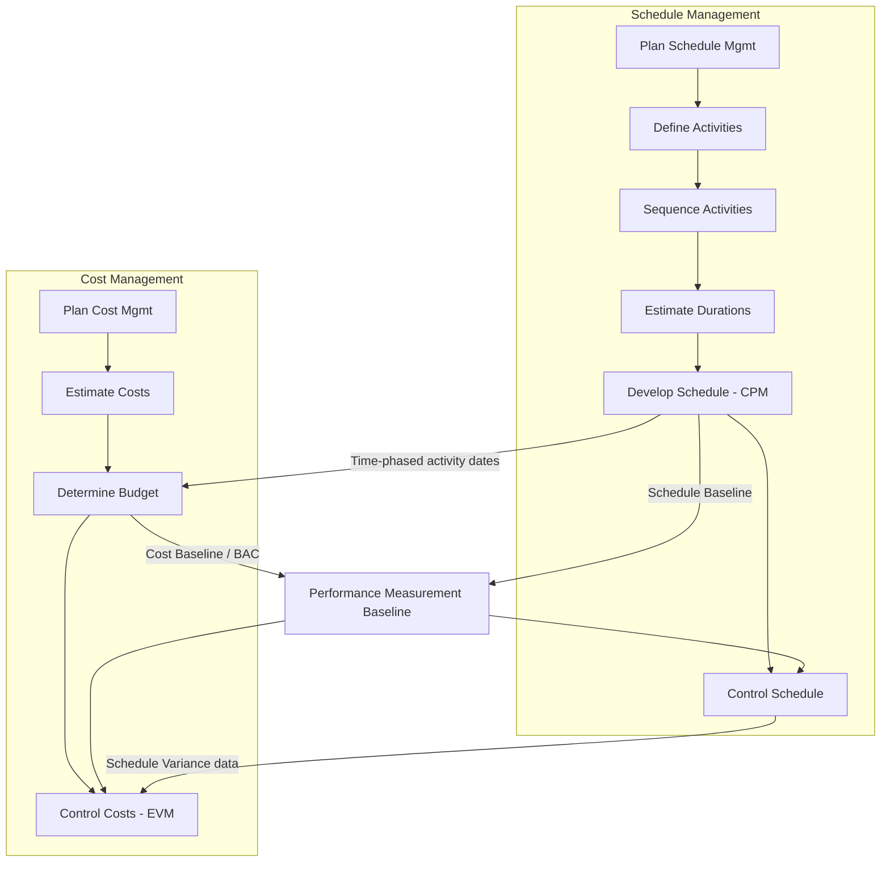

## Overview of PMBOK Knowledge Areas for Time and Cost

### Framing Note

The *PMBOK Guide* transitioned its structure across editions: the 6th Edition (2017) organizes content into 10 **Knowledge Areas** including "Project Schedule Management" and "Project Cost Management," while the 7th Edition (2021) shifted to a principles- and performance-domain-based structure and de-emphasized the Knowledge Area framework in favor of "Project Performance Domains" (e.g., Planning, Delivery, Measurement). [Unverified: exact terminology and structural emphasis should be confirmed against the specific PMBOK edition your certification or organization references, since both structures remain in active professional use.] This reference covers the Knowledge Area framework (6th Edition lineage) because it maps most directly and explicitly onto CPM and EVM mechanics, which is the traditional pedagogical approach for scheduling/cost control courses.

### Project Schedule Management (Time)

- **Key Points** — Six constituent processes:
  1. **Plan Schedule Management** — establishes policies, procedures, and documentation for planning, developing, managing, executing, and controlling the schedule
  2. **Define Activities** — decomposes work packages (from the WBS) into schedule activities
  3. **Sequence Activities** — establishes logical relationships between activities (FS, SS, FF, SF dependencies) — the direct input to the CPM network diagram
  4. **Estimate Activity Durations** — quantifies the time needed for each activity (analogous estimating, parametric estimating, three-point/PERT estimating)
  5. **Develop Schedule** — analyzes sequences, durations, resource requirements, and constraints to create the schedule model; this is where the **Critical Path Method** is formally applied
  6. **Control Schedule** — monitors project status to update schedule progress and manage changes to the schedule baseline

**Example**: In a bridge construction project, Define Activities breaks the "Substructure" work package into pier excavation, formwork, rebar placement, and concrete pour. Sequence Activities establishes that rebar placement cannot start until formwork is complete (FS relationship). Develop Schedule runs the forward and backward pass across the full network to compute early/late start and finish dates, identifying the critical path.

### Project Cost Management

- **Key Points** — Four constituent processes:
  1. **Plan Cost Management** — establishes policies and procedures for planning, structuring, and controlling project costs
  2. **Estimate Costs** — develops an approximation of monetary resources needed (analogous, parametric, bottom-up, three-point estimating)
  3. **Determine Budget** — aggregates estimated costs of individual activities/work packages into an authorized cost baseline (this becomes the time-phased **BAC**, Budget at Completion)
  4. **Control Costs** — monitors project status to update the budget and manage changes to the cost baseline; this is the process area where **Earned Value Management** formally resides

**Example**: Determine Budget aggregates activity-level cost estimates (labor, materials, equipment) plus contingency reserve into a time-phased cost baseline (the S-curve), distributed according to the schedule developed in Schedule Management — this is precisely how the Performance Measurement Baseline (PMB) is constructed.

### Structural Integration: How the Two Knowledge Areas Combine

CPM and EVM are not separate frameworks bolted onto PMBOK — they are the **specific techniques PMBOK references** within Develop Schedule and Control Costs, respectively. The critical dependency chain:

### Knowledge Area Outputs Mapped to CPM/EVM Artifacts

| PMBOK Process | Key Output | CPM/EVM Role |
| --- | --- | --- |
| Sequence Activities | Network diagram (logic) | Basis for forward/backward pass |
| Estimate Activity Durations | Duration estimates (deterministic or three-point) | Input to critical path length calculation |
| Develop Schedule | Schedule baseline, critical path, float | Basis for Planned Value (PV) time-phasing |
| Determine Budget | Cost baseline (BAC), funding requirements | Basis for the PMB's budget dimension |
| Control Schedule | Schedule performance data, SV/SPI | Schedule Variance, Schedule Performance Index |
| Control Costs | EVM metrics: EV, AC, CV, CPI, EAC, ETC | Full EVM analysis suite |

### Supporting Techniques Referenced Within These Knowledge Areas

- **Precedence Diagramming Method (PDM)** — the standard notation for CPM network diagrams (activity-on-node), used in Sequence Activities
- **Critical Path Method** — explicitly named technique within Develop Schedule for calculating the minimum project duration and identifying schedule flexibility (float)
- **Critical Chain Method** — an alternative scheduling technique addressing resource constraints and behavioral biases in estimating (buffer management instead of per-activity float)
- **Resource Optimization** — resource leveling and resource smoothing, applied after initial CPM calculation
- **Schedule Compression** — crashing (adding resources) and fast-tracking (parallelizing sequential activities)
- **Earned Value Analysis** — explicitly named technique within Control Costs, encompassing PV, EV, AC, SV, CV, SPI, CPI, EAC, ETC, VAC, TCPI

### Why This Matters for Practitioners

- PMI certification exams (PMP, CAPM) test Schedule and Cost Management as distinct but tightly coupled knowledge areas, with EVM formulas historically concentrated in the Cost Management domain and CPM/network calculations concentrated in Schedule Management
- Organizational Process Assets (templates, historical data, lessons learned) from prior projects feed both knowledge areas' estimating processes
- Enterprise Environmental Factors (market conditions, resource availability, organizational culture) constrain both scheduling and budgeting assumptions
- Integration Management (a separate PMBOK Knowledge Area) governs how changes to schedule or cost baselines are formally controlled via the Perform Integrated Change Control process — neither Schedule nor Cost Control operates with unilateral authority to change baselines

### Common Pitfalls

- Treating Schedule Management and Cost Management as sequential rather than iterative and interdependent (duration/resource assumptions affect cost estimates and vice versa)
- Applying EVM formulas (Control Costs) without a validated schedule network underlying the time-phased PV curve
- Conflating PMBOK 6th Edition process-group terminology with 7th Edition performance-domain terminology when communicating with stakeholders trained on a different edition
- Ignoring Resource Management and Risk Management knowledge areas' influence on both schedule and cost baselines (resource availability and identified risks directly affect duration and cost estimates)

**Related Topics**

- Precedence Diagramming Method (PDM) and dependency types
- Three-point (PERT) estimating for durations and costs
- Critical Chain Project Management (CCPM)
- Perform Integrated Change Control process
- PMBOK 7th Edition performance domains vs. 6th Edition knowledge areas
- Resource leveling vs. resource smoothing
- Cost baseline development and management reserves