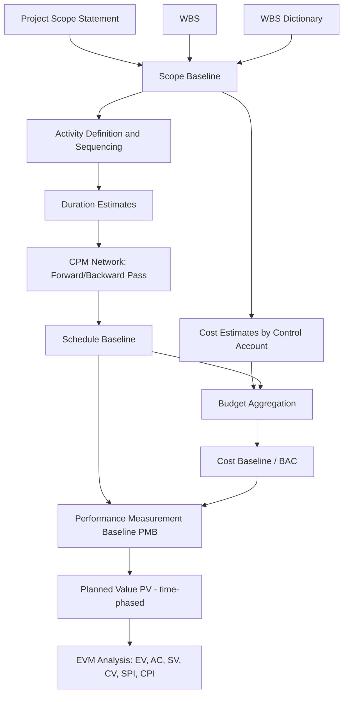

## Scope, Schedule, and Cost Baseline Concepts

### Definition

A **baseline** is an approved, time-stamped reference version of a project plan component, used as the fixed basis for comparison against actual performance. Baselines are only changed through formal change control — they are not casually adjusted as work progresses. The three baselines (scope, schedule, cost) individually govern their respective dimension, but together they combine into the **Performance Measurement Baseline (PMB)**, the integrated reference against which Earned Value Management operates.

### Scope Baseline

- **Key Points**
  - Comprises three components: the approved **Project Scope Statement**, the **Work Breakdown Structure (WBS)**, and the **WBS Dictionary**
  - Defines what is (and explicitly is not) included in the project
  - Each WBS element represents a discrete, measurable piece of work — the fundamental unit that both the schedule network and cost estimates are built from
  - Changes to scope baseline typically cascade into both schedule and cost baselines (scope creep without baseline change control is a primary driver of both schedule slippage and cost overrun)
- **Example**: A WBS Dictionary entry for "Foundation — Pier 3" specifies acceptance criteria (concrete strength, tolerances), assumptions, and the responsible organization — this becomes the anchor point for both a schedule activity and a cost account.

### Schedule Baseline

- **Key Points**
  - The approved version of the schedule model, containing baseline start dates, baseline finish dates, and the baseline critical path
  - Derived from the CPM network: activity sequencing, duration estimates, and the forward/backward pass calculation
  - Serves as the source of **Planned Value (PV)** time-phasing in EVM — PV at any date is the budgeted cost of work scheduled to be complete by that date, per the schedule baseline
  - Only modified through approved change requests; day-to-day schedule updates (progress, re-forecasting) occur against a **working schedule**, distinct from the baseline itself
  - Baseline variance is tracked via **Schedule Variance (SV)** and **Schedule Performance Index (SPI)**, computed by comparing current EV against baseline PV
- **Example**: The schedule baseline shows "Structural Steel Erection" with baseline start Day 45, baseline finish Day 75. If actual progress data six weeks in shows only 60% completion against a baseline expectation of 80%, this produces a negative SV.

### Cost Baseline

- **Key Points**
  - The approved, time-phased budget used to measure and monitor cost performance, excluding management reserves but including contingency reserves
  - Expressed as an S-curve: cumulative authorized budget plotted against time
  - The total value of the cost baseline is the **Budget at Completion (BAC)**
  - Built by aggregating cost estimates at the **control account** level (the point where scope, schedule, and cost intersect for management purposes) up through the WBS
  - Management reserves sit outside the cost baseline (held by the project sponsor/management) but within the overall **project budget**; this distinction matters because EVM formulas reference BAC, not the total project budget including management reserve
- **Example**: A cost baseline totals BAC = $8,500,000, time-phased so that by month 4, $3,000,000 in cumulative budget is planned to have been spent (this cumulative figure at any date is PV).

### The Performance Measurement Baseline (PMB)

- **Key Points**
  - The **integration** of scope, schedule, and cost baselines into a single time-phased budget plan used to measure project execution performance
  - PMB = the collection of control accounts, each tied to specific WBS elements, scheduled activities, and budgeted costs
  - Once established, the PMB should change only through formal, documented, approved change requests (often via an Integrated Baseline Review, or IBR, in formal EVM environments)
  - PV, as used in EVM, is literally the time-phased value of the PMB at any given reporting date
  - Uncontrolled or informal replanning that alters the PMB without approval undermines the validity of all subsequent EVM analysis — this is sometimes called "baseline erosion" or informally "gaming" the metrics if done to artificially improve reported performance [Inference: terminology such as "gaming" reflects common practitioner usage rather than a formally standardized PMBOK term.]

### Relationship Diagram

### Baseline vs. Working Plan vs. Actuals — Three Distinct Layers

| Layer | Description | EVM Term |
| --- | --- | --- |
| Baseline | Approved, frozen plan | Basis for PV |
| Working/current plan | Updated forecast reflecting known changes not yet baselined | Basis for ETC/EAC forecasting |
| Actuals | What has actually happened | AC (cost), EV (physical progress valued at budget rates) |

Conflating the working plan with the baseline is a common analytical error — variance analysis (SV, CV) is only meaningful when compared against the *original approved* baseline, not a silently revised one.

### Numeric Example

A control account "Electrical Rough-In" has:

- Scope baseline: defined by WBS code 3.2.4, WBS Dictionary specifies scope of work and acceptance criteria
- Schedule baseline: baseline duration 20 days, baseline start Day 60, baseline finish Day 80
- Cost baseline: budgeted at $150,000, time-phased linearly across the 20-day duration ($7,500/day)

At Day 70 (10 days into the activity per baseline):

$$PV = 10 \times 7{,}500 = 75{,}000$$

If actual physical progress is assessed at 40% complete:

$$EV = 0.40 \times 150{,}000 = 60{,}000$$

$$SV = EV - PV = 60{,}000 - 75{,}000 = -15{,}000 \text{ (behind baseline)}$$

This calculation is only valid because the baseline values ($150,000 total, 20-day duration, Day 60 start) remain fixed and unchanged from the originally approved plan.

### Common Pitfalls

- Re-baselining informally or too frequently, which erases the historical record needed for meaningful variance trending and lessons learned
- Including management reserve within BAC, inflating the apparent cost baseline and distorting CPI/EAC calculations
- Failing to decompose the WBS to a level fine enough to support meaningful control accounts (too coarse a WBS obscures variances; too fine adds excessive administrative overhead)
- Updating the working schedule/cost forecast but failing to formally document it as a baseline change when the deviation is significant — leading to disputes over "true" baseline status
- Treating scope baseline changes as schedule/cost-neutral without re-evaluating downstream network logic and budget allocations

**Related Topics**

- Work Breakdown Structure (WBS) development and decomposition levels
- Control accounts and the Control Account Plan (CAP)
- Integrated Baseline Review (IBR) process
- Management reserve vs. contingency reserve
- Perform Integrated Change Control
- Planned Value (PV) calculation methods (linear, milestone-weighted, percent-complete)
- Baseline re-planning and "replanning" vs. "rebaselining" distinctions