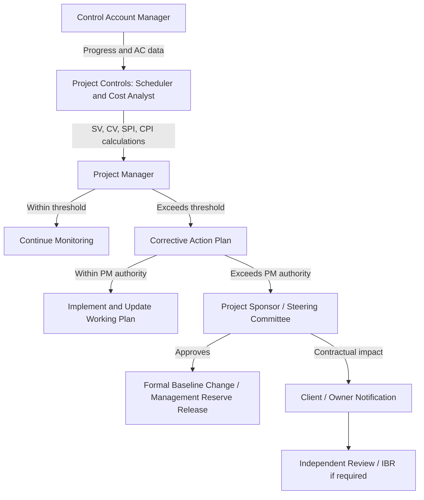

## Stakeholder Roles in Schedule and Cost Governance

### Overview

Schedule and cost governance is not the responsibility of a single role — it is distributed across a structured hierarchy of stakeholders, each with distinct authority, accountability, and information needs. Effective CPM/EVM implementation depends on clearly defined roles because baseline changes, variance thresholds, and corrective actions require specific approval authorities. Ambiguous role definition is a leading cause of baseline erosion and delayed corrective action.

### Governance Hierarchy

#### 1. Project Sponsor / Executive Steering Committee

- **Key Points**
  - Holds ultimate authority over the project's business case and overall budget envelope
  - Approves major baseline changes (typically beyond a defined cost/schedule threshold, e.g., changes exceeding 10% of BAC or affecting the critical path's end date)
  - Controls **management reserve** — funds held outside the cost baseline for unforeseen risks, released only at sponsor discretion
  - Receives summarized EVM reporting (CPI, SPI, EAC) rather than activity-level detail
- **Example**: When a control account forecasts a $500,000 overrun exceeding the project's contingency reserve, the project manager escalates a management reserve draw request to the sponsor.

#### 2. Project Manager (PM)

- **Key Points**
  - Owns day-to-day schedule and cost control; accountable for maintaining the PMB's integrity
  - Authorizes minor baseline adjustments within delegated thresholds; escalates larger changes via Integrated Change Control
  - Directs corrective action planning when SV/CV or SPI/CPI breach defined variance thresholds
  - Coordinates between control account managers, functional managers, and the sponsor
- **Example**: The PM reviews a monthly EVM report showing CPI = 0.88 across three control accounts, convenes a variance analysis meeting, and directs a recovery plan before escalating to the sponsor.

#### 3. Control Account Manager (CAM)

- **Key Points**
  - Owns a specific control account (the intersection of WBS, schedule, and budget) — the fundamental unit of EVM accountability in formal EVMS environments (per ANSI/EIA-748)
  - Responsible for accurate, timely reporting of progress (basis for EV) and actual costs (AC) within their account
  - Develops and maintains the detailed schedule logic and resource plan for their scope
  - First line of variance analysis and narrative explanation when thresholds are breached
- **Example**: The CAM for "Structural Steel Erection" reports 55% physical completion at month-end, computes EV against the account's BAC, and provides a variance narrative explaining a labor productivity shortfall.

#### 4. Project Controls / Scheduler and Cost Analyst

- **Key Points**
  - Technical specialists responsible for building and maintaining the CPM network (scheduler) and cost baseline/EVM calculations (cost analyst) — often combined into a single "Project Controls" function on smaller projects
  - Perform critical path calculations, float analysis, schedule risk analysis (e.g., Monte Carlo simulation)
  - Calculate and report SV, CV, SPI, CPI, EAC, ETC, TCPI on a defined cadence (weekly/monthly)
  - Maintain the schedule and cost baseline change log
- **Example**: The scheduler re-runs the forward/backward pass after a design change adds two activities, identifies that the critical path has shifted to a previously near-critical sequence, and flags the new critical path to the PM.

#### 5. Functional/Resource Managers

- **Key Points**
  - Provide resource commitments (labor, equipment) that underlie duration estimates and cost estimates
  - Accountable for resource-loaded schedule accuracy within their discipline (e.g., electrical, civil, procurement)
  - Often the first to identify resource constraints that could affect the critical path or cost performance
- **Example**: The electrical discipline manager flags that a key crew is double-booked across two concurrent projects, prompting a resource-leveling exercise that may extend a near-critical activity.

#### 6. Client / Owner (External Stakeholder)

- **Key Points**
  - Contractually entitled to schedule and cost performance reporting at a frequency and format defined in the contract (common on public and government contracts requiring formal EVMS compliance)
  - Approves changes affecting contractual milestones or the contract price
  - May conduct independent audits or Integrated Baseline Reviews (IBR) to validate the PMB's realism
- **Example**: On a government contract subject to ANSI/EIA-748, the owner's contracting officer reviews monthly Contract Performance Reports (CPR) and may require a Corrective Action Plan if CPI falls below a contractual threshold.

#### 7. Independent Estimator / EVMS Auditor (where applicable)

- **Key Points**
  - Provides independent validation of cost/schedule estimates and EVMS compliance, common in regulated or high-value contracts
  - Assesses whether the PMB was constructed with realistic assumptions (via IBR) and whether EVM data is being reported without manipulation
- **Example**: Prior to contract award on a major infrastructure program, an independent cost estimate (ICE) is compared against the contractor's proposed baseline to validate feasibility.

### Governance and Escalation Flow

### RACI-Style Summary

| Activity | CAM | PM | Scheduler/Analyst | Sponsor | Client |
| --- | --- | --- | --- | --- | --- |
| Baseline development | Responsible | Accountable | Responsible | Informed | Consulted |
| Progress/EV measurement | Responsible | Accountable | Consulted | Informed | Informed |
| Variance analysis | Consulted | Accountable | Responsible | Informed | — |
| Minor baseline change (within threshold) | Consulted | Accountable/Responsible | Consulted | Informed | Informed |
| Major baseline change (exceeds threshold) | Consulted | Responsible | Consulted | Accountable | Consulted |
| Management reserve release | — | Responsible | — | Accountable | Informed |
| Contract milestone change | — | Consulted | Consulted | Accountable | Accountable |

### Why Role Clarity Matters for CPM/EVM Integrity

- **Segregation of duties**: In formal EVMS environments, the party reporting progress (CAM) is ideally separated from the party approving baseline changes (PM/Sponsor) to reduce the incentive or opportunity to manipulate EV to hide poor performance
- **Escalation thresholds** prevent both under-escalation (small issues compounding unnoticed) and over-escalation (sponsor time consumed by routine variances)
- **Data latency**: Roles closest to the work (CAM) must report frequently enough that roles furthest from the work (sponsor, client) receive timely, actionable information — variance analysis loses value if reporting cadence is too slow relative to the rate of schedule/cost drift

### Common Pitfalls

- Allowing control account managers to both perform work and unilaterally certify their own percent-complete without independent verification, creating incentive for optimistic (or pessimistic, for schedule-relief) reporting
- Undefined or overly broad change authority thresholds, causing either bottlenecks at the sponsor level or uncontrolled baseline drift at the PM level
- Functional managers left out of schedule risk discussions despite controlling the resource assumptions the critical path depends on
- Client reporting formatted around contractual compliance rather than genuine decision-usefulness, obscuring real performance trends
- No defined process for when an independent audit or IBR is triggered, leading to inconsistent application across similar projects

**Related Topics**

- Control Account Plan (CAP) structure and content
- Integrated Baseline Review (IBR) process and triggers
- ANSI/EIA-748 EVMS guidelines and compliance
- Change control boards and approval thresholds
- Variance thresholds and corrective action planning
- RACI matrices in project governance
- Contract Performance Report (CPR) formats