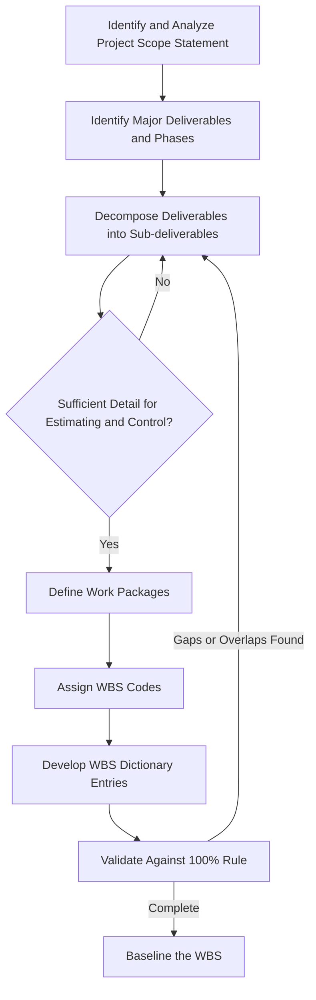

## WBS Principles and Decomposition Rules

### Definition

The Work Breakdown Structure (WBS) is a deliverable-oriented hierarchical decomposition of the total scope of work to be executed by the project team. Each descending level represents an increasingly detailed definition of project work. The WBS is the foundational scope artifact from which both the CPM schedule network and the EVM cost baseline are derived — every schedule activity and every cost account should trace back to a specific WBS element.

### Core Principles

- **Key Points**
  - **100% Rule**: The WBS must capture 100% of the scope defined in the project scope statement — all work, and only that work, including project management activities. Nothing outside the WBS is part of the project; nothing in the WBS falls outside project scope.
  - **Deliverable-oriented, not activity-oriented**: WBS elements describe *outcomes/nouns* (e.g., "Foundation," "Test Report") rather than *actions/verbs* (e.g., "Pour concrete," "Run tests") — the activity-level detail belongs in the schedule, not the WBS itself
  - **Mutual exclusivity**: Each element of work should appear in only one place in the WBS to avoid double-counting effort or budget
  - **Progressive elaboration**: Higher-level, less-defined project phases may be decomposed in less detail initially and elaborated further as more information becomes available (rolling wave planning)
  - **Independence from organizational structure**: The WBS reflects the *work*, not who performs it — organizational assignment is captured separately (e.g., via a Responsibility Assignment Matrix or RAM)

### The 8/80 Rule and Level of Decomposition

- **Key Points**
  - A commonly cited heuristic: decompose work packages until each one requires no less than 8 hours and no more than 80 hours of effort — though this is a guideline, not a rigid mandate, and appropriate granularity varies by project size, control needs, and reporting cadence [Inference: the 8/80 rule is a widely taught heuristic in project management education rather than a formally mandated PMBOK requirement.]
  - Alternative guidance: decompose until a work package can be estimated and scheduled with acceptable accuracy, and progress can be objectively measured within a single reporting period
  - **Over-decomposition** creates excessive administrative burden and reporting overhead; **under-decomposition** hides variances and obscures true performance
  - The lowest level of the WBS is the **work package** — the point where cost and schedule estimates are developed with the greatest reliability
- **Example**: "Install HVAC Ductwork" decomposed into "Duct Fabrication," "Duct Installation — Level 1," "Duct Installation — Level 2," and "Insulation and Sealing" — each sized to roughly a 1–2 week reporting window rather than left as a single 6-month work package.

### Decomposition Process

### WBS Structure Levels (Typical)

| Level | Name | Description | Example |
| --- | --- | --- | --- |
| 0 | Project | The entire project | "Riverside Bridge Construction" |
| 1 | Major Deliverables / Phases | Top-level breakdown | "Substructure," "Superstructure," "Roadway" |
| 2 | Sub-deliverables | Further decomposition | "Piers," "Abutments," "Foundations" |
| 3 | Components | Discrete components | "Pier 1," "Pier 2," "Pier 3" |
| 4 (lowest) | Work Packages | Estimable, schedulable, assignable units | "Pier 1 — Excavation," "Pier 1 — Rebar," "Pier 1 — Concrete Pour" |

### WBS Coding and the WBS Dictionary

- **Key Points**
  - Each WBS element receives a unique numeric or alphanumeric code (e.g., 1.2.3.4) enabling traceability across schedule, cost, and reporting systems
  - The **WBS Dictionary** accompanies the WBS graphic/outline and details, for each element: scope description, acceptance criteria, assumptions/constraints, responsible organization, associated schedule milestones, and cost estimates
  - Without a WBS Dictionary, WBS element titles alone are frequently ambiguous and insufficient to prevent scope disputes
- **Example WBS Dictionary Entry**:
  - Code: 1.2.3 — Pier 3 Foundation
  - Description: Excavation, formwork, reinforcement, and concrete placement for Pier 3 spread footing per Drawing S-204
  - Acceptance Criteria: 28-day concrete compressive strength ≥ 4,000 psi per test report; dimensional tolerance ±10mm
  - Responsible Organization: Civil Subcontractor
  - Associated Control Account: CA-1203

### Relationship to CPM and EVM

- **Key Points**
  - Each work package becomes the basis for one or more **schedule activities** in the CPM network (Define Activities process)
  - Each work package (or a grouping of work packages) forms a **control account** — the point at which EVM measurement (PV, EV, AC) is applied
  - A WBS that is too coarse produces control accounts too large to yield meaningful, timely variance signals; too fine, and the administrative cost of EVM tracking becomes disproportionate to project value
  - The **Control Account Plan (CAP)** documents the specific EV measurement method (e.g., 0/100, 50/50, percent-complete, milestone weighting) to be used for each control account, tied directly to the WBS Dictionary's acceptance criteria

### Common Decomposition Approaches

- **Deliverable-based**: Organized around physical or functional deliverables (most common in construction/engineering) — e.g., by building system or structural component
- **Phase-based**: Organized around project life cycle phases (Initiation, Design, Procurement, Construction, Commissioning)
- **Geographic/location-based**: Organized by physical location, useful in large or multi-site programs
- **Hybrid**: Combines approaches — e.g., top levels by phase, lower levels by deliverable within each phase

### Numeric Example: Validating the 100% Rule

A renovation project's Level 1 WBS lists: Design (1.0), Permitting (2.0), Demolition (3.0), Construction (4.0), Project Management (5.0). If the cost estimates for these five elements sum to less than the total approved project budget, or if punch-list/closeout work has no corresponding WBS element, the 100% Rule is violated — the missing scope will surface later as unplanned cost/schedule impact with no baseline to measure against.

### Common Pitfalls

- Writing WBS element names as verbs/actions (activity-style) rather than nouns/deliverables, which blurs the WBS/schedule distinction and complicates change control
- Decomposing unevenly — some branches taken to work-package level while sibling branches remain at a summary level, producing inconsistent control account granularity
- Omitting project management, risk management, or closeout activities from the WBS, violating the 100% Rule and leaving no cost/schedule baseline for that effort
- Building the WBS around organizational departments instead of deliverables, which conflates "who does the work" with "what work exists" and complicates matrixed reporting
- Failing to maintain the WBS Dictionary, leaving acceptance criteria and EV measurement methods undocumented and subject to dispute

**Related Topics**

- WBS Dictionary content and standardization
- Control Account Plan (CAP) and EV measurement methods (0/100, 50/50, percent-complete)
- Responsibility Assignment Matrix (RAM) and OBS integration
- Rolling wave planning and progressive elaboration
- Activity definition from work packages
- Code of accounts and WBS numbering conventions
- Scope baseline change control