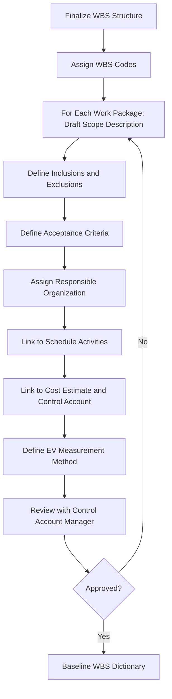

## WBS Dictionary Development

### Definition

The WBS Dictionary is the detailed narrative companion to the graphical/outline Work Breakdown Structure. Where the WBS itself provides a hierarchical map of *what* work exists, the WBS Dictionary defines *precisely what each element means* — scope boundaries, acceptance criteria, and the technical/administrative detail needed to estimate, schedule, execute, and measure that work objectively. Without it, WBS element titles are frequently ambiguous, leaving room for scope disputes, inconsistent EV measurement, and disputed acceptance.

### Purpose and Role in CPM/EVM

- **Key Points**
  - Provides the authoritative scope definition that schedule activities and cost estimates for a given WBS element must trace back to
  - Establishes **acceptance criteria** — the objective standard by which physical completion is judged, which is the basis for legitimate Earned Value claiming
  - Reduces subjectivity in percent-complete reporting by defining, in advance, what "done" looks like for each element
  - Serves as a reference during change control to determine whether a proposed change is in-scope (covered by existing dictionary language) or requires a formal scope change

### Standard Content Elements

A WBS Dictionary entry typically includes:

- **Key Points**
  - **WBS Code**: unique identifier linking to the WBS hierarchy (e.g., 1.2.3.4)
  - **Element Name**: deliverable-oriented title matching the WBS
  - **Description of Work**: narrative scope statement — what is included and explicitly excluded
  - **Assumptions and Constraints**: conditions the estimate/schedule depend on
  - **Responsible Organization**: department, subcontractor, or individual accountable for the work
  - **Milestones/Schedule Reference**: key dates or linked schedule activity IDs
  - **Resources Required**: labor, equipment, materials at a summary level
  - **Cost Estimate**: budget allocated to the element (feeds the cost baseline)
  - **Acceptance Criteria**: quality, quantity, or performance standard that must be met for the deliverable to be considered complete
  - **Technical References**: drawings, specifications, or standards governing the work
  - **Associated Control Account**: the EVM control account code the element rolls up into, and the designated EV measurement method (0/100, 50/50, percent-complete, weighted milestones)

### Development Process

### Example Entry

**WBS Code**: 2.3.1

**Element Name**: Curtain Wall Installation — Tower A, Floors 1–10

**Description of Work**: Supply and installation of unitized curtain wall panels for the north and south elevations of Tower A, floors 1 through 10, including anchor brackets, sealants, and glazing per Drawing A-501 Rev. C. Excludes interior finishes and window treatments, which are covered under WBS 4.1.2.

**Assumptions and Constraints**: Assumes panel fabrication is complete and delivered to site per procurement schedule WBS 2.1; installation sequenced floor-by-floor from ground level upward; weather-dependent activity with no more than 5 rain-delay days assumed in the estimate.

**Responsible Organization**: Curtain Wall Subcontractor (ABC Glazing Co.)

**Schedule Reference**: Linked to Activity IDs CW-101 through CW-110 in the master schedule; baseline finish Day 145.

**Resources Required**: Two installation crews (4 persons each), one tower crane allocation (shared resource), sealant materials per BOM 2.3.1-A.

**Cost Estimate**: $1,240,000 (labor: $420,000; materials: $780,000; equipment allocation: $40,000).

**Acceptance Criteria**: Panel alignment within ±3mm tolerance; water infiltration test passed per ASTM E1105; sealant cure inspection signed off by quality manager.

**Associated Control Account**: CA-2301; EV measurement method: weighted milestones (Fabrication delivered = 20%, Panels set = 50%, Sealant complete = 20%, QA sign-off = 10%).

### Why Precise Acceptance Criteria Matter for EVM Integrity

- **Key Points**
  - Vague or missing acceptance criteria allow inconsistent or overly optimistic percent-complete claims, inflating EV and understating true schedule/cost risk
  - Objective criteria (test results, inspection sign-offs, measurable tolerances) convert progress reporting from subjective judgment into an auditable, defensible metric
  - Weighted milestone methods (as in the example above) are only meaningful if each milestone's definition is unambiguous — otherwise, EV can be claimed prematurely or inconsistently across control account managers
- **Example**: If "Panels set" is not clearly defined (does it mean physically placed, or placed and structurally fastened?), two crews on the same project could claim substantially different percent-complete for functionally identical progress, corrupting the aggregated project-level CPI/SPI.

### EV Measurement Method Selection (Documented in the Dictionary)

| Method | Description | Best Suited For |
| --- | --- | --- |
| 0/100 | 0% credit until fully complete, then 100% | Short-duration work packages (days) |
| 50/50 | 50% credit at start, 50% at completion | Short-to-medium work packages |
| Percent Complete (Estimated) | CAM estimates % complete each period | Longer work packages with visible incremental progress |
| Weighted Milestones | Credit assigned at defined intermediate milestones | Complex work packages with clear intermediate deliverables |
| Level of Effort (LOE) | Credit accrues proportionally to time elapsed | Support/administrative work with no discrete deliverable (e.g., project management) |
| Apportioned Effort | Credit tied proportionally to a related discrete work package | Work directly dependent on another measured activity (e.g., inspection tied to construction progress) |

### Common Pitfalls

- Writing scope descriptions too vaguely to prevent disputes, effectively deferring scope definition to informal interpretation during execution
- Omitting explicit exclusions, causing scope boundary disputes between adjacent WBS elements (e.g., where does "rough-in" end and "finish work" begin)
- Selecting Level of Effort (LOE) measurement for work that actually has discrete, measurable deliverables — LOE artificially smooths variance and can mask true performance since LOE's EV is scheduled to always equal its PV by design
- Failing to update the dictionary when scope changes are approved, leaving the acceptance criteria and control account definition out of sync with the current baseline
- Treating dictionary development as a one-time documentation exercise rather than a living reference consulted during variance analysis and change control

**Related Topics**

- Control Account Plan (CAP) development
- Earned Value measurement method selection criteria
- Scope baseline and scope change control
- Responsibility Assignment Matrix (RAM)
- Quality acceptance criteria and inspection test plans
- Work package sizing and the 8/80 rule
- Configuration management for baseline documentation