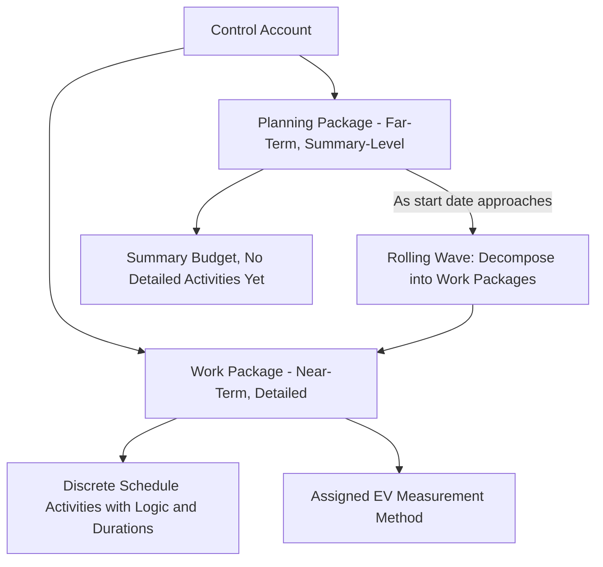

## Work Packages Versus Planning Packages

### Definitions

Both work packages and planning packages are WBS-level components used to manage scope, schedule, and cost, but they differ in the level of detail and certainty available for planning. This distinction is central to **rolling wave planning**, where near-term work is planned in fine detail while distant work is deliberately held at a coarser level until more information becomes available.

- **Work Package**: The lowest level of the WBS at which cost and duration can be reliably estimated and managed. It is decomposed into detailed schedule activities with defined logic, resource assignments, and an assigned Earned Value measurement method.
- **Planning Package**: A WBS component below the control account but above the work package, used when scope is known at a summary level but not yet decomposed into discrete work packages — typically because it lies far enough in the future that detailed planning would be premature or unreliable.

### Why the Distinction Exists

- **Key Points**
  - Detailed planning several months or years in advance is often wasted effort — scope, resource availability, and even sequencing assumptions frequently change before that work begins
  - Planning packages let the **cost baseline (PMB)** hold a fully time-phased budget for the entire project scope (satisfying the 100% Rule) while deferring **schedule/cost detail** for far-term work
  - As the project progresses and the planning package's start date approaches, it is decomposed into discrete work packages — a process explicitly required in formal EVMS environments to maintain baseline integrity

### Structural Position in the WBS/Control Account Hierarchy

### Comparison Table

| Attribute | Work Package | Planning Package |
| --- | --- | --- |
| Level of detail | Fully decomposed into schedule activities | Summary-level scope and budget only |
| Timing | Near-term (within current planning horizon) | Far-term (beyond current rolling wave horizon) |
| Schedule logic | Defined (predecessors/successors, durations) | Not yet defined; represented as a single summary duration |
| EV measurement method | Assigned (0/100, 50/50, % complete, milestones, LOE) | Not assigned until decomposed |
| Budget | Distributed to discrete activities | Held as a lump-sum, time-phased summary budget |
| Control account association | Rolls up directly | Rolls up directly (both sit below the control account) |
| Change control | Managed at activity level | Managed at package level until decomposed |

### Rolling Wave Planning in Practice

- **Key Points**
  - A **planning horizon** is defined (e.g., the next 3 months, or the next project phase) — work within this horizon is decomposed into work packages
  - Work beyond the horizon remains as planning packages with budget/duration held at a summary level
  - As time progresses, planning packages approaching the horizon are decomposed into detailed work packages through a formal, documented process — this decomposition is itself often subject to change control to preserve baseline traceability (the total budget moved from the planning package must equal the sum of the new work packages' budgets, preserving BAC integrity)
- **Example**: On a 24-month plant construction project, months 1–4 are fully decomposed into work packages with detailed CPM logic. Months 5–24 are held as planning packages at the phase level (e.g., "Mechanical Installation — Summary," "Commissioning — Summary"). At the start of month 3, the "Mechanical Installation" planning package covering months 5–8 is decomposed into discrete work packages (piping, equipment setting, instrumentation) as design and procurement information matures.

### Numeric Example: Preserving Baseline Integrity During Decomposition

A planning package "Commissioning — Summary" carries BAC = $600,000 across a 3-month summary duration. When decomposed into work packages:

| New Work Package | Duration | Budget |
| --- | --- | --- |
| System Functional Testing | 4 weeks | $220,000 |
| Punch List Resolution | 3 weeks | $150,000 |
| Performance Testing | 3 weeks | $160,000 |
| Owner Training | 2 weeks | $70,000 |
| **Total** |  | **$600,000** |

The sum of the new work packages' budgets must equal the original planning package's BAC exactly — any discrepancy indicates either scope was inadvertently added/dropped during decomposition, or a formal baseline change is required to reconcile the difference.

### Relationship to EVM Measurement

- **Key Points**
  - Planning packages, by definition, do not yet have an assigned EV measurement method because they lack the discrete deliverables needed to objectively measure percent-complete
  - Some EVM implementations apply **Level of Effort (LOE)** treatment to planning packages before decomposition, since LOE's EV is defined to always equal PV, avoiding false variance signals for work that hasn't truly started being measured in detail — however, this is an implementation convention, not a universal rule, and organizations vary in how they treat undecomposed planning package budget in interim reporting periods [Inference: treatment of planning-package EV prior to decomposition varies by organizational EVMS procedure and is not uniformly standardized across implementations.]
  - Once decomposed, the new work packages inherit standard EV measurement methods appropriate to their nature (0/100, weighted milestones, etc.)

### Common Pitfalls

- Leaving planning packages undecomposed too close to their actual start date, forcing rushed, low-quality work package definition under time pressure
- Losing budget traceability during decomposition — the classic error of the new work packages' summed budget not reconciling to the original planning package BAC
- Applying detailed EV measurement methods (like weighted milestones) to a planning package before it has been properly decomposed, producing spurious precision not supported by actual scope definition
- Treating the planning horizon as fixed rather than adjusting it based on project volatility (highly uncertain projects may need a shorter horizon; stable, well-understood projects can plan further out)
- Failing to document the decomposition event as part of the formal baseline change history, obscuring the audit trail of how the PMB evolved over time

**Related Topics**

- Rolling wave planning and progressive elaboration
- Control accounts and Control Account Plans (CAP)
- Earned Value measurement method selection (0/100, 50/50, LOE, weighted milestones)
- Baseline change control and traceability
- WBS Dictionary development
- Integrated Baseline Review (IBR) and planning package review cadence