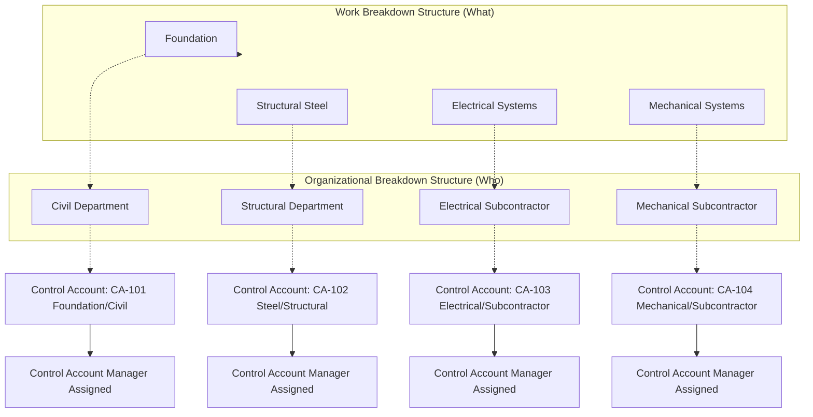

## Organizational Breakdown Structure

### Definition

The Organizational Breakdown Structure (OBS) is a hierarchical representation of the project organization, arranged to show which organizational units (departments, subcontractors, functional groups) are responsible for which portions of project work. Where the WBS answers "what work exists," the OBS answers "who is responsible for it." The two structures are intersected to produce **control accounts** — the fundamental management and EVM measurement unit.

### Purpose and Role in CPM/EVM

- **Key Points**
  - Establishes accountability by linking scope (WBS) to organizational responsibility (OBS)
  - The intersection of a WBS element and an OBS element defines a **control account**, the specific point where budget, schedule, and actual performance are integrated and measured
  - Enables cost and schedule reporting to be rolled up either by deliverable (via WBS) or by organizational unit (via OBS) — both views are usually needed for different stakeholders
  - Required as a foundational structure in formal EVMS environments (per ANSI/EIA-748) to support the assignment of Control Account Managers (CAMs)

### The WBS/OBS Intersection: The Responsibility Assignment Matrix (RAM)

- **Key Points**
  - The RAM (sometimes shown as a matrix or "cost account" grid) crosses WBS elements against OBS elements
  - Each cell where a WBS branch and an OBS branch intersect and both parties agree work is being performed becomes a **control account**
  - A single OBS element (e.g., "Electrical Department") may be responsible for multiple WBS elements across the project; conversely, a single WBS element may require input from multiple OBS elements, but for EVM purposes each control account should have exactly one accountable CAM to avoid diluted accountability

### Diagram: WBS/OBS Intersection Producing Control Accounts

### Typical OBS Hierarchy Levels

| Level | Description | Example |
| --- | --- | --- |
| 0 | Overall project organization | "Riverside Bridge Project Team" |
| 1 | Major functional or organizational groups | "Engineering," "Construction," "Procurement," "Project Controls" |
| 2 | Departments or subcontractor firms | "Structural Engineering," "Civil Subcontractor," "Electrical Subcontractor" |
| 3 | Individual teams or crews | "Structural Design Team A," "Electrical Crew 2" |
| 4 (lowest) | Individual Control Account Managers | Named individual accountable for a control account |

### Example RAM Excerpt

| WBS Element | Civil Dept. | Structural Dept. | Electrical Sub. | Project Controls |
| --- | --- | --- | --- | --- |
| 1.1 Foundation | A/R | C | I | I |
| 1.2 Structural Steel | I | A/R | I | I |
| 1.3 Electrical Rough-In | I | I | A/R | I |
| — Budget/Schedule Integration | — | — | — | A/R |

(A = Accountable, R = Responsible, C = Consulted, I = Informed — a RACI-style variant applied across the WBS/OBS intersection)

### Why OBS Structure Matters for Governance

- **Key Points**
  - Provides the basis for assigning **Control Account Managers (CAMs)** — without a clear OBS, control account accountability defaults ambiguously across multiple parties
  - Supports **resource management** by showing which organizational units are consuming which resources against which WBS scope, important for identifying resource contention across concurrent control accounts
  - Enables differentiated reporting: a functional manager (e.g., Electrical Department head) needs a rollup of all control accounts under their OBS branch across the entire project, while a project manager needs a rollup by WBS branch regardless of which department performs the work
  - Facilitates subcontractor/vendor performance tracking when portions of the OBS represent external organizations subject to contractual EVM reporting requirements

### Relationship to Formal EVMS Standards

- Under ANSI/EIA-748 guidelines, the WBS/OBS intersection into control accounts is a foundational structural requirement — auditors reviewing EVMS compliance specifically verify that control accounts are clearly defined, that each has a single accountable CAM, and that 100% of project scope and organizational responsibility is captured without gaps or overlaps (mirroring the 100% Rule applied jointly to both structures).

### Common Pitfalls

- Defining the OBS around convenient departmental boundaries that don't align cleanly with how work is actually being managed, forcing awkward or split control accounts
- Assigning shared/ambiguous accountability for a control account across multiple organizational units, diluting responsibility for variance explanation and corrective action
- Failing to update the OBS as subcontractors are added, replaced, or organizational restructuring occurs mid-project, leaving the RAM out of sync with actual accountability
- Building the WBS around organizational convenience rather than deliverables (conflating WBS and OBS), which undermines the clean separation the two structures are meant to provide
- Overlooking project controls, quality assurance, or project management functions in the OBS, leaving overhead-type work packages (Level of Effort) without a clearly accountable owner

**Related Topics**

- Responsibility Assignment Matrix (RAM) development
- Control accounts and Control Account Plans (CAP)
- Control Account Manager (CAM) roles and accountability
- ANSI/EIA-748 EVMS guidelines
- Subcontractor and vendor performance reporting
- WBS decomposition and the 100% Rule