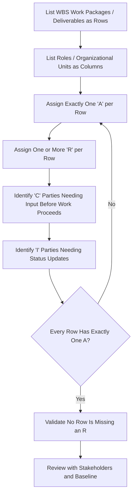

## Responsibility Assignment Matrix and RACI Charts

### Definition

A Responsibility Assignment Matrix (RAM) is a grid that maps project work (typically WBS elements) against organizational units or individuals (OBS elements), documenting who is responsible for each piece of work. RACI is the most widely used RAM notation, assigning one of four role designations — Responsible, Accountable, Consulted, Informed — to each intersection. Together, these tools formalize the WBS/OBS intersection into an explicit accountability structure, which is the organizational foundation for control account assignment in CPM/EVM environments.

### RACI Role Definitions

- **Key Points**
  - **Responsible (R)**: The person or group who actually performs the work. Multiple parties can be Responsible for a given task.
  - **Accountable (A)**: The single person ultimately answerable for correct and complete completion of the work — by convention, only one Accountable party per task/deliverable, to avoid diluted ownership
  - **Consulted (C)**: Subject matter experts or stakeholders whose input is sought before or during the work (two-way communication)
  - **Informed (I)**: Parties who need to be kept up to date on progress or completion (one-way communication)
- **Example**: For "Finalize Structural Design," the Structural Engineer is Responsible, the Engineering Manager is Accountable, the Client's Structural Reviewer is Consulted, and the Project Scheduler is Informed (since the design finalization date affects downstream schedule logic).

### Building a RACI Chart

### Example RACI Chart

| WBS Element / Task | Project Manager | Control Account Manager | Scheduler | Client |
| --- | --- | --- | --- | --- |
| Develop Schedule Baseline | A | R | R | I |
| Approve Schedule Baseline | A | C | I | C |
| Weekly Progress Reporting | I | R | R | I |
| Monthly EVM Analysis (SV/CV/SPI/CPI) | A | R | R | I |
| Corrective Action Plan (variance breach) | A | R | C | I |
| Baseline Change Request (minor) | A | R | C | I |
| Baseline Change Request (major, exceeds threshold) | R | C | C | A |

Note in the last row how Accountability shifts to the Client when a change exceeds a defined threshold — RACI charts should reflect the same escalation logic defined in the project's governance structure, not remain static regardless of the type or magnitude of decision involved.

### Relationship to CPM/EVM Governance

- **Key Points**
  - RACI clarifies **who has authority to approve baseline changes** at each threshold level, directly supporting the change control process that protects PMB integrity
  - Assigns clear **Responsible** parties for progress reporting (the basis of EV claims) and clear **Accountable** parties for variance analysis and corrective action — ambiguity here is a common root cause of delayed corrective action
  - Differentiates **Consulted** (input sought, e.g., a scheduler consulted on resequencing options) from **Informed** (told after the fact, e.g., a client informed of a routine internal reporting cycle) — misclassifying these often leads to either decision bottlenecks (too many C's) or blindsided stakeholders (too many I's where C was warranted)
  - Supports the **Control Account Manager (CAM)** assignment process by making explicit which single individual is Accountable for each control account's performance

### RACI Variants

| Variant | Added Role | Use Case |
| --- | --- | --- |
| RACI | (base model) | General project responsibility assignment |
| RASCI | Support (S) | Distinguishes primary doers from those providing supporting resources |
| RACI-VS | Verifies (V), Signs off (S) | Adds formal verification/approval steps, common in quality-critical or regulated work |
| CAIRO | Omitted (O) | Explicitly documents who is *not* involved, useful for clarifying boundaries in complex matrixed organizations |

[Inference: RASCI, RACI-VS, and CAIRO are established but less universally standardized variants; organizations may define their own additional role letters to fit specific governance needs.]

### Numeric/Practical Example: Diagnosing a Governance Gap

Suppose a control account shows CPI = 0.80 for two consecutive reporting periods with no corrective action taken. A review of the RACI chart reveals:

- The Control Account Manager is Responsible for reporting but not Accountable for corrective action
- No party is listed as Accountable for triggering the Corrective Action Plan process

This gap — a "responsibility hole" — is a direct explanation for the delayed response: reporting happened (R was fulfilled) but no one held clear ownership (A) for acting on the resulting variance. Correcting the RACI chart to explicitly assign Accountability for corrective action closes this gap.

### Common Pitfalls

- Assigning more than one "A" per task, which reintroduces the diluted accountability RACI is meant to eliminate
- Leaving a task with no "R" at all, meaning no one has explicitly agreed to perform the work
- Overusing "C" for parties who only need status updates, creating unnecessary approval bottlenecks and slowing decision cycles
- Treating the RACI chart as a static artifact created once at project start rather than updated as the OBS, contracts, or governance thresholds change
- Building the RACI chart independently of the WBS/OBS/control account structure, producing a document that doesn't actually align with how EVM accountability is formally assigned

**Related Topics**

- Organizational Breakdown Structure (OBS) development
- Control Account Manager (CAM) roles and accountability
- Change control boards and approval thresholds
- Stakeholder roles in schedule and cost governance
- Control Account Plan (CAP) documentation
- Escalation paths for variance thresholds