## History and Origins of CPM

### Overview

The Critical Path Method emerged in the late 1950s from the convergence of two independent efforts in industrial and defense project management: DuPont's chemical plant scheduling work and the U.S. Navy's Polaris missile program. Both addressed the same underlying problem — how to mathematically model project activity dependencies to determine minimum project duration and identify which activities, if delayed, would delay the entire project.

### DuPont and the Origins of CPM Proper

- **Key Points**
  - Developed in 1957 by a team including Morgan R. Walker (DuPont) and James E. Kelley Jr. (Remington Rand/UNIVAC), working on scheduling for plant construction, maintenance, and shutdown projects
  - Motivated by the high cost of plant shutdowns for maintenance — every day of shutdown represented significant lost production, creating strong incentive to mathematically minimize duration
  - Original CPM used a **deterministic** approach: single-point duration estimates per activity, plus an explicit **time-cost tradeoff** function relating activity duration to cost, allowing planners to identify the optimal balance between project duration and total cost (the basis of modern "crashing" analysis)
  - First applied on an industrial scale to a DuPont plant construction project, reportedly reducing shutdown time significantly compared to prior scheduling methods [Unverified: specific percentage improvements cited in some secondary sources vary and are difficult to verify against a single authoritative primary source.]

### PERT and the U.S. Navy Polaris Program

- **Key Points**
  - Developed concurrently (1957–1958) by the U.S. Navy Special Projects Office in conjunction with Booz Allen Hamilton and Lockheed, for the Polaris submarine-launched ballistic missile program
  - **Program Evaluation and Review Technique (PERT)** addressed a different core problem than CPM: the Polaris program involved immense schedule uncertainty (many activities had never been performed before), so PERT introduced **probabilistic** duration estimation using a three-point estimate (optimistic, most likely, pessimistic) and the Beta distribution to calculate expected duration and variance
  - PERT is credited (with some historical debate over the actual degree of impact) with helping accelerate the Polaris program's schedule, contributing to PERT's rapid adoption across U.S. defense and aerospace programs in the following years [Inference: historical accounts differ on how much credit PERT specifically deserves for schedule acceleration versus other concurrent management improvements on the Polaris program.]

### Convergence: CPM and PERT as Related but Distinct Techniques

| Attribute | CPM (DuPont) | PERT (U.S. Navy) |
| --- | --- | --- |
| Origin context | Industrial/chemical plant scheduling | Defense/aerospace R&D program |
| Duration estimation | Deterministic (single-point) | Probabilistic (three-point, Beta distribution) |
| Primary innovation | Time-cost tradeoff, activity network critical path | Schedule uncertainty quantification |
| Typical application | Well-understood, repeatable work (construction, maintenance) | Novel, high-uncertainty work (R&D, first-of-kind systems) |
| Network representation | Originally Activity-on-Arrow (AOA) | Originally Activity-on-Arrow (AOA) |

Over subsequent decades, the distinction between CPM and PERT blurred in common industry usage — many practitioners today use "CPM" as a general term for critical path network scheduling, sometimes incorporating PERT-style three-point estimating within a CPM framework (a hybrid sometimes called PERT/CPM). [Inference: this terminological convergence reflects widespread industry practice rather than a formally standardized merger of the two original methodologies.]

### Timeline

```mermaid
flowchart LR
    A["1956-1957: DuPont/Remington Rand develop CPM for plant scheduling"] --> B["1957-1958: U.S. Navy/Booz Allen/Lockheed develop PERT for Polaris program"]
    B --> C["Early 1960s: Both methods adopted across construction, aerospace, defense"]
    C --> D["1960s-1970s: Precedence Diagramming Method (PDM) developed, replacing Activity-on-Arrow with Activity-on-Node"]
    D --> E["1970s-1980s: Computerized scheduling software emerges (mainframe-based)"]
    E --> F["1980s-1990s: PC-based scheduling software (Primavera, Microsoft Project) widely adopted"]
    F --> G["1990s-2000s: Integration with Earned Value Management becomes standard in government/defense contracting"]
    G --> H["2000s-Present: Cloud-based, resource-loaded, risk-integrated CPM scheduling tools"]
```

### Evolution: From Activity-on-Arrow to Precedence Diagramming

- **Key Points**
  - Original CPM/PERT networks used **Activity-on-Arrow (AOA)** notation, where activities are represented as arrows and nodes represent events (points in time)
  - AOA required "dummy activities" (zero-duration placeholder arrows) to correctly represent certain logical dependencies, which made networks visually cumbersome for complex projects
  - **Precedence Diagramming Method (PDM)**, using **Activity-on-Node (AON)** notation — where activities are nodes and arrows represent dependencies — became dominant from the 1960s–1970s onward, eliminating the need for dummy activities and supporting a richer set of dependency types (Finish-to-Start, Start-to-Start, Finish-to-Finish, Start-to-Finish, plus lead/lag)
  - Virtually all modern scheduling software (Primavera P6, Microsoft Project) implements PDM/AON as the default network representation

### Integration with Earned Value Management

- **Key Points**
  - EVM has separate origins, tracing to U.S. Air Force and Department of Defense cost/schedule control efforts in the 1960s, culminating in the 1967 **Cost/Schedule Control Systems Criteria (C/SCSC)**
  - CPM and EVM developed somewhat independently before becoming formally integrated in defense and government contracting practice — CPM providing the schedule network and PMB time-phasing mechanism, EVM providing the performance measurement framework built atop that baseline
  - C/SCSC was later revised and adopted by industry as the **ANSI/EIA-748 Standard for Earned Value Management Systems** in 1998, cementing the formal linkage between CPM-based scheduling and EVM-based performance measurement in regulated contracting environments

### Legacy and Modern Relevance

- CPM's core mathematical logic (forward pass, backward pass, float calculation) remains unchanged since its original 1957 formulation — modern software automates the arithmetic but does not alter the underlying algorithm
- The time-cost tradeoff concept from original DuPont CPM directly underlies modern schedule compression techniques (crashing analysis)
- PERT's probabilistic approach persists in modern **schedule risk analysis** (e.g., Monte Carlo simulation of activity durations), now typically performed as a supplementary analysis layered atop a deterministic CPM baseline rather than as the primary scheduling method

### Common Pitfalls (in Understanding the History)

- Treating "CPM" and "PERT" as fully interchangeable terms without recognizing their distinct probabilistic vs. deterministic origins, which can cause confusion when discussing schedule risk analysis techniques
- Assuming EVM and CPM were always integrated — historically they developed from different origins (industrial/defense scheduling vs. defense cost control) before formal standards linked them
- Overlooking that dummy activities and AOA notation, while now largely obsolete, still appear in some legacy textbooks and exam materials, causing confusion when compared to modern AON-based software outputs

**Related Topics**

- Activity-on-Node vs. Activity-on-Arrow network diagramming
- Precedence Diagramming Method (PDM) and dependency types
- Three-point (PERT) estimating and Beta distribution
- Cost/Schedule Control Systems Criteria (C/SCSC) and ANSI/EIA-748
- Time-cost tradeoff and schedule crashing
- Schedule risk analysis and Monte Carlo simulation
- Evolution of scheduling software (mainframe to cloud-based)