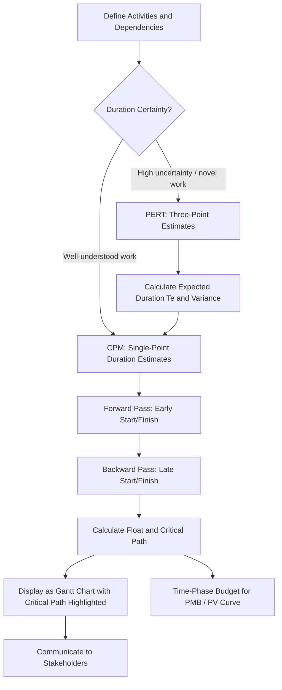

## CPM Compared to PERT and Gantt Charts

### Overview

CPM, PERT, and Gantt charts are three distinct but complementary scheduling tools, each addressing a different aspect of project time management. CPM calculates network logic and identifies the critical path; PERT extends duration estimation to account for uncertainty; Gantt charts provide a visual, calendar-based communication format. Understanding their differences — and how they combine in practice — is foundational before layering EVM analysis on top of the schedule.

### Critical Path Method (CPM)

- **Key Points**
  - A **deterministic** network scheduling technique: each activity has a single-point duration estimate
  - Uses forward pass (calculating early start/early finish) and backward pass (calculating late start/late finish) calculations to determine the **critical path** — the longest sequence of dependent activities, which determines minimum project duration
  - Produces **float/slack** values for every activity, showing schedule flexibility for non-critical work
  - Includes the **time-cost tradeoff** concept (originally from DuPont) enabling crashing analysis — accelerating the schedule by adding resources at increased cost to specific critical activities
  - Modern implementation almost universally uses **Precedence Diagramming Method (PDM)** with Activity-on-Node (AON) notation

### Program Evaluation and Review Technique (PERT)

- **Key Points**
  - A **probabilistic** technique using three-point estimation for each activity duration: optimistic ($O$), most likely ($M$), pessimistic ($P$)
  - Calculates expected duration using the Beta distribution approximation:

    $$T_E = \frac{O + 4M + P}{6}$$
  - Calculates activity variance and standard deviation to quantify schedule uncertainty:

    $$\sigma = \frac{P - O}{6}$$
  - Enables probabilistic statements about project completion (e.g., "70% confidence of completing by Day 120") by summing variances along the critical path and applying the Central Limit Theorem approximation
  - Historically associated with novel, high-uncertainty work (originally the Polaris missile program) rather than repeatable, well-understood construction-type work

### Gantt Charts

- **Key Points**
  - A **visual, calendar-based bar chart** representation of a schedule, with activities listed vertically and time plotted horizontally as horizontal bars
  - Developed independently by Henry Gantt in the early 20th century (predating CPM/PERT by several decades), originally for manufacturing production scheduling
  - Does not, by itself, calculate network logic, float, or the critical path — a Gantt chart is a **display format**, not a scheduling calculation method
  - Modern scheduling software (Primavera P6, Microsoft Project) computes the CPM network logic internally and then **displays the results as a Gantt chart**, often with dependency lines drawn between bars and the critical path highlighted (commonly in red)
  - Excels at stakeholder communication due to its intuitive visual format, but can obscure underlying network logic complexity if dependency lines are not shown or are too dense to read

### Comparative Table

| Attribute | CPM | PERT | Gantt Chart |
| --- | --- | --- | --- |
| Type | Calculation method (network analysis) | Calculation method (probabilistic estimation) | Visualization/display format |
| Duration input | Single-point (deterministic) | Three-point (optimistic/likely/pessimistic) | N/A (displays whatever schedule data exists) |
| Output | Critical path, float, project duration | Expected duration, variance, completion probability | Visual timeline of activities and durations |
| Handles dependencies? | Yes — core function | Yes — core function | Only if paired with underlying network logic |
| Best suited for | Well-understood, repeatable work | Novel, high-uncertainty work | Communicating schedule status to any audience |
| Origin | DuPont, 1957 (industrial) | U.S. Navy, 1957–58 (Polaris program) | Henry Gantt, early 1900s (manufacturing) |

### How They Combine in Practice

### Numeric Example: PERT Feeding a CPM Network

An activity "Develop Prototype Software Module" has no historical precedent, so the team applies PERT three-point estimation:

- Optimistic (O) = 10 days
- Most Likely (M) = 15 days
- Pessimistic (P) = 26 days

$$T_E = \frac{10 + 4(15) + 26}{6} = \frac{96}{6} = 16 \text{ days}$$

$$\sigma = \frac{26 - 10}{6} = 2.67 \text{ days}$$

This expected duration ($T_E = 16$ days) is then used as the single-point duration input for that activity within the broader CPM network's forward/backward pass calculation — demonstrating how PERT and CPM are frequently combined rather than treated as mutually exclusive alternatives, particularly for schedules mixing well-understood and novel work packages.

### Relevance to EVM

- **Key Points**
  - The CPM network's calculated activity dates form the time-phasing structure for **Planned Value (PV)** — without a validated critical path calculation, the PV curve (and thus all EVM variance analysis) has no defensible schedule basis
  - PERT-derived duration variance can inform **schedule risk analysis**, which in mature EVM programs is often reported alongside deterministic SPI/CPI to communicate confidence bounds around the forecasted completion date, not just a single-point EAC
  - Gantt charts remain the primary format for communicating **schedule status and critical path visibility** to stakeholders who may not engage directly with underlying EVM formulas or network calculations

### Common Pitfalls

- Treating a Gantt chart as if it were itself a scheduling calculation method — editing bars directly in a Gantt view without understanding the underlying network logic can silently break dependency relationships
- Applying PERT three-point estimation uniformly across an entire schedule when most activities are well-understood and repeatable, adding unnecessary estimating overhead without meaningfully improving accuracy
- Confusing "critical path" (a CPM output, mathematically defined by zero total float) with "critical-looking activities" as visually judged from a Gantt chart without actually running the network calculation
- Ignoring PERT-calculated variance/confidence levels and presenting a single deterministic completion date as if it carried certainty comparable to well-understood, repeatable work

**Related Topics**

- Forward pass and backward pass calculation mechanics
- Float and slack: total float vs. free float
- Precedence Diagramming Method (PDM) and dependency types
- Schedule risk analysis and Monte Carlo simulation
- Time-cost tradeoff and schedule crashing
- Planned Value (PV) curve development from the schedule baseline