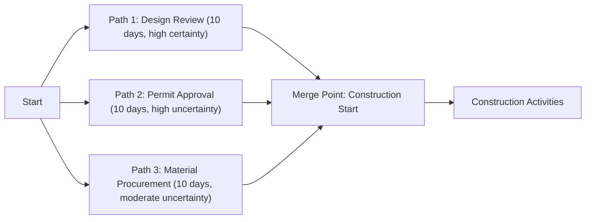

## Deterministic Versus Probabilistic Scheduling

### Overview

Deterministic and probabilistic scheduling represent two fundamentally different philosophies for handling uncertainty in activity duration estimation. Deterministic scheduling (classical CPM) assumes each activity duration is a known, fixed value; probabilistic scheduling explicitly models duration as a range or distribution, acknowledging that estimates carry inherent uncertainty. Understanding when and how to apply each approach — and how to interpret their outputs — is essential to producing defensible schedule and cost forecasts.

### Deterministic Scheduling

- **Key Points**
  - Each activity is assigned a **single-point duration estimate** (e.g., "Excavation: 5 days")
  - Forward pass and backward pass calculations produce a single, fixed project completion date and a single critical path
  - Assumes duration estimates are accurate and that no significant variability exists in execution — an assumption more defensible for well-understood, repeatable work with strong historical data
  - Computationally simple, fast to calculate and update, and the basis for virtually all commercial scheduling software's default output (Primavera P6, Microsoft Project)
  - Provides no native way to express confidence level — a stated completion date of "Day 180" gives no indication of how likely that date actually is to be achieved

### Probabilistic Scheduling

- **Key Points**
  - Models each activity duration as a **range or distribution** rather than a fixed number — classically the PERT three-point estimate (optimistic, most likely, pessimistic), or more rigorously, a full probability distribution (Triangular, Beta, PERT distribution, Lognormal) used in **Monte Carlo simulation**
  - Produces a **distribution of possible project completion dates**, not a single date — allowing statements like "there is an 80% probability of completing by Day 195"
  - Explicitly surfaces **schedule risk**, including the phenomenon of **merge bias** (also called "merge point risk"): when multiple paths converge at a single successor activity, the probability of *all* paths finishing on time is lower than the probability of any single path finishing on time, meaning near-critical paths can meaningfully affect overall project risk even though they are not the mathematically "critical" path in a deterministic model
  - Requires more data, more computational effort (typically thousands of simulation iterations), and more sophisticated software (e.g., @RISK, Primavera Risk Analysis, or Monte Carlo add-ins) than deterministic CPM

### Comparative Table

| Attribute | Deterministic Scheduling | Probabilistic Scheduling |
| --- | --- | --- |
| Duration input | Single-point estimate | Range/distribution (3-point, or full distribution) |
| Output | Single completion date, single critical path | Distribution of completion dates, confidence levels |
| Computation | Simple forward/backward pass | Monte Carlo simulation (iterative) |
| Handles path convergence risk (merge bias)? | No — hidden by design | Yes — explicitly surfaced |
| Typical tool | Primavera P6, Microsoft Project (standard mode) | Monte Carlo simulation add-ins, @RISK, Primavera Risk Analysis |
| Best suited for | Baseline planning, EVM's PV time-phasing, contractual milestone commitment | Risk assessment, contingency/reserve sizing, confidence-based reporting |
| Communicates uncertainty? | No (single date implies false precision) | Yes (explicit probability distributions) |

### Merge Bias Illustrated

Even if each of the three converging paths individually has an 80% chance of finishing by Day 10, the probability that *all three* finish by Day 10 (required for Construction Start to begin on time) is mathematically lower than 80% — a deterministic CPM model, which only tracks the single longest (critical) path, would not surface this compounding risk from the near-critical paths feeding the same merge point. [Inference: the magnitude of this effect depends on the correlation and variance structure of the specific paths involved and cannot be generalized to a fixed percentage without simulation.]

### Numeric Example: PERT Estimate as a Bridge Between the Two Approaches

Consider an activity "Regulatory Approval" with:

- Optimistic (O) = 20 days
- Most Likely (M) = 35 days
- Pessimistic (P) = 80 days

$$T_E = \frac{20 + 4(35) + 80}{6} = \frac{240}{6} = 40 \text{ days}$$

$$\sigma = \frac{80 - 20}{6} = 10 \text{ days}$$

A deterministic schedule would simply use $T_E = 40$ days as the fixed input to the CPM network. A probabilistic (Monte Carlo) model would instead sample durations from a distribution centered near this estimate across thousands of iterations, propagating the variance through the entire network to produce a completion date distribution — revealing, for instance, that while the deterministic model shows Day 200 as the project finish, only a 55% probability of actually achieving Day 200 exists once full network uncertainty is modeled.

### Relevance to EVM

- **Key Points**
  - EVM's Planned Value (PV) baseline is, by convention, built from the **deterministic** schedule — a single, approved time-phased budget curve is required for the PMB to function as a fixed reference point for variance measurement
  - Probabilistic analysis is typically layered *alongside* the deterministic PMB as a supplementary risk assessment, informing **contingency reserve sizing** and **confidence-based forecasting** (e.g., reporting EAC not as a single number but as a range with associated probability), rather than replacing the deterministic baseline itself
  - Schedule Performance Index (SPI), a purely deterministic-baseline-derived metric, gives no indication of the underlying schedule risk from unconverged near-critical paths — a project could show SPI = 1.0 while still carrying substantial hidden risk from merge bias on secondary paths

### When to Use Each Approach

- **Deterministic** is appropriate for: contractual baseline commitments, day-to-day progress tracking, EVM's PV/PMB structure, and well-understood repeatable work
- **Probabilistic** is appropriate for: contingency/reserve sizing, high-uncertainty R&D or first-of-kind work, communicating confidence levels to executives/clients, and identifying hidden risk from path convergence that a single critical path calculation would miss

### Common Pitfalls

- Presenting a deterministic single-point completion date to stakeholders as though it carries a guaranteed or high-confidence outcome, without disclosing the underlying uncertainty
- Running Monte Carlo simulation without first validating that the underlying deterministic network logic (dependencies, durations) is itself correct — simulating a flawed network only produces a more precisely wrong answer
- Ignoring near-critical paths entirely because they are not the single mathematically critical path, missing merge bias risk at key convergence points
- Applying probabilistic methods indiscriminately across an entire large schedule, generating excessive analytical overhead where deterministic estimates would have been sufficiently accurate for well-understood work packages

**Related Topics**

- Monte Carlo simulation for schedule risk analysis
- Merge bias and path convergence risk
- Three-point (PERT) estimating techniques
- Contingency and management reserve sizing
- Forward pass and backward pass calculation mechanics
- Near-critical path identification and monitoring
- Confidence-based EAC forecasting