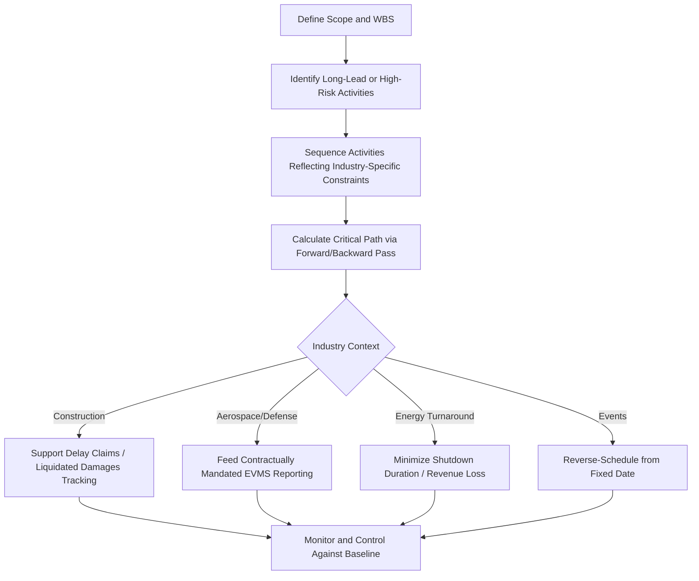

## Industries and Applications of CPM

### Overview

While the Critical Path Method originated in chemical plant maintenance scheduling, its mathematical framework — network logic, forward/backward pass, float calculation — generalizes to any endeavor composed of interdependent tasks with durations. CPM is now applied across a wide range of industries, with the specific value proposition (cost control, regulatory compliance, risk mitigation, resource optimization) shifting depending on sector characteristics.

### Construction and Infrastructure

- **Key Points**
  - The most mature and widespread application domain for CPM; virtually all large construction and infrastructure projects use CPM scheduling as a contractual deliverable
  - Supports **delay claims and forensic schedule analysis** — CPM networks are used to apportion responsibility for schedule overruns between owner and contractor (e.g., Time Impact Analysis, Windows Analysis, As-Planned vs. As-Built comparison)
  - Frequently tied to **liquidated damages clauses**, where contractual penalties accrue based on missed CPM-derived milestone dates
  - Resource-loaded and cost-loaded CPM schedules directly feed EVM reporting on public infrastructure contracts
- **Example**: A highway interchange project uses CPM to sequence earthwork, drainage, bridge structures, and paving, identifying that bridge girder delivery lead time — not the visually larger earthwork package — actually drives the critical path.

### Aerospace and Defense

- **Key Points**
  - Historical origin point (via PERT) for probabilistic scheduling under high technical uncertainty
  - CPM/EVM integration is often **contractually mandated** on U.S. government contracts per ANSI/EIA-748 EVMS guidelines, particularly for major weapons systems and space programs
  - Long lead times for specialized components (e.g., custom avionics, propulsion systems) frequently drive the critical path rather than assembly or integration activities
  - High reliance on schedule risk analysis (Monte Carlo simulation) layered atop deterministic CPM baselines due to first-of-kind engineering uncertainty

### Information Technology and Software Development

- **Key Points**
  - Applied in traditional (waterfall/predictive) IT projects: infrastructure rollouts, ERP implementations, system migrations
  - Less directly applicable to agile software development, where iterative, adaptive life cycles use different progress measurement (velocity, story points) rather than classical activity-network duration estimating — though **hybrid approaches** exist, applying CPM/EVM at a program level (e.g., release milestones) while individual sprints use agile methods [Inference: the specific hybrid techniques used vary significantly by organization and are not standardized industry-wide.]
  - Critical path in IT projects often runs through testing, data migration validation, or third-party vendor/API integration dependencies rather than pure development effort

### Manufacturing and Product Development

- **Key Points**
  - Used for new product introduction (NPI) scheduling, coordinating design, tooling, supplier qualification, and pilot production
  - Long-lead procurement items (custom tooling, specialized components) frequently define the critical path rather than internal engineering or assembly activities
  - Integrates with **Design for Manufacturing (DFM)** review gates, where CPM identifies the schedule impact of design iteration cycles

### Healthcare and Pharmaceutical

- **Key Points**
  - Applied to clinical trial scheduling, regulatory submission timelines, and hospital/facility construction projects
  - Regulatory approval milestones (e.g., FDA review cycles) are frequently high-variance, high-impact activities well-suited to probabilistic (PERT-style) duration modeling layered onto the CPM network
  - Facility commissioning projects (hospitals, labs) use CPM similarly to general construction but with added complexity from specialized regulatory/compliance inspection sequencing

### Energy and Utilities

- **Key Points**
  - Power plant construction, transmission line projects, and refinery/petrochemical turnarounds (planned maintenance shutdowns) are direct descendants of CPM's original DuPont application context
  - Turnaround/shutdown scheduling remains one of the highest-stakes CPM applications, since production losses during shutdown are often measured in significant revenue per day, closely mirroring the original 1957 use case
  - Renewable energy project development (solar, wind) uses CPM to sequence permitting, interconnection studies, procurement, and construction — permitting and interconnection often dominate the critical path rather than physical construction

### Event and Program Management

- **Key Points**
  - Applied to large-scale event planning (conferences, product launches, major sporting events) where fixed, immovable end dates create unusually rigid schedule constraints
  - CPM here often emphasizes reverse-scheduling from a fixed launch/event date, identifying which preparatory activities have zero float given that hard deadline

### Cross-Industry Comparison

| Industry | Typical Critical Path Driver | EVM Integration Maturity |
| --- | --- | --- |
| Construction/Infrastructure | Long-lead materials, permitting, weather | High (especially public sector) |
| Aerospace/Defense | Specialized component lead time, technical uncertainty | Very high (often contractually mandated) |
| IT/Software (traditional) | Testing, data migration, vendor integration | Moderate |
| Manufacturing/NPI | Custom tooling, supplier qualification | Moderate |
| Healthcare/Pharma | Regulatory review cycles | Low to moderate |
| Energy/Utilities | Permitting, interconnection, shutdown duration | High (especially regulated utilities) |
| Events/Programs | Fixed end-date reverse scheduling | Low |

### Diagram: Common Cross-Industry CPM Application Pattern

### Common Pitfalls Across Industries

- Applying a generic CPM template without adapting activity granularity and dependency logic to the industry's actual risk drivers (e.g., treating permitting as a simple fixed-duration activity in industries where it is highly variable)
- Underestimating the schedule impact of long-lead procurement items because they appear administratively simple compared to visible on-site construction or engineering work
- Applying classical CPM/EVM formulas to agile or highly adaptive work without appropriate tailoring, producing metrics that don't meaningfully reflect actual progress
- Failing to adapt EVM measurement methods to industry-specific deliverable types (e.g., regulatory milestone-based EV claiming in pharma vs. physical percent-complete in construction)

**Related Topics**

- Forensic schedule analysis and delay claims (Time Impact Analysis, Windows Analysis)
- ANSI/EIA-748 EVMS guidelines in government contracting
- Turnaround/shutdown scheduling optimization
- Hybrid agile-CPM/EVM approaches for IT programs
- Long-lead procurement scheduling and supply chain risk
- Reverse scheduling from fixed milestone dates