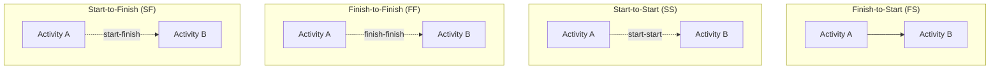

## Core CPM Terminology and Definitions

### Purpose

This reference establishes the precise vocabulary used throughout Critical Path Method scheduling. Consistent terminology is essential because CPM calculations are unforgiving of ambiguity — terms like "float" and "slack" are often used interchangeably in casual speech but carry distinct calculated meanings, and confusing them leads directly to scheduling errors.

### Fundamental Network Elements

- **Activity**: A discrete unit of work with an identifiable start and finish, consuming time and typically resources. The basic building block of a CPM network.
- **Milestone**: A significant point or event in the schedule with zero duration, typically marking the completion of a deliverable or phase (e.g., "Design Approved," "Substantial Completion").
- **Node**: In Precedence Diagramming Method (PDM), a box or box-like element representing an activity (Activity-on-Node notation).
- **Arrow/Link**: A line connecting two nodes, representing the logical dependency (relationship) between them.
- **Network Diagram**: The complete graphical representation of all activities and their logical relationships.
- **Predecessor**: An activity that must occur before another activity, per the defined dependency.
- **Successor**: An activity that occurs after another activity, per the defined dependency.

### Dependency (Relationship) Types

- **Key Points**
  - **Finish-to-Start (FS)**: Successor cannot start until predecessor finishes (the most common relationship type)
  - **Start-to-Start (SS)**: Successor cannot start until predecessor starts
  - **Finish-to-Finish (FF)**: Successor cannot finish until predecessor finishes
  - **Start-to-Finish (SF)**: Successor cannot finish until predecessor starts (rare in practice)
  - **Lead**: A negative lag — allows the successor to begin before the predecessor relationship would otherwise permit (e.g., FS with a 3-day lead means the successor can start 3 days before the predecessor finishes)
  - **Lag**: A required delay inserted after a dependency is satisfied (e.g., FS with a 2-day lag means the successor starts 2 days after the predecessor finishes, such as concrete cure time)

### Diagram: Dependency Types

### Duration and Date Terminology

- **Duration**: The estimated time required to complete an activity, typically expressed in working days or hours.
- **Early Start (ES)**: The earliest possible date an activity can begin, given its predecessor logic, calculated via the **forward pass**.
- **Early Finish (EF)**: The earliest possible date an activity can finish; calculated as $EF = ES + Duration$.
- **Late Start (LS)**: The latest an activity can begin without delaying the project finish date, calculated via the **backward pass**.
- **Late Finish (LF)**: The latest an activity can finish without delaying the project finish date.
- **Forward Pass**: The network calculation moving from project start to project finish, computing ES and EF for every activity.
- **Backward Pass**: The network calculation moving from project finish to project start, computing LS and LF for every activity.
- **Data Date (Status Date)**: The point in time as of which schedule progress is reported; distinguishes completed/in-progress work from future work in an updated schedule.

### Float and Criticality

- **Key Points**
  - **Total Float (TF)**: The amount of time an activity can be delayed without delaying the overall project finish date. Calculated as:

    $$TF = LS - ES = LF - EF$$
  - **Free Float (FF)**: The amount of time an activity can be delayed without delaying the **early start** of its immediate successor(s) — a stricter, more localized measure than total float.
  - **Critical Path**: The longest continuous sequence of dependent activities through the network, determining the minimum possible project duration. By definition, activities on the critical path have **zero (or the minimum) total float**.
  - **Critical Activity**: Any activity with zero total float (or the project's designated float threshold for criticality).
  - **Near-Critical Path**: A path with total float close to, but not equal to, zero — carries elevated risk of becoming critical if delays consume the available float.
  - Note: "float" and "slack" are widely used as synonyms in practice, though "slack" is sometimes used specifically for node/event-level float in older Activity-on-Arrow (AOA) contexts. [Inference: usage conventions for "float" vs. "slack" vary by textbook, software, and regional practice rather than following one universally fixed distinction.]

### Numeric Example: Float Calculation

Activity "Install Windows" has:

- Early Start (ES) = Day 40, Early Finish (EF) = Day 45
- Late Start (LS) = Day 48, Late Finish (LF) = Day 53

$$TF = LS - ES = 48 - 40 = 8 \text{ days}$$

This activity can be delayed up to 8 days without pushing back the overall project finish date. If its successor's Early Start were Day 44 rather than being driven by this activity's own late dates, the **Free Float** calculation would separately measure delay tolerance specifically against that successor's schedule.

### Schedule Compression Terminology

- **Crashing**: Adding resources (labor, equipment, overtime) to critical path activities to shorten their duration, at increased cost — directly descended from DuPont's original time-cost tradeoff concept.
- **Fast-Tracking**: Performing activities in parallel that were originally planned sequentially, shortening overall duration but typically increasing risk (e.g., starting construction before design is 100% complete).
- **Resource Leveling**: Adjusting activity start/finish dates within available float to resolve resource over-allocation, potentially extending the project finish date.
- **Resource Smoothing**: Adjusting activity timing within available float to reduce resource demand fluctuations *without* extending the critical path or project finish date.

### Baseline and Progress Terminology

- **Baseline Schedule**: The approved version of the schedule, frozen as the reference point for progress measurement.
- **Target Dates**: Dates set as goals, which may differ from calculated CPM dates (e.g., a contractually imposed finish date earlier than the CPM-calculated critical path finish, resulting in **negative total float**).
- **Negative Float**: Occurs when a constraint (e.g., a mandatory contractual finish date) is earlier than the calculated late finish date, indicating the schedule as currently logic-driven cannot meet the imposed deadline without intervention.
- **Percent Complete**: A measure of progress on an activity, used as input to Earned Value calculations depending on the assigned EV measurement method.

### Reference Table: Key Formulas

| Term | Formula |
| --- | --- |
| Early Finish | $EF = ES + Duration$ |
| Late Start | $LS = LF - Duration$ |
| Total Float | $TF = LS - ES$ (equivalently $LF - EF$) |
| Free Float | $FF = \min(ES_{successors}) - EF_{current activity}$ |
| PERT Expected Duration | $T_E = \dfrac{O + 4M + P}{6}$ |
| PERT Standard Deviation | $\sigma = \dfrac{P - O}{6}$ |

### Common Pitfalls

- Confusing Total Float with Free Float — a non-critical activity can have substantial total float but zero free float if delaying it at all would immediately push back a tightly-linked successor
- Treating "critical path" as a fixed, permanent designation rather than something that must be recalculated as the schedule updates — the critical path can shift to a different sequence as progress occurs or logic changes
- Misinterpreting negative float as a calculation error rather than correctly recognizing it as a signal that an imposed constraint date is incompatible with current network logic
- Using "slack" and "float" inconsistently within the same project documentation, causing confusion between team members trained on different software or textbook conventions

**Related Topics**

- Forward pass and backward pass calculation mechanics
- Precedence Diagramming Method (PDM) dependency types
- Schedule compression: crashing vs. fast-tracking
- Resource leveling vs. resource smoothing
- Near-critical path monitoring and risk
- Negative float and constraint date management