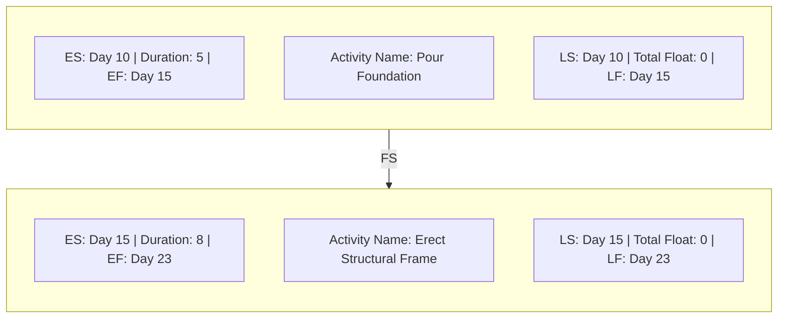
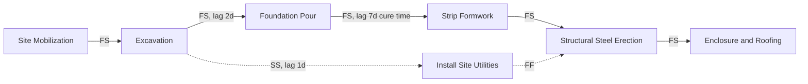

## Precedence Diagramming Method

### Definition

The Precedence Diagramming Method (PDM) is the network diagramming technique in which activities are represented as nodes (boxes) and logical dependencies are represented as arrows connecting those nodes — hence its alternate name, **Activity-on-Node (AON)**. PDM is the diagramming standard implemented by virtually all modern scheduling software (Primavera P6, Microsoft Project) and has effectively superseded the older Activity-on-Arrow (AOA) approach used in original CPM/PERT formulations.

### Structural Components

- **Key Points**
  - **Node**: Represents a single activity, typically displayed as a box containing the activity name, duration, and calculated dates (ES, EF, LS, LF)
  - **Arrow**: Represents the dependency relationship between two activities; does not itself consume time or resources (unlike in AOA, where arrows represented activities)
  - **No dummy activities required**: Unlike AOA, PDM can express all necessary logical relationships directly through arrow type and lag/lead values, eliminating the zero-duration placeholder arrows AOA required for certain dependency patterns

### The Four Dependency Types in PDM

- **Key Points**
  - **Finish-to-Start (FS)**: Successor starts only after predecessor finishes — the default and most common relationship (e.g., "Pour Foundation" must finish before "Erect Structural Frame" starts)
  - **Start-to-Start (SS)**: Successor starts only after predecessor starts — used for activities that can proceed in tandem once initiated (e.g., "Excavate Trench" and "Lay Conduit" may both start once mobilization begins, with a defined offset)
  - **Finish-to-Finish (FF)**: Successor finishes only after predecessor finishes — used when completion of one activity is gated by completion of another (e.g., "Final Inspection" cannot finish until "Punch List Resolution" finishes)
  - **Start-to-Finish (SF)**: Successor cannot finish until predecessor starts — the rarest relationship type, typically seen in specialized scenarios such as shift-changeover logic (e.g., outgoing security shift cannot finish until incoming shift starts)

### Standard PDM Node Layout (as displayed in scheduling software)

### Lead and Lag in PDM

- **Key Points**
  - **Lag**: A required waiting period inserted into a dependency (e.g., FS + 3 days lag means the successor starts 3 days after the predecessor finishes, commonly used for concrete curing time, paint drying, or approval processing delays)
  - **Lead**: A negative lag, allowing the successor to begin before the dependency would otherwise strictly permit (e.g., FS – 2 days lead means the successor can begin 2 days before the predecessor finishes, representing planned overlap)
  - Leads and lags apply to any of the four dependency types, not just Finish-to-Start
- **Example**: "Concrete Pour" (FS) → "Strip Formwork," with a 7-day lag representing mandatory concrete cure time before formwork removal is permitted.

### PDM Network Example with Multiple Relationship Types

In this example, "Install Site Utilities" (E) begins shortly after Excavation begins (SS relationship) but must finish no later than when Structural Steel Erection (F) finishes (FF relationship) — illustrating how PDM's flexible relationship types capture realistic overlapping and constrained work patterns that a simple chain of Finish-to-Start relationships could not represent.

### Calculating the Network: Forward and Backward Pass in PDM

- **Key Points**
  - **Forward Pass**: Proceeds from the first activity to the last, computing Early Start (ES) and Early Finish (EF) for each node based on predecessor logic and any applicable leads/lags
  - **Backward Pass**: Proceeds from the last activity back to the first, computing Late Finish (LF) and Late Start (LS) based on successor logic
  - **Total Float** for each activity: $TF = LS - ES$
  - The **critical path** is the sequence of activities with the minimum total float (typically zero) running from project start to project finish

### PDM Versus Activity-on-Arrow (AOA): Why PDM Prevailed

| Attribute | PDM (Activity-on-Node) | AOA (Activity-on-Arrow) |
| --- | --- | --- |
| Activity representation | Node (box) | Arrow |
| Dependency representation | Arrow | Node (event) |
| Dummy activities needed? | No | Yes, for certain logic patterns |
| Relationship types supported | FS, SS, FF, SF (with lead/lag) | Effectively FS only (without workarounds) |
| Software implementation | Universal in modern tools | Largely obsolete, seen in legacy/academic contexts |
| Visual complexity for large networks | Lower (no dummy arrows cluttering diagram) | Higher |

### Relevance to EVM

- **Key Points**
  - The PDM network's calculated ES/EF dates directly determine the **Planned Value (PV)** time-phasing — each activity's budgeted cost is distributed across its scheduled duration according to the network's calculated dates
  - Accurate PDM logic (correct relationship types, leads/lags reflecting real constraints like cure times or regulatory review periods) is a prerequisite for a defensible PMB; incorrect dependency types (e.g., using FS where SS with lag would be more accurate) can distort the entire time-phased budget curve
  - Schedule updates during Execution/Monitoring & Controlling recalculate the PDM network using the current data date, which then feeds updated forecasts (EAC, ETC) — errors or oversimplifications in the original PDM logic compound as the schedule is repeatedly updated

### Common Pitfalls

- Defaulting every relationship to Finish-to-Start out of habit, even when Start-to-Start or Finish-to-Finish would more accurately model real overlapping work, resulting in an artificially long (or short) calculated project duration
- Overusing lags to force a desired schedule outcome rather than to represent genuine physical or process constraints (e.g., cure time, regulatory review), which obscures the true logic and makes the schedule harder to audit or update
- Failing to model resource-driven Start-to-Start or Finish-to-Finish relationships, causing the network to imply artificial parallelism or sequencing that doesn't reflect actual resource constraints
- Neglecting to update lead/lag values when underlying assumptions change (e.g., a revised concrete mix design shortens cure time), leaving stale constraints baked into the network

**Related Topics**

- Forward pass and backward pass calculation mechanics
- Activity-on-Arrow (AOA) and dummy activities (legacy comparison)
- Lead and lag application in schedule development
- Total float vs. free float calculation
- Schedule baseline and PV time-phasing
- Resource-driven scheduling constraints