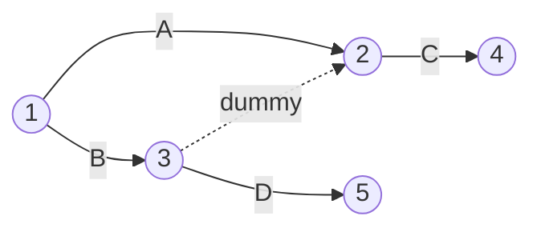

## Arrow Diagramming Method

### Definition and Overview

The Arrow Diagramming Method (ADM), also known as Activity-on-Arrow (AOA), is a network diagramming technique used in project scheduling where activities are represented as arrows and events (points in time) are represented as nodes (circles). The direction of the arrow indicates the logical sequence and flow of work from one event to the next.

Unlike the more commonly used Precedence Diagramming Method (PDM), where activities are placed on nodes, ADM places the activity itself along the connecting line, while the nodes mark the start and finish of that activity.

### Core Components

**Key Points**

- **Arrow (Branch)**: Represents an activity. The length of the arrow has no bearing on duration; it is purely a symbolic representation.
- **Node (Event)**: Represents a point in time — the start or completion of one or more activities. Nodes are typically numbered sequentially (i-j notation), where "i" is the tail event and "j" is the head event.
- **Dummy Activity**: A special zero-duration arrow (drawn as a dashed line) used solely to preserve correct logical dependencies when two or more activities share the same start and end nodes, or to show a dependency without consuming time or resources.

### i-j Notation

Every activity in ADM is uniquely identified by its tail node (i) and head node (j), commonly written as Activity (1-2), (2-3), etc. This numbering convention:

- Must ensure the head node number is always greater than the tail node number (i < j), preserving a left-to-right logical flow.
- Prevents two different activities from sharing the same i-j pair, which is where dummy activities become necessary.

### The Need for Dummy Activities

Dummy activities solve two distinct problems:

1. **Identity Problem**: When two parallel activities start and end at the same nodes (e.g., Activity A and Activity B both run from Node 1 to Node 2), they cannot both be labeled (1-2). A dummy is inserted to give one activity a unique i-j identifier.
2. **Logic Problem**: When an activity is dependent on only part of the preceding work, not all of it, a dummy arrow enforces the correct partial dependency without implying a false relationship.

**Example**

Consider this dependency scenario:

- Activity A precedes Activity C
- Activity B precedes both Activity C and Activity D
- Activity A does **not** precede Activity D

If A and B were drawn converging directly into a single node before splitting into C and D, the diagram would incorrectly show that A precedes D. The correct solution uses a dummy:

Here, the dummy (dashed) forces C to depend on both A and B, while D depends only on B, preserving accurate logic.

### Visual Structure (SVG)

<svg xmlns="http://www.w3.org/2000/svg" viewBox="0 0 640 220">
<text x="20" y="20" font-size="13" font-family="sans-serif" fill="#333">Arrow Diagramming Method — Activity on Arrow (svg_diagram)</text>
<circle cx="60" cy="120" r="20" fill="none" stroke="#2b6cb0" stroke-width="2" />
<text x="55" y="125" font-size="12" font-family="sans-serif">1</text>
<circle cx="220" cy="120" r="20" fill="none" stroke="#2b6cb0" stroke-width="2" />
<text x="215" y="125" font-size="12" font-family="sans-serif">2</text>
<circle cx="380" cy="60" r="20" fill="none" stroke="#2b6cb0" stroke-width="2" />
<text x="375" y="65" font-size="12" font-family="sans-serif">3</text>
<circle cx="380" cy="180" r="20" fill="none" stroke="#2b6cb0" stroke-width="2" />
<text x="375" y="185" font-size="12" font-family="sans-serif">4</text>
<circle cx="540" cy="120" r="20" fill="none" stroke="#2b6cb0" stroke-width="2" />
<text x="535" y="125" font-size="12" font-family="sans-serif">5</text>

<line x1="80" y1="120" x2="200" y2="120" stroke="#333" stroke-width="2" marker-end="url(#arrow)" />
<text x="130" y="112" font-size="12" font-family="sans-serif">A (1-2)</text>
<line x1="238" y1="112" x2="360" y2="68" stroke="#333" stroke-width="2" marker-end="url(#arrow)" />
<text x="260" y="82" font-size="12" font-family="sans-serif">B (2-3)</text>
<line x1="238" y1="128" x2="360" y2="172" stroke="#333" stroke-width="2" marker-end="url(#arrow)" />
<text x="260" y="165" font-size="12" font-family="sans-serif">C (2-4)</text>
<line x1="380" y1="80" x2="380" y2="160" stroke="#e53e3e" stroke-width="2" stroke-dasharray="6,4" marker-end="url(#arrow)" />
<text x="390" y="122" font-size="12" font-family="sans-serif" fill="#e53e3e">Dummy (3-4)</text>
<line x1="398" y1="68" x2="524" y2="112" stroke="#333" stroke-width="2" marker-end="url(#arrow)" />
<text x="440" y="82" font-size="12" font-family="sans-serif">D (3-5)</text>
<line x1="398" y1="180" x2="524" y2="128" stroke="#333" stroke-width="2" marker-end="url(#arrow)" />
<text x="440" y="165" font-size="12" font-family="sans-serif">E (4-5)</text>
</svg>

### Forward and Backward Pass in ADM

Time analysis in ADM is performed at the **event (node)** level rather than the activity level, unlike PDM:

- **Earliest Event Time (EET)**: The earliest time an event can occur, computed via forward pass:

  $$EET_j = \max(EET_i + Duration_{i-j})$$

  for all activities entering node j.
- **Latest Event Time (LET)**: The latest time an event can occur without delaying the project, computed via backward pass:

  $$LET_i = \min(LET_j - Duration_{i-j})$$

  for all activities leaving node i.
- **Total Float** for an activity (i-j) is calculated as:

  $$TF = LET_j - EET_i - Duration_{i-j}$$

Because float here is computed on shared events, a single event's slack can be ambiguous when multiple activities converge on it — a key structural limitation compared to PDM's activity-based float.

### ADM vs. PDM Comparison

| Aspect | ADM (Activity-on-Arrow) | PDM (Precedence Diagramming) |
| --- | --- | --- |
| Activity representation | Arrows (lines) | Nodes (boxes) |
| Event representation | Nodes (circles) | Not used |
| Dummy activities | Required | Not needed |
| Relationship types | Finish-to-Start only | FS, SS, FF, SF with lag/lead |
| Modern software support | Rare/legacy | Standard (MS Project, Primavera P6) |
| Complexity for large networks | High (dummy proliferation) | Lower |

### Relationship to CPM

ADM was the original diagramming convention used in the earliest formulations of the Critical Path Method (developed by DuPont and Remington Rand in the late 1950s). The critical path in an ADM network is the sequence of activities (arrows) connecting events with zero total float — i.e., where $EET = LET$ at both the tail and head nodes and the connecting activity consumes no slack.

[Unverified] Some historical CPM literature and specific certification exam materials may treat ADM as functionally interchangeable with early CPM notation; practitioners should confirm which convention (ADM or PDM) is expected in a given certification context (e.g., PMP references PDM as the standard).

### Practical Limitations

- **Scalability**: Large projects generate excessive dummy activities, making diagrams visually cluttered and error-prone to maintain manually.
- **Relationship Rigidity**: ADM only natively supports Finish-to-Start (FS) logic; overlapping or lag-based relationships require workarounds using dummies and split activities.
- **Tooling**: Most modern project management software (Primavera P6, Microsoft Project, Oracle) has standardized on PDM/AON, making ADM largely a historical and academic teaching tool today rather than an industry-deployed method.

### Worked Example

Given the following activities:

| Activity | i-j | Duration (days) |
| --- | --- | --- |
| A | 1-2 | 4 |
| B | 1-3 | 3 |
| C | 2-4 | 5 |
| D | 3-4 | 6 |
| E | 4-5 | 2 |

Forward pass:

- $EET_1 = 0$
- $EET_2 = 0 + 4 = 4$
- $EET_3 = 0 + 3 = 3$
- $EET_4 = \max(4+5, 3+6) = \max(9, 9) = 9$
- $EET_5 = 9 + 2 = 11$

Backward pass (from $LET_5 = 11$):

- $LET_4 = 11 - 2 = 9$
- $LET_3 = 9 - 6 = 3$
- $LET_2 = 9 - 5 = 4$
- $LET_1 = \min(4-4, 3-3) = 0$

Critical path: Since both A-C (4+5=9) and B-D (3+6=9) reach node 4 at the same time with zero float on both chains, this network has **two concurrent critical paths**: 1-2-4-5 (via A, C, E) and 1-3-4-5 (via B, D, E), each totaling 11 days.

**Next Steps**

- Precedence Diagramming Method (PDM) and the four dependency types (FS, SS, FF, SF)
- Critical Path Method (CPM) forward/backward pass mechanics
- Free Float vs. Total Float calculations
- Network diagram software conventions (Primavera P6, MS Project)
- Program Evaluation and Review Technique (PERT) and its ADM lineage
- Lag and Lead time modeling in modern scheduling networks