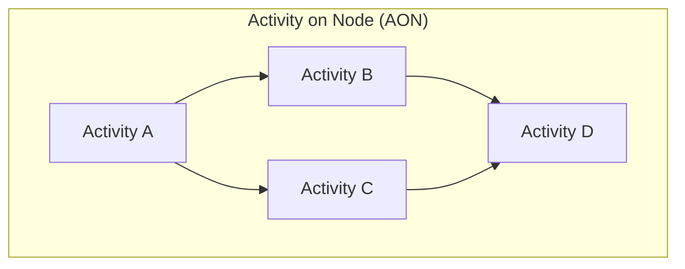
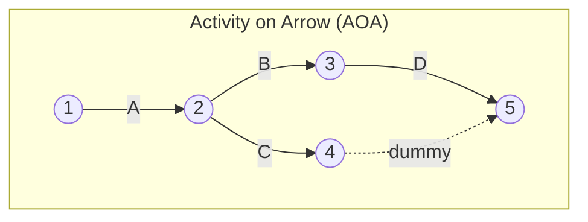

## Activity on Node versus Activity on Arrow

### Overview

Activity on Node (AON) and Activity on Arrow (AOA) are the two foundational conventions for representing project schedule logic in network diagrams. Both are used to model activity sequencing, calculate the critical path, and derive float, but they differ fundamentally in how activities and dependencies are graphically represented. AON forms the basis of the modern Precedence Diagramming Method (PDM), while AOA forms the basis of the classical Arrow Diagramming Method (ADM).

### Fundamental Representational Difference

**Key Points**

- **Activity on Node (AON)**: The activity itself is represented by the node (box). Arrows between boxes represent dependencies only and carry no duration.
- **Activity on Arrow (AOA)**: The activity is represented by the arrow (line). Nodes represent events (points in time — start/finish milestones), not activities.

This single distinction cascades into nearly every other structural difference between the two methods.

### Side-by-Side Comparison

| Dimension | Activity on Node (AON) | Activity on Arrow (AOA) |
| --- | --- | --- |
| Activity symbol | Box/Node | Arrow/Line |
| Dependency symbol | Arrow (connector only) | Node (event) |
| Dummy activities | Not required | Required to resolve shared i-j pairs and partial dependencies |
| Relationship types supported | Finish-to-Start (FS), Start-to-Start (SS), Finish-to-Finish (FF), Start-to-Finish (SF) | Finish-to-Start (FS) only, natively |
| Lag/Lead time | Natively supported on any relationship type | Requires workarounds (split activities, dummies) |
| Float calculation basis | Per-activity (ES, EF, LS, LF) | Per-event (EET, LET), less intuitive for individual activities |
| Numbering convention | Arbitrary/sequential node IDs | Strict i-j numbering (head node > tail node) |
| Modern software support | Standard (MS Project, Primavera P6, Oracle) | Rare; largely historical/academic |
| Visual scalability | Better for large, complex networks | Degrades quickly due to dummy proliferation |
| Historical origin | Developed later, refined via PMI standardization | Original CPM/PERT convention (DuPont, Remington Rand, US Navy, late 1950s) |

### Diagram Comparison

Notice how AOA requires a dummy activity to correctly show that D depends on B, while the join at node 5 also reflects C's completion — a relationship AON expresses directly and unambiguously with two converging arrows into a single "D" node, no dummy required.

### Relationship Type Flexibility

**Example**

Suppose a painting activity can begin once 20% of the drywall installation is complete (an overlapping relationship), not after full completion.

- **In AON**: This is modeled natively as a Start-to-Start (SS) relationship with a lag:

  $$ES_{Paint} = ES_{Drywall} + Lag$$

  where lag represents the time offset (e.g., 2 days into drywall work).
- **In AOA**: This relationship cannot be modeled directly. The drywall activity would need to be artificially split into two sub-activities (e.g., "Drywall Phase 1" and "Drywall Phase 2"), with the painting arrow originating from the node between them — increasing diagram complexity and reducing fidelity to the actual work breakdown.

This flexibility is the primary reason AON/PDM superseded AOA/ADM in professional practice.

### Float and Time Calculation Differences

In **AON**, float is calculated per activity:

$$Total\ Float = LS - ES = LF - EF$$

In **AOA**, float is calculated per event, then attributed to activities:

$$EET_j = \max(EET_i + Duration_{i-j})\ \text{(forward pass)}$$

$$LET_i = \min(LET_j - Duration_{i-j})\ \text{(backward pass)}$$

$$TF_{i-j} = LET_j - EET_i - Duration_{i-j}$$

[Unverified] In practice, when multiple activities share a converging or diverging event in AOA, event-based float can obscure which specific activity holds the slack, a known interpretive limitation not present in AON's activity-level float — though the severity of this ambiguity is dependent on network topology and is sometimes considered a minor academic distinction in simple networks.

### Why the Industry Shifted to AON

1. **Elimination of dummy activities** — simplifies diagram construction and reduces error rates in large schedules.
2. **Support for all four dependency types** — real-world construction, software, and manufacturing schedules frequently require SS, FF, and SF relationships that AOA cannot express natively.
3. **Software compatibility** — virtually all contemporary scheduling tools (Primavera P6, Microsoft Project, Deltek Open Plan) are built exclusively around PDM/AON logic; AOA/ADM has no significant modern tooling support.
4. **PMI standardization** — the PMBOK Guide has, since its early editions, presented PDM as the default network diagramming method for the CPM, relegating ADM to a historical footnote.

### When AOA Is Still Referenced

- **Academic and certification contexts**: Some project management certification exams (and historical engineering curricula) retain AOA/ADM coverage to teach the conceptual origins of network scheduling and reinforce understanding of dependency logic through dummy-activity problem solving.
- **Historical program documentation**: Legacy aerospace and defense program schedules (e.g., original Polaris missile program PERT charts) were built using AOA and may still be referenced for historical or audit purposes.
- **Pedagogical value**: Working through AOA's dummy-activity puzzles is often used as a teaching tool to deepen understanding of dependency logic before transitioning students to PDM.

### Conclusion

AON and AOA both fulfill the same core purpose — visualizing activity sequence and enabling Critical Path Method calculations — but AON's activity-centric structure, native support for all dependency types, and universal software adoption have made it the de facto standard in modern project management. AOA persists primarily as a historical and educational reference point, valuable for understanding the conceptual foundations of network scheduling but rarely deployed on live projects today.

**Related Topics**

- Precedence Diagramming Method (PDM) in depth
- Arrow Diagramming Method (ADM) in depth
- The four dependency types: FS, SS, FF, SF
- Lag and Lead time application in network schedules
- Critical Path Method forward and backward pass mechanics
- Program Evaluation and Review Technique (PERT) and its AOA lineage