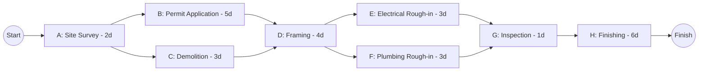

## Constructing a Project Network Diagram

### Overview

Constructing a project network diagram is the process of translating a Work Breakdown Structure (WBS) and its associated activity list into a logical, sequenced visual model that shows how activities relate to one another. This diagram forms the structural backbone for all subsequent Critical Path Method (CPM) calculations, including forward pass, backward pass, float determination, and schedule compression. Modern practice constructs these diagrams almost exclusively using the Precedence Diagramming Method (PDM/AON).

### Prerequisites Before Diagramming

**Key Points**

- **Activity List**: A complete, discrete breakdown of all schedule activities, typically derived from decomposing the WBS.
- **Activity Attributes**: Duration estimates, resource requirements, constraints, and assumptions for each activity.
- **Milestone List**: Key events with zero duration (e.g., "Design Approved," "Permit Received") that anchor the schedule.
- **Dependency Determination**: Identification of relationships between activities — mandatory (hard logic), discretionary (soft logic/preferred sequencing), and external dependencies.

Without accurate dependency determination, the resulting network diagram — regardless of how well it is drawn — will produce an incorrect critical path.

### Step-by-Step Construction Process

**Step 1 — Establish the Activity List**

List every activity with a unique identifier (e.g., A, B, C or WBS-coded IDs like 1.1.1). Ensure activities are at a consistent level of decomposition — neither too granular (causing diagram clutter) nor too coarse (hiding critical dependencies).

**Step 2 — Determine Dependency Types**

For each activity, identify its predecessor(s) and classify the relationship:

- **Finish-to-Start (FS)**: Successor cannot start until predecessor finishes (most common; default assumption if unspecified).
- **Start-to-Start (SS)**: Successor cannot start until predecessor starts.
- **Finish-to-Finish (FF)**: Successor cannot finish until predecessor finishes.
- **Start-to-Finish (SF)**: Successor cannot finish until predecessor starts (rare).

**Step 3 — Identify Lag and Lead Time**

Apply any positive (lag) or negative (lead) time offsets to relationships. For example, "Concrete Curing" might require FS+3 days (3-day lag) before formwork removal can begin.

**Step 4 — Sequence Activities Left to Right**

Arrange nodes in a logical flow from project start to project finish, generally left to right, ensuring no backward-pointing arrows (which would indicate an illogical loop).

**Step 5 — Connect Dependencies**

Draw arrows between activity nodes according to the dependency type determined in Step 2. In AON/PDM, the arrow itself carries no duration — only the relationship type and any lag/lead.

**Step 6 — Insert Start and Finish Milestones**

Add a single "Project Start" node feeding all initial activities, and a single "Project Finish" node receiving all final activities, ensuring a single point of entry and exit for the network (avoiding multiple disconnected start/end points, which breaks the forward/backward pass calculation).

**Step 7 — Validate the Network Logic**

Check for common errors before proceeding to time analysis:

- **Dangling activities**: Activities with no successor (other than the final milestone) or no predecessor (other than the initial milestone).
- **Loops**: Circular logic where Activity A depends on B, which depends on A — an invalid, unsolvable network.
- **Redundant relationships**: Logic ties that are already implied by another path and add unnecessary complexity.

### Worked Example

**Example**

Given the following activity list for a small renovation project:

| Activity | Description | Predecessor(s) | Duration (days) |
| --- | --- | --- | --- |
| A | Site Survey | — | 2 |
| B | Permit Application | A | 5 |
| C | Demolition | A | 3 |
| D | Framing | B, C | 4 |
| E | Electrical Rough-in | D | 3 |
| F | Plumbing Rough-in | D | 3 |
| G | Inspection | E, F | 1 |
| H | Finishing | G | 6 |

Constructing the network:

This diagram correctly shows that D (Framing) cannot begin until *both* B and C are complete (a converging dependency), and G (Inspection) requires *both* E and F complete — critical logic that must be captured accurately for the forward/backward pass to yield a correct critical path.

### Common Construction Errors

| Error | Description | Consequence |
| --- | --- | --- |
| Missing dependency | A real logical constraint is omitted | Understates project duration or produces an invalid critical path |
| Redundant dependency | A relationship already implied transitively is drawn explicitly | Adds visual clutter; usually harmless but reduces clarity |
| Circular logic (loop) | Activity depends on itself through a chain | Network cannot be mathematically solved |
| Dangling activity | An activity has no successor and isn't tied to the finish milestone | Skews backward pass; float calculations become invalid |
| Over-constraining with SF | Misuse of rare Start-to-Finish logic where FS was intended | Produces counterintuitive, often incorrect scheduling behavior |
| Mixing mandatory and discretionary logic without labeling | Preferred sequencing treated as hard constraint | Reduces schedule flexibility during compression/crashing later |

### Diagram Validation Checklist

**Key Points**

- Exactly one start node and one end node exist in the network.
- Every activity (except the first) has at least one predecessor.
- Every activity (except the last) has at least one successor.
- No circular references exist between any activities.
- All dependency types and lag/lead values are explicitly documented, not assumed.
- The diagram has been reviewed against the WBS to confirm no scope has been omitted.

### From Diagram to Critical Path

Once the network diagram is validated, it becomes the input for CPM time analysis:

1. **Forward Pass**: Calculate Early Start (ES) and Early Finish (EF) for each activity, moving left to right through the network.

   $$EF = ES + Duration$$
2. **Backward Pass**: Calculate Late Finish (LF) and Late Start (LS), moving right to left from the project finish.

   $$LS = LF - Duration$$
3. **Float Calculation**: Determine Total Float for each activity.

   $$Total\ Float = LS - ES$$
4. **Critical Path Identification**: The sequence of activities with zero total float defines the critical path — the longest path through the network and the minimum possible project duration.

[Inference] Because the accuracy of the entire CPM schedule depends entirely on how faithfully the network diagram captures real-world logical constraints, the diagram construction phase is arguably the single highest-leverage step in the scheduling process — errors introduced here propagate through every downstream calculation.

### Conclusion

Constructing a project network diagram is a disciplined, sequential process that transforms a flat activity list into a logically connected model of project execution. The quality of this diagram — its completeness, correct dependency typing, and absence of structural errors — directly determines the reliability of the critical path, float calculations, and any subsequent schedule compression efforts. A well-constructed network diagram is not merely a visual aid; it is the mathematical foundation of the entire project schedule.

**Next Steps**

- Precedence Diagramming Method (PDM) relationship types in depth
- Forward Pass and Backward Pass calculation mechanics
- Total Float vs. Free Float
- Identifying and interpreting the Critical Path
- Schedule compression techniques: Crashing and Fast-Tracking
- Network diagram validation and schedule quality audits