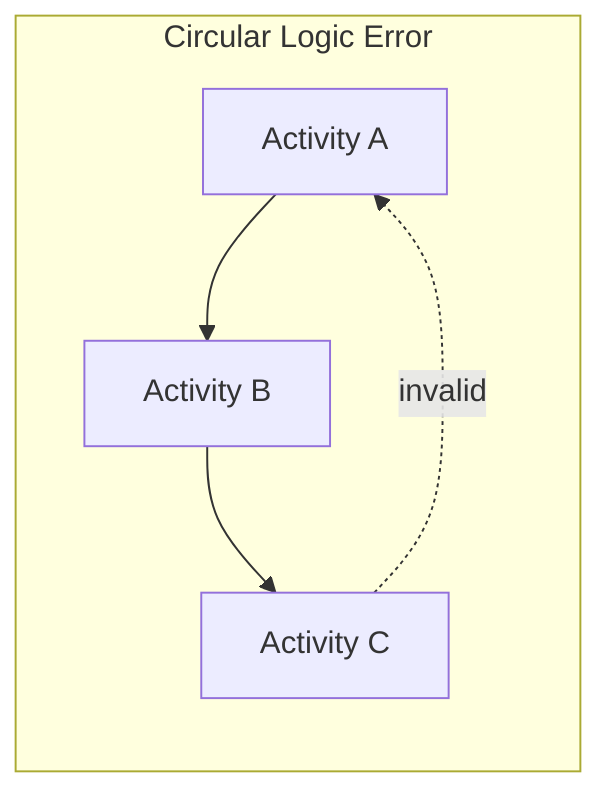

## Common Network Diagramming Errors

### Overview

Network diagramming errors are logical or structural flaws introduced during the construction of a project schedule network that compromise the accuracy of Critical Path Method (CPM) calculations. Because forward pass, backward pass, float, and critical path determination are entirely dependent on the correctness of the underlying network logic, even a single undetected error can produce a materially wrong project duration, a false critical path, or unreliable float values. Recognizing and systematically checking for these errors is a core schedule quality assurance discipline.

### Category 1: Structural/Topological Errors

**Key Points**

- **Loops (Circular Logic)**: Occurs when a chain of dependencies loops back on itself (e.g., A → B → C → A). This makes the network mathematically unsolvable because no activity in the loop can have a determinate start time — each depends on another that has not yet been resolved.
- **Dangling Activities (Open Ends)**: An activity with no successor (other than being properly tied to the project finish milestone) or no predecessor (other than the project start milestone). Dangling starts and finishes distort the backward pass, because the software or analyst cannot determine what constrains that activity's late dates.
- **Multiple Start or Finish Nodes**: A network should converge to exactly one start point and one finish point. Multiple disconnected start/finish nodes create ambiguity in what the "project finish date" actually represents and can produce multiple, disconnected critical paths that don't reflect true project constraints.

### Category 2: Logic/Dependency Errors

**Example**

Consider a schedule where "Install Drywall" is linked only to "Frame Walls" with a Finish-to-Start relationship, but in reality electrical and plumbing rough-in must also be inspected and approved first. If this logic is omitted:

- The forward pass will calculate an artificially early start date for drywall.
- The critical path may shift away from the true constraining sequence (inspections), hiding real risk.
- Float on the inspection activities will be overstated, making them appear to have schedule slack they do not actually have.

Common sub-errors in this category:

| Error Type | Description | Typical Cause |
| --- | --- | --- |
| Missing dependency (omitted logic) | A real constraint between activities is not modeled | Incomplete stakeholder input during planning |
| Redundant dependency | A relationship is drawn explicitly even though it is already implied transitively through another path | Over-cautious planning; copy-paste from templates |
| Incorrect relationship type | Using Finish-to-Start when the real constraint is Start-to-Start or Finish-to-Finish | Default bias toward FS in less flexible tools or rushed planning |
| Mandatory vs. discretionary confusion | Preferred sequencing (soft logic) is modeled as if it were a hard constraint | Failure to document rationale for each dependency at creation time |
| Out-of-sequence logic | An activity is logically placed before a predecessor it should follow | Copy/paste errors when reorganizing large schedules |

### Category 3: Lag/Lead Misapplication

**Key Points**

- **Excessive or Arbitrary Lag**: Applying lag time without a documented justification (e.g., "add 5 days lag" with no basis) artificially extends the schedule and obscures the true critical path.
- **Negative Lag (Lead) Misuse**: Using lead time to force overlapping work without validating that the overlap is technically feasible (e.g., starting finishing work before rough-in inspection actually permits it).
- **Lag on the Wrong Relationship Type**: Applying a lag intended for material curing (a Finish-to-Start context) onto a Start-to-Start relationship, producing a mathematically different and incorrect timing effect.

[Unverified] Some scheduling practitioners consider undocumented lag/lead values one of the most common sources of schedule disputes in claims and forensic delay analysis, since a lag with no stated basis is difficult to defend or audit after the fact — though the frequency of this specific issue varies significantly by industry and organizational scheduling maturity.

### Category 4: Level-of-Detail Errors

**Key Points**

- **Over-Decomposition**: Breaking activities down to an excessively granular level (e.g., separate activities for "pick up hammer" and "drive nail") creates unmanageable diagram complexity without adding scheduling value.
- **Under-Decomposition (Hammocking too early)**: Combining too much scope into single, large activities hides internal dependencies and prevents accurate float calculation for constituent work.
- **Inconsistent Granularity**: Mixing very fine-grained activities in one part of the network with very coarse summary-level activities in another, making relative float and criticality comparisons meaningless across the schedule.

### Category 5: Arrow Diagramming Method (ADM)-Specific Errors

For schedules still using the legacy AOA/ADM convention, additional error categories apply:

| Error Type | Description |
| --- | --- |
| Duplicate i-j pairs | Two different activities assigned the same tail-head node numbers without a dummy to differentiate them |
| Missing dummy activity | Failure to insert a dummy where partial dependency logic requires it, causing a false full dependency to be implied |
| Unnecessary dummy activity | Inserting a dummy where none is logically required, adding needless complexity |
| Backward-numbered nodes | Head node number lower than tail node number, violating the i < j convention and breaking sequential solvability |

### Category 6: Calculation and Interpretation Errors

**Key Points**

- **Forward/Backward Pass Arithmetic Errors**: Manual calculation mistakes in Early Start/Finish or Late Start/Finish values, more common in manually maintained schedules than in software-driven ones.
- **Misreading Float**: Confusing Total Float (schedule flexibility relative to the project finish) with Free Float (flexibility relative to only the next successor), leading to incorrect prioritization of at-risk activities.
- **Ignoring Negative Float**: When imposed constraint dates make the backward pass produce negative float, failing to recognize this as a sign the schedule is already behind an imposed deadline before execution even begins.

$$Total\ Float = LS - ES = LF - EF$$

$$Free\ Float = ES_{successor} - EF_{predecessor}$$

### Validation Techniques to Catch These Errors

**Next Steps** *(validation techniques, not future topics — see below for actual related topics)*

1. **Predecessor/Successor Trace**: Manually or programmatically verify every activity has at least one valid predecessor and successor (except designated start/finish milestones).
2. **Loop Detection Algorithms**: Most scheduling software (Primavera P6, MS Project) automatically flags circular references; always run this check before finalizing a baseline.
3. **Critical Path Reasonableness Review**: Have a subject matter expert review the identified critical path — if it doesn't align with intuitive project risk areas, hidden logic errors are often the cause.
4. **Lag/Lead Justification Audit**: Require documented rationale for every non-zero lag or lead value at the time it is entered.
5. **Float Distribution Analysis**: Extremely high float values on activities expected to be near-critical often indicate a missing dependency.
6. **Peer Review / Independent Schedule Check**: An independent scheduler reviewing the network fresh, without familiarity with the assumptions of the original author, frequently catches logic errors the original planner overlooked.

### Conclusion

Common network diagramming errors span structural flaws (loops, dangling activities), logical flaws (missing, redundant, or mistyped dependencies), lag/lead misuse, inconsistent level of detail, and — in legacy ADM networks — dummy activity mismanagement. Because these errors propagate directly into the forward pass, backward pass, float, and critical path outputs, disciplined validation practices — loop detection, predecessor/successor tracing, and independent peer review — are essential quality controls before a network diagram is used as the basis for a project baseline.

**Related Topics**

- Critical Path Method forward and backward pass mechanics
- Total Float vs. Free Float
- Schedule quality audits and DCMA 14-point assessment
- Precedence Diagramming Method relationship types (FS, SS, FF, SF)
- Forensic schedule delay analysis
- Arrow Diagramming Method and dummy activity logic