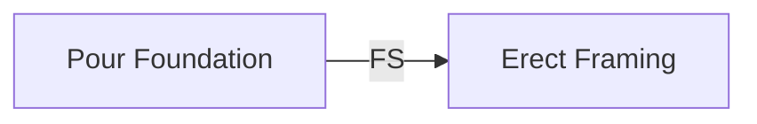
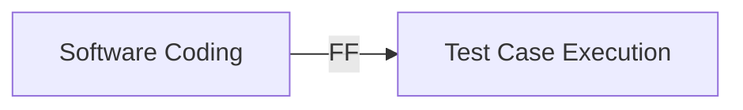

## Finish-to-Start, Start-to-Start, Finish-to-Finish, and Start-to-Finish Relationships

### Overview

These four relationship types — Finish-to-Start (FS), Start-to-Start (SS), Finish-to-Finish (FF), and Start-to-Finish (SF) — define every possible logical dependency between two activities in the Precedence Diagramming Method (PDM). Each relationship governs how the timing of one activity (the successor) is constrained by the timing of another (the predecessor). Correctly identifying which relationship applies to each dependency is essential for producing an accurate network diagram and, consequently, a valid Critical Path Method (CPM) schedule.

### Finish-to-Start (FS)

**Key Points**

- The successor activity cannot **start** until the predecessor activity **finishes**.
- This is the most common and intuitive relationship type, and is the default assumption in most scheduling software when no relationship is explicitly specified.
- Formula: $ES_{successor} \geq EF_{predecessor} + Lag$

**Example**

"Pour Concrete Foundation" (predecessor) must finish before "Erect Wall Framing" (successor) can start. The framing crew has no work to do until the concrete exists.

### Start-to-Start (SS)

**Key Points**

- The successor activity cannot **start** until the predecessor activity **starts**.
- Used to model overlapping, parallel work where the successor can begin shortly after the predecessor begins, without waiting for full completion.
- Formula: $ES_{successor} \geq ES_{predecessor} + Lag$

**Example**

"Lay Foundation Trench" (predecessor) and "Lay Utility Piping" (successor) — piping installation can begin once trenching starts, provided there is enough excavated trench available, without waiting for the entire trench to be dug. A lag (e.g., SS+2 days) is often applied to represent the buffer needed for the predecessor to get sufficiently ahead of the successor.

### Finish-to-Finish (FF)

**Key Points**

- The successor activity cannot **finish** until the predecessor activity **finishes**.
- Used when two activities can proceed in parallel but must be completed together or in a fixed sequence at the end.
- Formula: $EF_{successor} \geq EF_{predecessor} + Lag$

**Example**

"Software Coding" (predecessor) and "Write Test Cases" (successor) — testing can be written and executed alongside coding, but final test sign-off cannot be completed until coding is fully finished, since late code changes could invalidate earlier test results.

### Start-to-Finish (SF)

**Key Points**

- The successor activity cannot **finish** until the predecessor activity **starts**.
- The rarest and least intuitive relationship type; it is counterintuitive because it links a *future* activity's completion to a *preceding* activity's start.
- Formula: $EF_{successor} \geq ES_{predecessor} + Lag$
- Most commonly cited in shift-based or just-in-time (JIT) operational scenarios rather than construction/manufacturing project schedules.

**Example**

A classic textbook illustration: "New Security Guard Shift Starts" (predecessor) determines when "Previous Security Guard Shift Ends" (successor) can finish — the outgoing guard cannot leave until the incoming guard arrives and starts. [Unverified] This relationship type is widely regarded in scheduling literature as rarely used in practice compared to FS, SS, and FF, though its actual frequency of use varies by industry and is difficult to quantify precisely.

### Comparative Summary Table

| Relationship | Constraint Logic | Formula | Typical Use Case | Frequency in Practice |
| --- | --- | --- | --- | --- |
| Finish-to-Start (FS) | Successor starts after predecessor finishes | $ES_S \geq EF_P + Lag$ | Sequential, non-overlapping work | Very common (default) |
| Start-to-Start (SS) | Successor starts after predecessor starts | $ES_S \geq ES_P + Lag$ | Overlapping/parallel work with a start offset | Common |
| Finish-to-Finish (FF) | Successor finishes after predecessor finishes | $EF_S \geq EF_P + Lag$ | Parallel work requiring synchronized completion | Common |
| Start-to-Finish (SF) | Successor finishes after predecessor starts | $EF_S \geq ES_P + Lag$ | Shift handoffs, JIT/succession scenarios | Rare |

### Visual Comparison of All Four Types

<svg xmlns="http://www.w3.org/2000/svg" viewBox="0 0 700 360">
<text x="20" y="20" font-size="14" font-family="sans-serif" fill="#333" font-weight="bold">Four PDM Relationship Types (svg_diagram)</text>

<text x="20" y="55" font-size="12" font-family="sans-serif" fill="`#2b6cb0`">Finish-to-Start (FS)</text>

<rect x="20" y="65" width="120" height="30" fill="`#ebf8ff`" stroke="`#2b6cb0`" />

<text x="45" y="85" font-size="11" font-family="sans-serif">Predecessor</text>

<rect x="200" y="65" width="120" height="30" fill="`#ebf8ff`" stroke="`#2b6cb0`" />

<text x="230" y="85" font-size="11" font-family="sans-serif">Successor</text>

<line x1="140" y1="80" x2="198" y2="80" stroke="`#2b6cb0`" stroke-width="2" marker-end="url(#arrowhead)" />

<text x="20" y="130" font-size="12" font-family="sans-serif" fill="`#2b6cb0`">Start-to-Start (SS)</text>

<rect x="20" y="140" width="120" height="30" fill="`#f0fff4`" stroke="`#38a169`" />

<text x="45" y="160" font-size="11" font-family="sans-serif">Predecessor</text>

<rect x="60" y="180" width="120" height="30" fill="`#f0fff4`" stroke="`#38a169`" />

<text x="90" y="200" font-size="11" font-family="sans-serif">Successor</text>

<line x1="30" y1="170" x2="70" y2="180" stroke="`#38a169`" stroke-width="2" marker-end="url(#arrowhead)" />

<text x="380" y="130" font-size="12" font-family="sans-serif" fill="`#2b6cb0`">Finish-to-Finish (FF)</text>

<rect x="380" y="140" width="120" height="30" fill="`#fffaf0`" stroke="`#dd6b20`" />

<text x="405" y="160" font-size="11" font-family="sans-serif">Predecessor</text>

<rect x="440" y="180" width="120" height="30" fill="`#fffaf0`" stroke="`#dd6b20`" />

<text x="465" y="200" font-size="11" font-family="sans-serif">Successor</text>

<line x1="500" y1="170" x2="500" y2="178" stroke="`#dd6b20`" stroke-width="2" marker-end="url(#arrowhead)" />

<line x1="500" y1="170" x2="560" y2="178" stroke="`#dd6b20`" stroke-width="2" marker-end="url(#arrowhead)" />

<text x="20" y="250" font-size="12" font-family="sans-serif" fill="`#2b6cb0`">Start-to-Finish (SF)</text>

<rect x="20" y="260" width="120" height="30" fill="`#fff5f5`" stroke="`#e53e3e`" />

<text x="45" y="280" font-size="11" font-family="sans-serif">Predecessor</text>

<rect x="200" y="245" width="120" height="30" fill="`#fff5f5`" stroke="`#e53e3e`" />

<text x="230" y="265" font-size="11" font-family="sans-serif">Successor</text>

<line x1="20" y1="260" x2="200" y2="275" stroke="`#e53e3e`" stroke-width="2" marker-end="url(#arrowhead)" />

</svg>

### Impact on CPM Calculations

Each relationship type changes how Early Start (ES), Early Finish (EF), Late Start (LS), and Late Finish (LF) propagate through the network during the forward and backward pass:

- **FS** propagates dates through the *finish* date of the predecessor.
- **SS** propagates dates through the *start* date of the predecessor, which can allow the successor to begin much earlier than an FS relationship would permit — often shortening overall project duration when used appropriately.
- **FF** constrains the *finish* dates of two activities together, which can create a bottleneck if the predecessor's duration extends unexpectedly.
- **SF** links the successor's finish to the predecessor's start — the rarest and most error-prone relationship to calculate manually, since it runs counter to the typical left-to-right forward flow of scheduling logic.

$$Total\ Float = LS - ES = LF - EF$$

The choice of relationship type directly affects which activities fall on the critical path — a schedule using SS/FF relationships to legitimately overlap work will often show a shorter, different critical path than an equivalent schedule using only FS relationships.

### Choosing the Correct Relationship Type

**Next Steps** *(decision guidance, not future topics — see Related Topics below)*

1. Ask: "What physically or logically must happen before the successor can *begin*?" → Points toward FS or SS.
2. Ask: "What physically or logically must happen before the successor can *be considered complete*?" → Points toward FF or SF.
3. Default to **FS** unless there is a specific, documented reason for overlap (SS/FF) or a rare succession-style constraint (SF).
4. Always pair non-default relationships (SS, FF, SF) with a documented lag/lead rationale, since these are the relationships most prone to misuse and the hardest to audit later (see common network diagramming errors).

### Conclusion

FS, SS, FF, and SF together provide the complete vocabulary for expressing logical dependency in a precedence-based network diagram. FS remains the default and most common relationship, SS and FF are essential tools for legitimately compressing schedules through parallel work, and SF remains a rare, specialized relationship reserved for succession-style constraints. Correct application of these relationship types — paired with appropriate lag or lead values — is fundamental to producing a network diagram whose critical path and float values accurately reflect real project constraints.

**Related Topics**

- Lag and Lead time application across relationship types
- Precedence Diagramming Method (PDM) construction
- Schedule compression: Fast-Tracking using SS/FF overlaps
- Total Float vs. Free Float calculations
- Common network diagramming errors
- Mandatory vs. discretionary dependencies