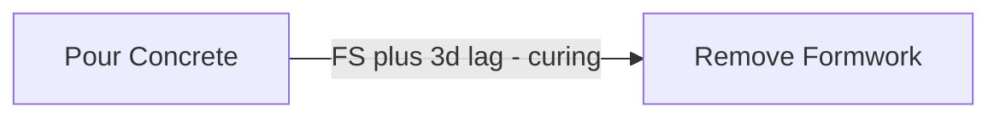
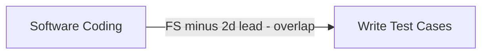

## Leads and Lags

### Overview

Leads and lags are time modifiers applied to a logical relationship between two activities in a network diagram, adjusting the timing of the successor relative to the predecessor beyond what the base relationship type (FS, SS, FF, SF) alone would dictate. A **lag** delays the successor's start or finish, while a **lead** accelerates it, allowing activities to overlap. Both are essential tools for producing a network diagram that reflects real-world timing constraints with precision, and both directly affect Critical Path Method (CPM) calculations.

### Definitions

**Key Points**

- **Lag**: A positive time value added to a relationship, delaying the start or finish of the successor activity beyond the point the base relationship would otherwise allow. Represents mandatory waiting time between two activities.
- **Lead**: A negative time value (often expressed as a negative lag) applied to a relationship, allowing the successor to start or finish earlier than the base relationship would otherwise allow. Represents permitted overlap between two activities.
- Both are applied to the specific relationship type in use (FS, SS, FF, or SF) — the lag/lead modifies the calculated date derived from that relationship.

### Lag — Detailed Explanation

**Example**

"Pour Concrete" (predecessor) finishes, but "Remove Formwork" (successor) cannot start immediately — the concrete needs 3 days to cure sufficiently. This is modeled as a Finish-to-Start relationship with a 3-day lag: **FS+3**.

$$ES_{successor} \geq EF_{predecessor} + Lag$$

Common real-world sources of lag:

- Material curing or drying time (concrete, paint, adhesives)
- Mandatory waiting periods (regulatory review windows, contractual notice periods)
- Administrative processing time (approval routing, procurement lead time)
- Deliberate schedule buffers inserted to absorb minor variability

### Lead — Detailed Explanation

**Example**

"Write Test Cases" (successor) does not need to wait for "Software Coding" (predecessor) to fully complete — testing can begin once 80% of the coding is done, roughly 2 days before coding finishes. This is modeled as a Finish-to-Start relationship with a 2-day lead, written as **FS-2**.

$$ES_{successor} \geq EF_{predecessor} - Lead$$

Leads are one of the primary mechanisms used in **fast-tracking**, a schedule compression technique that overlaps activities normally performed sequentially in order to shorten overall project duration.

### Leads and Lags Across Relationship Types

Lag and lead can be applied to any of the four PDM relationship types, producing different timing effects:

| Relationship + Modifier | Formula | Effect |
| --- | --- | --- |
| FS + Lag | $ES_S \geq EF_P + Lag$ | Successor starts a fixed time *after* predecessor finishes (e.g., curing time) |
| FS + Lead | $ES_S \geq EF_P - Lead$ | Successor starts *before* predecessor fully finishes (overlap near the end) |
| SS + Lag | $ES_S \geq ES_P + Lag$ | Successor starts a fixed time *after* predecessor starts (staggered start) |
| SS + Lead | $ES_S \geq ES_P - Lead$ | Successor can start *before* predecessor even begins (unusual; rarely used) |
| FF + Lag | $EF_S \geq EF_P + Lag$ | Successor finishes a fixed time *after* predecessor finishes |
| FF + Lead | $EF_S \geq EF_P - Lead$ | Successor finishes *before* predecessor finishes (successor completes early) |
| SF + Lag/Lead | $EF_S \geq ES_P \pm Value$ | Rare combination; typically seen in shift-succession contexts |

### Visual Comparison: Lag vs. Lead on a Timeline

<svg xmlns="http://www.w3.org/2000/svg" viewBox="0 0 640 220">
<text x="20" y="20" font-size="14" font-family="sans-serif" fill="#333" font-weight="bold">Lag vs. Lead on a Timeline (svg_diagram)</text>

<line x1="20" y1="200" x2="600" y2="200" stroke="#666" stroke-width="1" />

<text x="20" y="55" font-size="12" font-family="sans-serif" fill="`#2b6cb0`">Lag: gap between activities</text>

<rect x="20" y="65" width="150" height="25" fill="`#ebf8ff`" stroke="`#2b6cb0`" />

<text x="45" y="82" font-size="10" font-family="sans-serif">Predecessor</text>

<rect x="250" y="65" width="150" height="25" fill="`#ebf8ff`" stroke="`#2b6cb0`" />

<text x="280" y="82" font-size="10" font-family="sans-serif">Successor</text>

<rect x="170" y="65" width="80" height="25" fill="`#fefcbf`" stroke="`#d69e2e`" stroke-dasharray="3,2" />

<text x="178" y="82" font-size="9" font-family="sans-serif">Lag (wait)</text>

<text x="20" y="130" font-size="12" font-family="sans-serif" fill="`#2b6cb0`">Lead: overlap between activities</text>

<rect x="20" y="140" width="200" height="25" fill="`#f0fff4`" stroke="`#38a169`" />

<text x="45" y="157" font-size="10" font-family="sans-serif">Predecessor</text>

<rect x="160" y="140" width="150" height="25" fill="`#f0fff4`" stroke="`#38a169`" fill-opacity="0.7" />

<text x="195" y="157" font-size="10" font-family="sans-serif">Successor</text>

<text x="165" y="180" font-size="9" font-family="sans-serif" fill="`#e53e3e`">overlap region (lead)</text>

</svg>

### Impact on Critical Path Method Calculations

Lag and lead values are incorporated directly into the forward and backward pass:

$$EF_{predecessor} + Lag \leq ES_{successor}\ \text{(FS relationship, forward pass)}$$

$$LS_{successor} - Lag \geq LF_{predecessor}\ \text{(FS relationship, backward pass)}$$

- **Lags extend the critical path** if they occur on the longest path through the network — a 5-day curing lag on a critical activity chain adds 5 days directly to total project duration.
- **Leads can shorten the critical path**, provided the overlapping activities can genuinely be performed in parallel without introducing rework risk (a discretionary dependency being loosened).
- Lag/lead values do **not** change the relationship type itself; they modify the calculated date threshold within that relationship.

### Risks and Considerations

**Key Points**

- **Undocumented lag/lead is a common source of schedule disputes**: If a lag exists on a schedule with no recorded justification, it becomes difficult to defend during claims, audits, or forensic delay analysis (see common network diagramming errors).
- **Excessive lead can introduce rework risk**: Starting a successor activity too early, before the predecessor has produced sufficiently stable inputs, can result in wasted work if the predecessor's output later changes (e.g., starting detailed design before conceptual design is sufficiently mature).
- **Lag is not the same as float**: Lag is a fixed, planned delay built into the relationship itself; float is the calculated flexibility (slack) an activity has within the overall schedule. Confusing the two is a common schedule interpretation error.
- **Negative lag ≠ negative float**: A lead (negative lag) is a deliberate compression technique chosen by the scheduler; negative float is an unplanned symptom indicating the schedule is already behind an imposed constraint date.

[Unverified] Forensic scheduling literature commonly recommends that all lag and lead values above a certain threshold (e.g., more than a few days) be explicitly documented with a stated technical or contractual basis at the time of schedule baseline approval, though specific threshold recommendations vary by contract type, industry, and the scheduling standard being followed (e.g., AACE International Recommended Practices).

### Worked Example Combining Multiple Lags/Leads

**Example**

| Activity | Predecessor | Relationship | Duration |
| --- | --- | --- | --- |
| A: Pour Foundation | — | — | 3 days |
| B: Cure Concrete | A | FS+0 | 4 days (this itself represents lag time as an activity) |
| C: Erect Framing | A | FS+4 (curing lag) | 6 days |
| D: Install Roofing | C | FS-1 (1-day lead, minor overlap) | 5 days |

Forward pass:

- $EF_A = 3$
- $ES_C = EF_A + 4 = 7$, so $EF_C = 7 + 6 = 13$
- $ES_D = EF_C - 1 = 12$, so $EF_D = 12 + 5 = 17$

The 4-day curing lag on A→C directly extends the schedule by 4 days if this chain is critical, while the 1-day lead on C→D recovers 1 day back — illustrating how lag and lead act as opposing levers on the same network path.

### Conclusion

Leads and lags are precision tools for adjusting the timing of dependent activities beyond what a basic relationship type alone can express — lag models mandatory waiting time (curing, approvals, administrative delay), while lead models legitimate overlap for schedule compression. Both directly affect forward pass, backward pass, and critical path calculations, and both carry documentation obligations: undocumented or poorly justified lag/lead values are a recurring source of schedule disputes and forensic delay claims. Disciplined application — always paired with a stated rationale — keeps the network diagram both accurate and defensible.

**Related Topics**

- Finish-to-Start, Start-to-Start, Finish-to-Finish, and Start-to-Finish relationships
- Schedule compression: Fast-Tracking and Crashing
- Total Float vs. Free Float
- Common network diagramming errors
- Forensic schedule delay analysis
- Mandatory, discretionary, and external dependencies