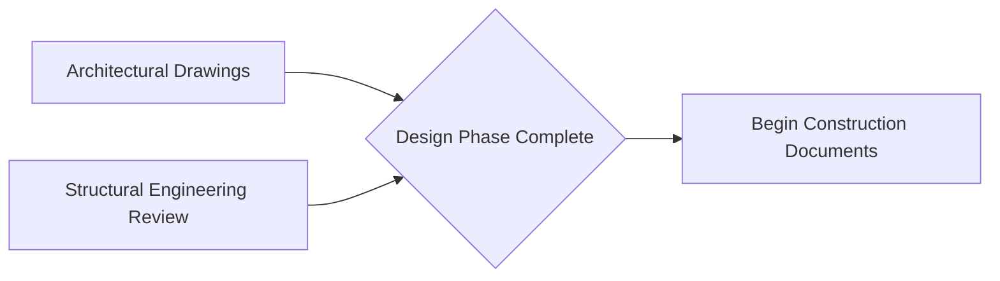

## Milestones in Network Logic

### Overview

A milestone is a significant point or event in a project schedule that marks the completion of a major deliverable, phase, or decision point. Unlike normal activities, milestones have **zero duration** — they represent a moment in time rather than a span of work. Within a network diagram, milestones serve as anchor points that structure the logic, provide reporting checkpoints, and often carry contractual or regulatory significance. Understanding how milestones integrate into network logic is essential for both schedule construction and stakeholder communication.

### Defining Characteristics of Milestones

**Key Points**

- **Zero duration**: A milestone's duration is always 0, regardless of the complexity of the work it represents completion of. Its Early Start (ES) equals its Early Finish (EF), and its Late Start (LS) equals its Late Finish (LF).
- **Represents an event, not work**: Milestones do not consume resources or represent effort; they mark that a defined condition has been met (e.g., "Design Approved," "Permit Received," "Phase 1 Complete").
- **Diagrammatic convention**: In PDM/AON diagrams, milestones are typically drawn as diamonds or as boxes with rounded/pointed ends, visually distinguishing them from standard rectangular activity boxes.
- **Can appear anywhere in the network**: at the very start (project kickoff), at intermediate phase transitions, or at the very end (project closeout/final acceptance).

### Types of Milestones

| Type | Description | Example |
| --- | --- | --- |
| Start Milestone | Marks the beginning of the project or a phase | "Project Kickoff" |
| Finish Milestone | Marks the completion of the project or a phase | "Project Closeout" |
| Interim/Phase Milestone | Marks a key transition point between major phases | "Design Phase Complete" |
| Contractual Milestone | Tied to payment terms or contractual obligations | "Substantial Completion" (often triggers payment release) |
| Regulatory/External Milestone | Tied to an external approval or compliance checkpoint | "Environmental Permit Approved" |
| Decision Gate Milestone | Marks a go/no-go decision point in a phased or stage-gate project | "Go/No-Go for Phase 2 Funding" |

### Milestones in the Network Diagram

**Example**

Consider a construction project where "Design Phase Complete" is a milestone dependent on the finish of both "Architectural Drawings" and "Structural Engineering Review":

Here, the milestone M acts as a **synchronization point** — it cannot occur until both predecessor activities finish, and no successor activity can begin until the milestone itself is achieved. This converging/diverging structure is one of the most common and useful applications of milestones in network logic.

### Milestones and the Critical Path

**Key Points**

- Because milestones have zero duration, they do not add time to the schedule themselves, but they **can still be on the critical path** if they have zero total float.
- A milestone lying on the critical path indicates that the *timing* of that event — not any work associated with it — is a limiting factor for overall project completion.
- Milestones are frequently used specifically to make the critical path more visible and reportable to stakeholders who may not need to see (or want to see) every underlying activity.

$$Total\ Float_{milestone} = LS_{milestone} - ES_{milestone} = LF_{milestone} - EF_{milestone}$$

Since ES = EF and LS = LF for a milestone, this simplifies to comparing a single early date against a single late date, making milestone float calculation more direct than for standard activities.

### Milestone Constraints

Milestones are frequently assigned **schedule constraints** that affect how they interact with the forward and backward pass:

| Constraint Type | Effect |
| --- | --- |
| Finish No Earlier Than (FNET) | Prevents the milestone from being scheduled before a specified date, even if network logic would allow it earlier |
| Finish No Later Than (FNLT) | Caps the milestone's late finish date, potentially creating negative float if the network logic would otherwise push it later |
| Must Finish On (MFO) | Locks the milestone to an exact date, overriding calculated logic entirely |
| Mandatory Finish | Often applied to the final project milestone to reflect a contractual deadline |

**Example**

If "Regulatory Approval Received" is a milestone with a Finish No Later Than constraint tied to a fixed government hearing date, and the network's natural (unconstrained) late finish calculation would place it later than that date, the schedule will show **negative float**, signaling that the project is already at risk of missing this externally imposed deadline before execution even begins.

### Milestones vs. Activities: Key Distinctions

| Aspect | Milestone | Activity |
| --- | --- | --- |
| Duration | Zero | Greater than zero |
| Resource consumption | None | Typically consumes labor, equipment, or material |
| Representation in PDM | Diamond or pointed box | Rectangle |
| ES/EF relationship | ES = EF | EF = ES + Duration |
| Purpose | Marks an event or checkpoint | Represents actual work being performed |
| Reporting use | High-level stakeholder communication | Detailed execution tracking |

### Common Uses of Milestones in Practice

**Key Points**

- **Executive/stakeholder reporting**: Summarized milestone charts are often presented to sponsors and clients instead of the full, detailed network diagram, since milestones distill hundreds of activities into a handful of meaningful checkpoints.
- **Contract administration**: Milestones frequently trigger payment releases, retention reductions, or liquidated damages clauses in construction and engineering contracts.
- **Phase-gate governance**: In stage-gate project management, milestones represent formal go/no-go decision points requiring sponsor or steering committee approval before subsequent work proceeds.
- **Schedule health checks**: Analysts often review milestone trend charts over time (comparing forecast milestone dates across successive schedule updates) to detect slippage patterns early.

### Common Errors Involving Milestones

**Key Points**

- **Assigning duration to a milestone**: A milestone with any duration greater than zero is a modeling error — if the "event" genuinely takes time, it should be modeled as an activity instead.
- **Missing predecessor/successor links**: A milestone with no incoming or outgoing logic becomes a dangling node, distorting the forward or backward pass (see common network diagramming errors).
- **Over-constraining milestones**: Applying hard date constraints (Must Finish On) to milestones without a genuine contractual or regulatory basis artificially suppresses calculated float and can mask true schedule risk.
- **Milestone proliferation**: Adding too many milestones dilutes their communicative value; milestones should represent genuinely significant events, not every minor task completion.

### Conclusion

Milestones function as zero-duration synchronization and reporting points within network logic, marking the completion of major deliverables, phases, or decision gates without themselves consuming time or resources. Despite having no duration, milestones can still lie on the critical path and are frequently subject to schedule constraints tied to contractual or regulatory requirements. Properly used, milestones simplify stakeholder communication, support contract administration, and provide clear checkpoints for monitoring schedule health — but they must be logically connected within the network and free of artificially assigned duration to preserve calculation accuracy.

**Related Topics**

- Constructing a project network diagram
- Total Float vs. Free Float
- Schedule constraints (FNET, FNLT, MFO) and their effect on CPM
- Common network diagramming errors
- Schedule performance reporting and milestone trend analysis
- Mandatory, discretionary, and external dependencies