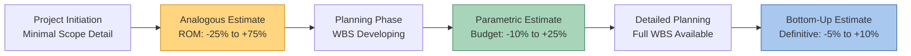

## Analogous Estimating

### Definition

Analogous estimating is a top-down estimating technique that derives the duration or cost of a current activity, phase, or project by using historical data from a similar past activity, phase, or project, adjusted for known differences in scope, complexity, or scale. It relies on expert judgment and historical records rather than detailed bottom-up calculation.

PMI's *PMBOK Guide* classifies analogous estimating as a form of expert judgment applied to historical information, and it is one of the least precise but fastest estimating methods available.

### Core Characteristics

**Key Points**

- Uses actual duration/cost from a comparable prior project as the baseline
- Applies scaling factors to account for differences (size, complexity, location, resources)
- Requires less time and data than bottom-up or parametric methods
- Generally produces lower accuracy—typically cited in the range of -25% to +75% [Unverified — accuracy ranges are commonly cited heuristics in project management literature but vary by source and organizational context]
- Most useful early in the project lifecycle when detailed scope information is unavailable

### When to Use Analogous Estimating

- **Project initiation / feasibility phase**: Before a Work Breakdown Structure (WBS) exists in sufficient detail
- **Rough Order of Magnitude (ROM) estimates**: Initial budget screening or go/no-go decisions
- **Time-constrained estimating**: When speed matters more than precision
- **Portfolio-level comparisons**: Evaluating multiple candidate projects against each other quickly
- **Absence of detailed data**: When the project is genuinely novel and only high-level historical comparables exist

### Methodology

#### Step-by-Step Process

1. **Identify a comparable reference project or activity** with documented actual duration/cost
2. **Verify comparability** on key dimensions: scope, technology, resources, complexity, environmental conditions
3. **Establish the baseline value** (e.g., "Project A took 14 months and cost $2.1M")
4. **Apply adjustment factors** for known differences (scaling ratios, complexity multipliers)
5. **Apply expert judgment** to refine the adjusted figure
6. **Document assumptions and rationale** for traceability and future lessons-learned use

#### Adjustment Formula

A common simplified scaling approach:

$$Estimate_{new} = Actual_{reference} \times \left(\frac{Scope_{new}}{Scope_{reference}}\right)^{n}$$

Where $n$ is an empirically derived scaling exponent (often between 0.7 and 1.0 for many construction and engineering domains, reflecting economies of scale) [Inference — the exact exponent is domain- and organization-specific and requires calibration against historical data; there is no single universal value].

**Example**

A prior project to construct a 5,000 sq. ft. warehouse took 6 months and cost $450,000. A new warehouse project of 8,000 sq. ft. is being scoped.

Using a linear scope ratio (n = 1) for a first-pass ROM:

$$Cost_{new} = 450{,}000 \times \frac{8{,}000}{5{,}000} = \$720{,}000$$

$$Duration_{new} = 6 \times \frac{8{,}000}{5{,}000} = 9.6 \text{ months}$$

An estimator with domain expertise might then adjust downward slightly (e.g., to 8.5 months) citing economies of scale in mobilization and repeated processes, documenting this as an expert judgment overlay on the raw analogous calculation.

### Analogous vs. Other Estimating Techniques

| Technique | Basis | Relative Accuracy | Effort Required | Typical Project Phase |
| --- | --- | --- | --- | --- |
| Analogous | Historical whole-project/activity comparison | Low | Low | Initiation / early planning |
| Parametric | Statistical relationship between variables (e.g., cost per sq. ft.) | Moderate to High | Moderate | Planning |
| Bottom-Up | Sum of detailed component estimates | High | High | Detailed planning / WBS complete |
| Three-Point (PERT) | Optimistic/Pessimistic/Most Likely weighted average | Moderate | Moderate | Planning (activity level) |

**Key Points**

- Analogous estimating sits at the "quick and rough" end of the spectrum; bottom-up sits at the "slow and precise" end
- Many organizations use analogous estimating for the initial ROM and refine to parametric or bottom-up as the project progresses through planning gates (progressive elaboration)

### Relationship to CPM and EVM

- **CPM linkage**: Analogous duration estimates are often used to populate preliminary activity durations in an early network diagram before detailed durations are available, allowing a rough critical path to be identified for scheduling feasibility checks
- **EVM linkage**: Analogous cost estimates frequently form the basis of the initial Budget at Completion (BAC) during early Performance Measurement Baseline (PMB) development, later refined as the WBS matures and bottom-up estimates replace the top-down figures
- Because analogous estimates carry wider uncertainty bands, schedules and budgets built primarily on them typically carry higher contingency reserves than those built on bottom-up data

### Advantages and Limitations

**Key Points — Advantages**

- Fast and inexpensive to produce
- Requires minimal project detail
- Leverages organizational lessons learned and historical databases
- Useful for comparative screening across multiple project options

**Key Points — Limitations**

- Accuracy depends heavily on how truly comparable the reference project is
- Vulnerable to bias if the reference project itself was poorly estimated or executed
- Less reliable when technology, market conditions, or team composition differ significantly from the reference
- Not suitable as the sole basis for a definitive/control-level budget or contractual bid in most cases

### Diagram: Estimating Technique Progression

[Unverified — the specific accuracy percentage ranges shown are widely cited industry rules of thumb for estimate classes (aligning loosely with AACE International's Cost Estimate Classification System) but exact figures vary by source, industry, and organizational estimating maturity.]

### Data Sources for Analogous Estimating

- Historical project files and closeout reports
- Organizational Process Assets (OPA) / lessons learned repositories
- Industry benchmarking databases (e.g., RSMeans for construction, ICEAA resources for cost engineering)
- Expert interviews with personnel who executed comparable prior work
- Published case studies or vendor-supplied reference data for similar technology deployments

### Best Practices

**Key Points**

- Select reference projects that match as closely as possible on scope, technology, and organizational context—not just superficial similarity (e.g., "same industry" is not sufficient if scale differs by an order of magnitude)
- Always document the reference project and adjustment rationale so the estimate is auditable and defensible
- Combine analogous estimates with expert judgment reviews rather than treating the scaled number as final
- Revisit and refine the estimate using parametric or bottom-up methods as soon as sufficient scope detail becomes available
- Maintain a well-curated historical database, since analogous estimating quality is only as good as the historical data feeding it

### Related Topics

- Parametric estimating and cost-estimating relationships (CERs)
- Three-point (PERT) estimating and Beta distribution
- Bottom-up estimating and Work Breakdown Structure (WBS) decomposition
- Rough Order of Magnitude (ROM) vs. Definitive estimate classifications
- Contingency reserve and management reserve determination
- Organizational Process Assets and lessons-learned repositories
- Budget at Completion (BAC) development in Earned Value Management