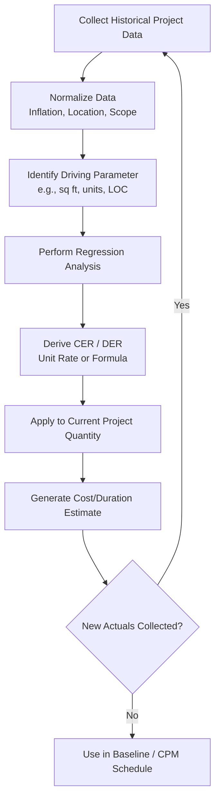

## Parametric Estimating

### Definition

Parametric estimating is a technique that uses a statistical or mathematical relationship between historical data and other variables (parameters) to calculate an estimate for activity duration or cost. It applies a **cost-estimating relationship (CER)** or **duration-estimating relationship (DER)**—typically a rate, unit cost, or productivity factor derived from historical data—and multiplies it by the quantity of work in the current project.

Unlike analogous estimating, which scales a single whole-project comparison, parametric estimating builds the estimate from a validated unit rate applied across measurable quantities, giving it materially higher accuracy when the underlying data set is robust.

### Core Formula

The general parametric relationship:

$$Estimate = Quantity \times Unit\ Rate$$

Where the unit rate is derived from regression analysis, historical productivity data, or industry-published standards.

**Example**

If historical data shows electrical conduit installation averages $18 per linear foot and 0.05 labor-hours per linear foot, a new scope of 2,000 linear feet yields:

$$Cost = 2{,}000 \times 18 = \$36{,}000$$

$$Duration_{labor-hours} = 2{,}000 \times 0.05 = 100\ \text{labor-hours}$$

### Statistical Basis: Regression Models

Parametric models are frequently built using regression analysis on historical project data.

#### Linear Regression Form

$$y = a + bx$$

Where:

- $y$ = estimated cost or duration
- $x$ = the driving parameter (e.g., square footage, number of units, lines of code)
- $a$ = fixed cost/duration component (intercept)
- $b$ = variable cost/duration per unit of $x$ (slope, the CER)

**Example**

A CER developed from 12 completed data-center fit-out projects yields:

$$Cost = 250{,}000 + 340x$$

where $x$ is server rack count. For a new project requiring 180 racks:

$$Cost = 250{,}000 + (340 \times 180) = 250{,}000 + 61{,}200 = \$311{,}200$$

The $250,000 intercept represents fixed costs (mobilization, design, permitting) that do not scale with rack count, while $340/rack captures the variable installation cost.

#### Non-Linear / Learning Curve Models

For processes exhibiting economies of scale or learning effects, a power function is often more accurate:

$$y = ax^{b}$$

Where $b < 1$ typically reflects productivity improvements as quantity increases (a learning curve effect commonly seen in repetitive manufacturing or construction of identical units).

### Data Requirements for Reliable Parametric Models

**Key Points**

- Sufficient historical sample size (statistically, more data points reduce estimate variance)
- Data must be **normalized** for inflation, location factors, and scope definition consistency before regression
- The parameter chosen (driver variable) must have a demonstrable causal or strong correlational relationship with cost/duration
- Outliers and anomalous historical projects should be identified and either excluded or explained
- Regular recalibration is needed as market rates, labor productivity, and technology change over time

### Common Parametric Units by Industry

| Industry | Typical Parameter | Example Unit Rate |
| --- | --- | --- |
| Construction | Square footage, linear footage | Cost per sq. ft., cost per linear ft. of pipe |
| Software Development | Function points, lines of code, story points | Hours per function point |
| Manufacturing | Units produced | Labor-hours per unit |
| IT Infrastructure | Number of servers/endpoints | Cost per server deployed |
| Road/Highway | Lane-miles | Cost per lane-mile |
| Electrical | Linear feet of conduit/cable | Cost per linear foot |

### Parametric Estimating vs. Analogous Estimating

| Aspect | Parametric | Analogous |
| --- | --- | --- |
| Basis | Statistical relationship (CER/DER) across many data points | Single or few comparable whole-project references |
| Accuracy | Moderate to high | Low to moderate |
| Data required | Larger, normalized historical dataset | One or few comparable projects |
| Scalability | Handles varying scope sizes well via the rate | Requires manual scaling adjustments |
| Best used | Planning phase, once quantities are known | Initiation phase, before detailed scope exists |

**Key Points**

- Parametric estimating generally requires the WBS to be developed enough that measurable quantities (square footage, unit counts, function points) are known
- It sits between analogous (top-down, rough) and bottom-up (detailed, resource-loaded) on the estimating precision spectrum

### Application to CPM

- Parametric duration estimates feed directly into activity duration fields in the CPM network, since a DER converts a quantity (e.g., 500 cubic yards of concrete) into a labor-hour or crew-day duration using a productivity rate
- Crew productivity rates (units per day) are a parametric input commonly used to calculate activity duration:

$$Duration_{days} = \frac{Total\ Quantity}{Crew\ Production\ Rate\ (units/day)}$$

**Example**

Placing 1,200 cubic yards of concrete with a crew production rate of 150 cubic yards/day:

$$Duration = \frac{1{,}200}{150} = 8\ \text{days}$$

This duration then populates the corresponding activity node in the precedence diagram, directly affecting forward-pass and backward-pass calculations and potential critical path membership.

### Application to EVM

- Parametric cost models are commonly used to establish the **Budget at Completion (BAC)** at the work-package level once quantities are defined, feeding the time-phased Performance Measurement Baseline (PMB)
- Parametric rates also support **Estimate to Complete (ETC)** recalculations mid-project: if actual productivity rates deviate from the planned CER, the remaining quantity can be re-estimated using the observed (actual) rate rather than the original planned rate

$$ETC = Remaining\ Quantity \times Actual\ Observed\ Rate$$

This provides a more defensible forecast than a flat percentage-complete assumption, particularly for quantity-driven work like earthwork, piping, or cabling.

### Diagram: Parametric Estimating Workflow

### Advantages and Limitations

**Key Points — Advantages**

- Higher accuracy than analogous estimating when built on solid historical data
- Scales naturally with quantity changes—simple to re-run for scope changes
- Objective and statistically defensible, useful for competitive bids and audits
- Can be automated within estimating software once CERs are established

**Key Points — Limitations**

- Requires a robust, well-maintained historical database; unavailable in organizations without mature data practices
- Assumes the historical relationship remains valid (extrapolation beyond the historical data range reduces reliability)
- Sensitive to poor data normalization—mixing projects across dissimilar markets or scope definitions corrupts the CER
- Less effective for genuinely unique or first-of-a-kind work where no comparable rate exists

### Illustration: Regression Fit

<svg xmlns="http://www.w3.org/2000/svg" viewBox="0 0 640 380" font-family="Arial, sans-serif">
<text x="320" y="20" text-anchor="middle" font-size="14" font-weight="bold">Cost-Estimating Relationship: Linear Regression (svg_diagram)</text>
<line x1="70" y1="320" x2="600" y2="320" stroke="#333" stroke-width="2" />
<line x1="70" y1="320" x2="70" y2="50" stroke="#333" stroke-width="2" />
<text x="335" y="355" text-anchor="middle" font-size="12">Quantity (x)</text>
<text x="25" y="185" text-anchor="middle" font-size="12" transform="rotate(-90 25 185)">Cost (y)</text>
<circle cx="120" cy="290" r="5" fill="#2c5f9e" />
<circle cx="170" cy="270" r="5" fill="#2c5f9e" />
<circle cx="220" cy="240" r="5" fill="#2c5f9e" />
<circle cx="260" cy="230" r="5" fill="#2c5f9e" />
<circle cx="310" cy="195" r="5" fill="#2c5f9e" />
<circle cx="360" cy="180" r="5" fill="#2c5f9e" />
<circle cx="410" cy="150" r="5" fill="#2c5f9e" />
<circle cx="460" cy="130" r="5" fill="#2c5f9e" />
<circle cx="510" cy="100" r="5" fill="#2c5f9e" />
<circle cx="550" cy="80" r="5" fill="#2c5f9e" />
<line x1="90" y1="300" x2="570" y2="70" stroke="#cc3300" stroke-width="2" stroke-dasharray="0" />
<text x="580" y="65" font-size="11" fill="#cc3300">y = a + bx</text>

<text x="320" y="30" font-size="10" fill="#666" />

<text x="90" y="335" font-size="10" fill="#666">Historical data points (blue)</text>

<text x="90" y="345" font-size="10" fill="#666">Fitted CER line (red)</text>

</svg>

### Best Practices

**Key Points**

- Validate the statistical strength of the relationship (e.g., $R^2$ value) before relying on a CER for critical estimates; low correlation indicates the chosen parameter is a weak predictor
- Segment CERs by category when a single rate would mask meaningful variation (e.g., separate cost-per-sq-ft rates for office vs. warehouse space rather than one blended rate)
- Refresh CERs periodically using recently completed projects to avoid rate drift from inflation or productivity changes
- Cross-check parametric results against a secondary method (analogous or a partial bottom-up sample) as a sanity check before finalizing a baseline
- Clearly document the source, sample size, and date range of the data used to derive each CER for auditability

### Related Topics

- Analogous estimating and top-down scaling techniques
- Bottom-up estimating and resource-loaded activity durations
- Cost-estimating relationships (CERs) and regression analysis fundamentals
- Learning curve theory in repetitive construction/manufacturing tasks
- Productivity-based duration calculation for CPM activities
- Estimate to Complete (ETC) and Estimate at Completion (EAC) forecasting in EVM
- Three-point (PERT) estimating for activity-level uncertainty modeling