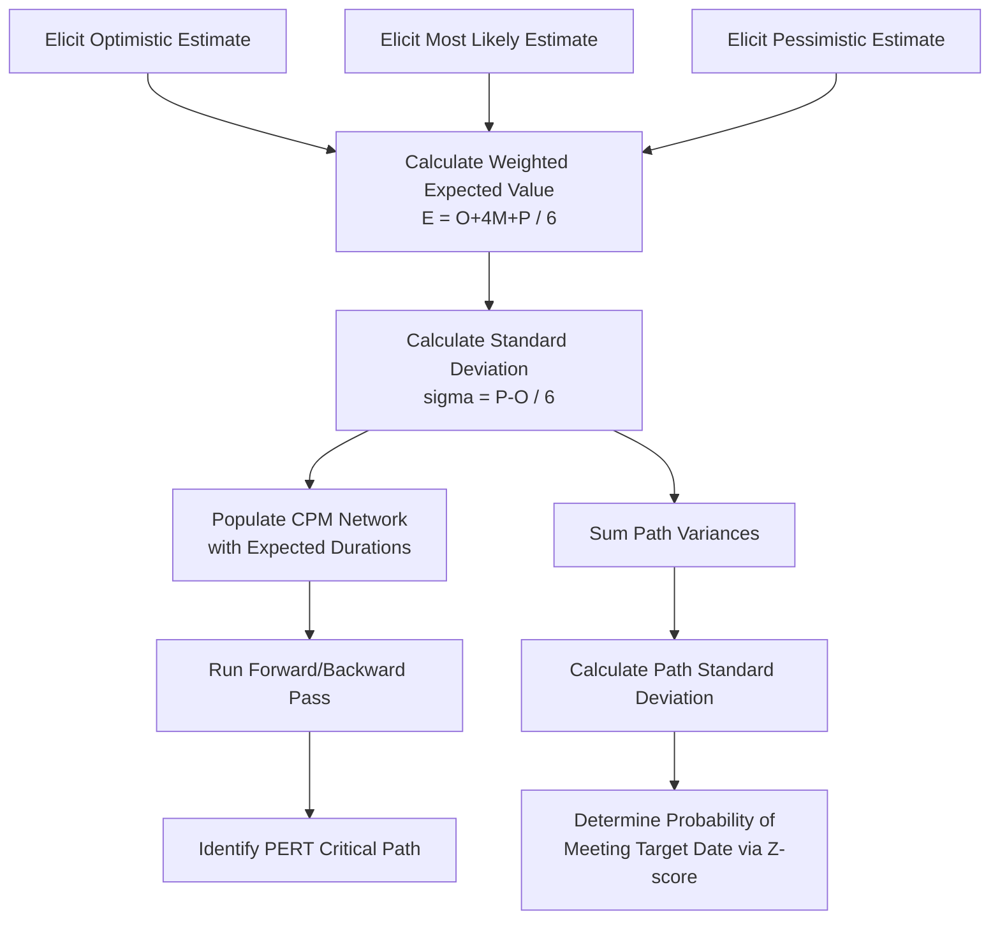

## Three-Point Estimating and the PERT Formula

### Definition

Three-point estimating is a technique that derives a single expected duration or cost estimate by combining three separate estimates for each activity: an optimistic scenario, a most likely scenario, and a pessimistic scenario. It explicitly acknowledges estimation uncertainty rather than relying on a single-point figure, and forms the mathematical basis of the **Program Evaluation and Review Technique (PERT)**, originally developed by the U.S. Navy in the 1950s for the Polaris missile program.

### The Three Estimates

- **Optimistic (O)**: The duration/cost if everything goes better than expected—best-case scenario with no significant obstacles
- **Most Likely (M)**: The duration/cost under normal conditions—the realistic, expected outcome
- **Pessimistic (P)**: The duration/cost if significant problems or risks materialize—worst-case (but still plausible) scenario

**Key Points**

- All three estimates should be elicited from subject matter experts (SMEs) with relevant experience on similar work
- Estimates should reflect *plausible* extremes, not absolute best/worst case (e.g., excluding force majeure events)
- Each estimate is typically gathered independently to reduce anchoring bias before being combined mathematically

### PERT Weighted Average Formula (Beta Distribution)

The classic PERT formula assumes the three estimates approximate a **Beta probability distribution**, weighting the most likely value four times more heavily than the optimistic or pessimistic values:

$$E = \frac{O + 4M + P}{6}$$

Where $E$ is the expected (weighted average) duration or cost.

**Example**

An activity has the following SME estimates:

- Optimistic (O) = 8 days
- Most Likely (M) = 12 days
- Pessimistic (P) = 22 days

$$E = \frac{8 + 4(12) + 22}{6} = \frac{8 + 48 + 22}{6} = \frac{78}{6} = 13\ \text{days}$$

The weighted expected duration (13 days) is higher than the most likely estimate (12 days) because the pessimistic tail (22 days) pulls the distribution to the right—reflecting asymmetric risk exposure common in real project work, where problems tend to add more delay than good luck saves.

### Triangular Distribution (Simple Average) Alternative

Some organizations use a simpler triangular distribution model instead of the Beta-based PERT weighting, giving each estimate equal weight:

$$E = \frac{O + M + P}{3}$$

**Example (same data)**

$$E = \frac{8 + 12 + 22}{3} = \frac{42}{3} = 14\ \text{days}$$

**Key Points**

- The triangular average is simpler to compute but does not emphasize the most likely value, often producing a slightly different (frequently higher) result
- PMI's *PMBOK Guide* presents both the triangular and Beta-weighted formulas as acceptable three-point techniques, distinguishing them primarily by whether the most likely estimate receives extra weight

### Standard Deviation and Variance

Because three-point estimating models uncertainty explicitly, it enables calculation of statistical dispersion around the expected value—critical for schedule risk analysis.

#### Activity Standard Deviation

$$\sigma = \frac{P - O}{6}$$

#### Activity Variance

$$\sigma^{2} = \left(\frac{P - O}{6}\right)^{2}$$

**Example (same data: O=8, P=22)**

$$\sigma = \frac{22 - 8}{6} = \frac{14}{6} \approx 2.33\ \text{days}$$

$$\sigma^{2} \approx 5.44$$

A larger spread between optimistic and pessimistic values produces a higher standard deviation, indicating greater uncertainty in that specific activity's duration.

### Path-Level and Project-Level Variance

For activities on the same critical path, variances are additive (assuming statistical independence between activities—a simplifying assumption commonly used in PERT):

$$\sigma^{2}_{path} = \sum \sigma^{2}_{i}$$

$$\sigma_{path} = \sqrt{\sum \sigma^{2}_{i}}$$

This path-level standard deviation is then used to estimate the probability of completing the project by a target date, using the standard normal (Z) distribution:

$$Z = \frac{Target\ Date - Expected\ Path\ Duration}{\sigma_{path}}$$

The resulting Z-score is looked up against a standard normal distribution table to determine the probability of meeting or beating the target date.

**Example**

A critical path has an expected duration of 120 days with a path standard deviation of 10 days. Leadership wants to know the probability of finishing within 135 days.

$$Z = \frac{135 - 120}{10} = 1.5$$

A Z-score of 1.5 corresponds to approximately the 93rd percentile on the standard normal distribution, meaning there is roughly a 93% probability [Inference — this percentile is derived from standard normal distribution tables and assumes the PERT independence and normality assumptions hold; real-world correlation between activities can make this estimate optimistic] of completing the path within 135 days, given the stated assumptions.

### Application in CPM Networks

- Each activity in the precedence diagram receives an $E$ value (expected duration) calculated via PERT, which is then used in the standard forward-pass/backward-pass calculations exactly as a single-point duration would be
- The **PERT critical path** is identified using the same longest-path logic as traditional CPM, but with expected durations replacing single-point estimates
- Because uncertainty is now quantified per activity, schedule risk analysis (often via Monte Carlo simulation) can layer on top of the basic PERT network to model near-critical paths that might overtake the nominal critical path under unfavorable conditions

### PERT vs. Traditional CPM

| Aspect | Traditional CPM | PERT |
| --- | --- | --- |
| Duration input | Single deterministic estimate | Three estimates (O, M, P) combined into weighted expected value |
| Uncertainty modeling | Not explicitly modeled | Explicitly modeled via variance/standard deviation |
| Output | Fixed critical path and dates | Expected critical path plus probability distribution of completion dates |
| Best suited for | Well-understood, repetitive work | Novel, uncertain, or high-risk work (R&D, first-of-a-kind projects) |
| Origin | DuPont, 1950s (deterministic) | U.S. Navy, 1950s (probabilistic) |

**Key Points**

- Modern scheduling practice often blends the two: activities with well-known durations use single-point CPM estimates, while high-uncertainty activities use PERT three-point inputs within the same network
- Software such as Primavera P6 and Microsoft Project support three-point/PERT duration fields directly [Unverified — exact field names and calculation options vary by software version]

### Application to EVM

- Three-point cost estimates can similarly be applied to work package budgets, producing an expected Budget at Completion (BAC) with an associated confidence range rather than a single deterministic figure
- Contingency reserves are frequently sized using the calculated variance/standard deviation from three-point estimates, rather than an arbitrary flat percentage—e.g., setting reserve at a level corresponding to a target confidence percentile (P80, P90) derived from the cumulative probability distribution
- When reporting Estimate at Completion (EAC), some organizations present a range (optimistic/most likely/pessimistic EAC) derived from the same three-point logic applied to remaining work, rather than a single-point forecast

### Diagram: PERT Estimating and Risk Analysis Flow

### Illustration: Beta Distribution Shape

<svg xmlns="http://www.w3.org/2000/svg" viewBox="0 0 640 300" font-family="Arial, sans-serif">
<text x="320" y="20" text-anchor="middle" font-size="14" font-weight="bold">PERT Beta Distribution Curve (svg_diagram)</text>
<line x1="60" y1="250" x2="600" y2="250" stroke="#333" stroke-width="2" />
<line x1="60" y1="250" x2="60" y2="50" stroke="#333" stroke-width="2" />
<text x="330" y="280" text-anchor="middle" font-size="12">Duration</text>

<path d="M 100 245 Q 180 240 230 150 Q 280 60 340 90 Q 420 140 500 220 Q 540 240 560 245" fill="none" stroke="`#2c5f9e`" stroke-width="2.5" />

<line x1="100" y1="250" x2="100" y2="240" stroke="#333" />
<text x="100" y="268" text-anchor="middle" font-size="11">O (8)</text>
<line x1="300" y1="250" x2="300" y2="90" stroke="#cc3300" stroke-dasharray="4,2" />
<text x="300" y="268" text-anchor="middle" font-size="11">M (12)</text>
<line x1="560" y1="250" x2="560" y2="240" stroke="#333" />
<text x="560" y="268" text-anchor="middle" font-size="11">P (22)</text>
<line x1="335" y1="250" x2="335" y2="105" stroke="#3a7d5c" stroke-dasharray="2,2" />
<text x="335" y="45" text-anchor="middle" font-size="11" fill="#3a7d5c">E (13) — weighted expected value</text>
</svg>

### Advantages and Limitations

**Key Points — Advantages**

- Explicitly captures uncertainty rather than presenting false precision
- Enables statistical probability analysis of meeting target dates or budgets
- Encourages structured SME input across a realistic range of outcomes rather than a single guess
- Foundation for more advanced schedule risk techniques (Monte Carlo simulation)

**Key Points — Limitations**

- Assumes activity durations are statistically independent, which is often not true in practice (common-cause risks like weather or labor shortages affect multiple activities simultaneously) [Inference — this is a widely acknowledged limitation of the classic PERT independence assumption in project management literature]
- Assumes a Beta distribution shape, which may not accurately reflect the true underlying probability distribution for all activity types
- Requires more SME time and effort than single-point estimating
- Can produce a false sense of statistical rigor if the underlying O/M/P inputs themselves are poorly elicited or biased

### Best Practices

**Key Points**

- Elicit O, M, and P estimates independently from single-point estimates to avoid anchoring on a prior number
- Use structured elicitation techniques (Delphi method, facilitated workshops) to reduce individual estimator bias
- Reserve three-point/PERT estimating for activities with genuine uncertainty; applying it uniformly across well-understood, repetitive work adds unnecessary overhead
- Pair PERT variance calculations with Monte Carlo simulation for a fuller picture of project-level schedule risk, since the classic Z-score approach only evaluates the nominal critical path and can understate risk from near-critical paths
- Revisit and update three-point estimates as the project progresses and uncertainty resolves (progressive elaboration)

### Related Topics

- Monte Carlo simulation for schedule risk analysis
- Beta and triangular probability distributions in project estimating
- Critical path vs. near-critical path risk exposure
- Contingency and management reserve sizing methodologies
- Analogous and parametric estimating techniques
- Schedule Performance Index (SPI) and probabilistic forecasting in EVM
- Delphi technique and other structured expert-judgment elicitation methods