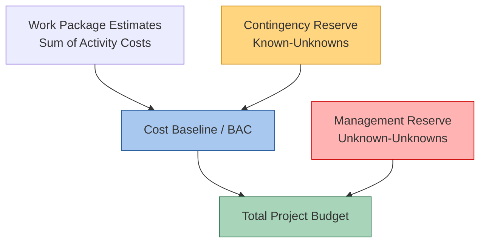

## Estimating Contingency and Reserves

### Definition

Contingency and management reserves are budget and schedule allowances set aside to account for uncertainty in project estimates. They are a formal mechanism for managing the gap between a deterministic estimate (single-point duration/cost) and the probabilistic reality that actual outcomes vary due to identified and unidentified risks.

PMI's *PMBOK Guide* distinguishes two distinct reserve categories, which differ in scope, ownership, and control:

- **Contingency Reserve**: Addresses *known-unknowns*—identified risks within the project's risk register that have quantifiable probability and impact. Owned and controlled by the project manager.
- **Management Reserve**: Addresses *unknown-unknowns*—unforeseeable risks that cannot be specifically identified in advance. Owned and controlled by senior management/sponsor, and typically requires formal change control to access.

### Contingency Reserve vs. Management Reserve

| Aspect | Contingency Reserve | Management Reserve |
| --- | --- | --- |
| Addresses | Known-unknowns (identified risks) | Unknown-unknowns (unforeseeable risks) |
| Ownership | Project manager | Sponsor / senior management |
| Included in baseline? | Yes — part of the cost/schedule baseline | No — outside the baseline, part of total project budget |
| Access process | PM can allocate directly per risk response plan | Requires formal change request/approval |
| Basis for sizing | Risk register, probability/impact analysis, simulation | Organizational policy, historical overrun rates, executive judgment |
| Reported in EVM as | Part of Budget at Completion (BAC) | Separate from BAC, part of total project budget/funding |

**Key Points**

- Contingency reserve sits *inside* the Performance Measurement Baseline (PMB); management reserve sits *outside* it
- The total project budget equals the PMB (cost baseline including contingency) plus management reserve
- Confusing the two—or allowing contingency to be spent without linkage to a specific realized risk—undermines the integrity of both risk management and EVM reporting

### Formula: Total Project Budget Structure

$$Total\ Project\ Budget = BAC + Management\ Reserve$$

$$BAC = \sum(Work\ Package\ Estimates) + Contingency\ Reserve$$

### Methods for Sizing Contingency Reserve

#### 1. Percentage of Base Estimate

A flat percentage applied to the base cost or duration estimate, often derived from historical organizational data or industry benchmarks.

$$Contingency = Base\ Estimate \times Contingency\ \%$$

**Example**

A $2,000,000 base estimate with a 10% contingency policy:

$$Contingency = 2{,}000{,}000 \times 0.10 = \$200{,}000$$

**Key Points**

- Simple and fast to apply, but not risk-specific—treats all projects/phases as equally uncertain regardless of actual risk exposure
- Common percentages vary widely by industry and project maturity phase [Unverified — specific percentage benchmarks are organization- and industry-specific and not universally standardized]

#### 2. Expected Monetary Value (EMV) / Risk-Based Method

Contingency is calculated by summing the probability-weighted impact of each identified risk in the risk register.

$$EMV_{risk} = Probability \times Impact$$

$$Contingency = \sum EMV_{risk_i}$$

**Example**

| Risk | Probability | Impact ($) | EMV |
| --- | --- | --- | --- |
| Subcontractor delay | 30% | 80,000 | 24,000 |
| Material price escalation | 20% | 50,000 | 10,000 |
| Permit delay | 15% | 40,000 | 6,000 |
| Weather delay | 40% | 25,000 | 10,000 |

$$Contingency = 24{,}000 + 10{,}000 + 6{,}000 + 10{,}000 = \$50{,}000$$

**Key Points**

- Directly traceable to specific risks in the risk register, supporting drawdown tracking as risks are retired or realized
- Requires a maintained, quantified risk register with credible probability/impact estimates—quality depends heavily on risk identification completeness
- Does not by itself capture risk *correlation* (multiple risks materializing simultaneously); this is often better handled via simulation

#### 3. Three-Point Estimating / PERT-Derived Reserve

Using the standard deviation calculated from optimistic/most likely/pessimistic estimates (see three-point estimating), reserve can be sized to a target confidence level.

$$\sigma_{path} = \sqrt{\sum \sigma^{2}_{i}}$$

Reserve is then set at a chosen number of standard deviations above the expected value (e.g., one standard deviation ≈ 84th percentile confidence under a normal approximation).

**Example**

An expected project cost of $3,000,000 with a calculated path/portfolio standard deviation of $150,000. Setting contingency at one standard deviation:

$$Contingency = 150{,}000$$

$$Budget\ at\ 84\%\ confidence \approx 3{,}150{,}000$$

[Inference — the percentile correspondence assumes an approximately normal distribution of the aggregated cost/duration, which is a simplifying assumption; actual distributions, especially with correlated risks, may be skewed.]

#### 4. Monte Carlo Simulation

Runs thousands of iterations of the project cost/schedule model, randomly sampling each activity's duration/cost from its defined probability distribution (often derived from three-point estimates), to generate a cumulative probability distribution of total project outcomes.

**Key Points**

- Allows selection of reserve based on a specific target confidence level (e.g., P50, P80, P90) read directly from the simulated cumulative distribution curve
- Captures correlation between activities/risks if modeled explicitly, addressing a key weakness of the simple PERT path-variance approach
- Requires simulation software (e.g., @RISK, Primavera Risk Analysis, or custom Python/R models) and more sophisticated risk data inputs

**Example (Conceptual)**

A Monte Carlo simulation of 10,000 iterations produces a cumulative distribution where:

- P50 (50% confidence) = $3,050,000
- P80 (80% confidence) = $3,280,000
- P90 (90% confidence) = $3,410,000

An organization requiring 80% confidence in the budget would set:

$$Contingency = 3{,}280{,}000 - 3{,}000{,}000\ (base\ estimate) = \$280{,}000$$

### Diagram: Cumulative Probability Curve (S-Curve)

<svg xmlns="http://www.w3.org/2000/svg" viewBox="0 0 640 340" font-family="Arial, sans-serif">
<text x="320" y="20" text-anchor="middle" font-size="14" font-weight="bold">Cost Contingency via Cumulative Probability (svg_diagram)</text>
<line x1="70" y1="290" x2="600" y2="290" stroke="#333" stroke-width="2" />
<line x1="70" y1="290" x2="70" y2="40" stroke="#333" stroke-width="2" />
<text x="335" y="315" text-anchor="middle" font-size="12">Total Project Cost</text>
<text x="25" y="165" text-anchor="middle" font-size="12" transform="rotate(-90 25 165)">Cumulative Probability</text>

<path d="M 100 285 Q 200 280 280 220 Q 360 130 440 80 Q 520 55 570 45" fill="none" stroke="`#2c5f9e`" stroke-width="2.5" />

<line x1="70" y1="165" x2="600" y2="165" stroke="#999" stroke-dasharray="3,3" />
<text x="620" y="169" font-size="10" fill="#666">50%</text>
<line x1="290" y1="165" x2="290" y2="290" stroke="#cc8400" stroke-dasharray="3,3" />
<text x="290" y="305" text-anchor="middle" font-size="10">P50</text>
<line x1="70" y1="97" x2="600" y2="97" stroke="#999" stroke-dasharray="3,3" />
<text x="620" y="101" font-size="10" fill="#666">80%</text>
<line x1="430" y1="97" x2="430" y2="290" stroke="#cc0000" stroke-dasharray="3,3" />
<text x="430" y="305" text-anchor="middle" font-size="10">P80</text>

<text x="100" y="40" font-size="10" fill="#666">Base Estimate</text>

<line x1="100" y1="45" x2="100" y2="290" stroke="`#3a7d5c`" stroke-dasharray="2,2" />

</svg>

### Application to CPM: Schedule Contingency (Time Reserve)

Schedule contingency (also called schedule reserve or time buffer) applies the same logic to duration rather than cost:

- Sized using the same techniques (percentage, PERT variance, Monte Carlo schedule risk analysis)
- Often inserted into the network as an explicit **buffer activity** (particularly in Critical Chain Project Management, a related but distinct methodology) or reflected as extended durations on high-risk critical/near-critical path activities
- A schedule risk analysis identifies which near-critical paths have a meaningful probability of becoming critical, informing where schedule reserve is most needed rather than spreading it evenly

**Example**

A CPM network's deterministic critical path totals 200 days. A Monte Carlo schedule simulation shows the P80 completion duration is 224 days. The 24-day difference may be held as an explicit schedule reserve activity at the end of the network, distinct from the deterministic finish milestone, to protect the contractual completion date.

### Application to EVM: Reserve Tracking and Drawdown

- **Contingency reserve**, being inside the BAC, is subject to normal EVM tracking once allocated to specific work packages as risks are realized and responses executed
- **Management reserve** drawdown is tracked separately and reported to the sponsor/governance body; when management reserve is formally transferred into the baseline (e.g., to fund an approved scope change or realized unknown-risk event), this constitutes a **baseline change** requiring formal documentation, not a routine EVM variance
- A "contingency burn-down chart" is a common project control tool, plotting remaining contingency reserve over time against planned drawdown, to detect whether reserve is being consumed faster than the risk profile would predict

$$Remaining\ Contingency = Original\ Contingency - \sum(Realized\ Risk\ Costs\ Allocated)$$

**Key Points**

- Rapid, unplanned contingency burn-down is a leading indicator of schedule/cost trouble that may not yet be visible in CPI/SPI, since contingency use precedes actual cost variance in the underlying work packages
- Some organizations track a "contingency drawdown curve" as a companion metric to the standard EVM S-curve

### Common Pitfalls

- **Padding at the activity level**: Individual estimators inflate their own activity estimates "just in case," which duplicates the purpose of formal contingency reserve and obscures true risk exposure (Parkinson's Law effects—work expands to fill the padded time)
- **Treating contingency as a slush fund**: Using contingency reserve for scope creep or convenience rather than in response to a realized, documented risk undermines the reserve's statistical basis and depletes protection against genuine risk events
- **Static reserve, never revisited**: Failing to update contingency reserve estimates as risks are retired, realized, or newly identified throughout the project lifecycle
- **Conflating contingency and management reserve** in reporting, which obscures who actually controls and approves the use of each pool

### Best Practices

**Key Points**

- Size contingency reserve using a risk-based method (EMV, three-point, or Monte Carlo) rather than an arbitrary flat percentage wherever risk data quality permits
- Maintain a live linkage between the risk register and contingency allocation—each contingency drawdown should trace to a specific identified risk or documented root cause
- Keep management reserve genuinely separate from the cost baseline in reporting systems, with formal change control governing any transfer into the BAC
- Track contingency burn-down as an early warning indicator alongside traditional CPI/SPI metrics
- Reassess reserve adequacy at each major project phase gate, since risk exposure typically decreases as the project matures and uncertainty resolves (though new risks can also emerge)
- Avoid activity-level padding; concentrate uncertainty management in the formal reserve mechanism instead

### Related Topics

- Risk register development and probability/impact assessment
- Monte Carlo simulation for schedule and cost risk analysis
- Three-point estimating and PERT variance calculations
- Performance Measurement Baseline (PMB) and Budget at Completion (BAC)
- Critical Chain Project Management and buffer management
- Change control processes for baseline modifications
- Earned Value Management variance analysis (CPI, SPI, CV, SV)