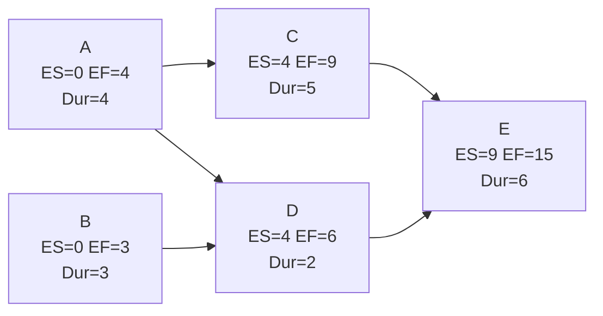

## Early Start and Early Finish Calculation

### Definition

Early Start (ES) is the earliest possible time an activity can begin, given that all its predecessor activities have been completed. Early Finish (EF) is the earliest possible time an activity can be completed, calculated by adding the activity's duration to its Early Start.

These values are computed during the **forward pass** of the Critical Path Method (CPM), which traverses the network diagram from the project start node to the project end node.

### Core Formulas

$$EF = ES + Duration$$

For an activity with a single predecessor:

$$ES = EF_{predecessor}$$

For an activity with multiple predecessors:

$$ES = \max(EF_{p1}, EF_{p2}, \ldots, EF_{pn})$$

**Key Points**

- The Early Start of any activity equals the **largest** (maximum) Early Finish among all its immediate predecessors — not the smallest.
- The first activity (or activities) in a network, with no predecessors, is assigned $ES = 0$ (in zero-based day counting) or $ES = 1$ (in calendar day-numbering, where day 1 is the first working day). Both conventions are used in practice; consistency matters more than which one is chosen.
- The Early Finish of the last activity (or the maximum EF among all terminal activities) determines the theoretical minimum project duration.
- Forward pass calculations flow left-to-right through the network diagram, following the direction of the dependency arrows.

### Step-by-Step Calculation Procedure

1. **Identify the start node(s)** — activities with no predecessors. Set $ES = 0$ for these.
2. **Calculate EF** for each start activity: $EF = ES + Duration$.
3. **Move to successor activities.** For each successor, look at all of its predecessors' EF values.
4. **Take the maximum EF** among the predecessors to determine the successor's ES.
5. **Calculate EF** for the successor using $EF = ES + Duration$.
6. **Repeat** steps 3–5 until every activity in the network has been processed and you reach the terminal node(s).
7. **Record the project's minimum duration** as the maximum EF among all ending activities.

### Worked Example

Consider a small network with five activities:

| Activity | Duration | Predecessors |
| --- | --- | --- |
| A | 4 | — |
| B | 3 | — |
| C | 5 | A |
| D | 2 | A, B |
| E | 6 | C, D |

**Calculation:**

- **Activity A** (no predecessors): $ES = 0$, $EF = 0 + 4 = 4$
- **Activity B** (no predecessors): $ES = 0$, $EF = 0 + 3 = 3$
- **Activity C** (predecessor: A): $ES = EF_A = 4$, $EF = 4 + 5 = 9$
- **Activity D** (predecessors: A, B): $ES = \max(EF_A, EF_B) = \max(4, 3) = 4$, $EF = 4 + 2 = 6$
- **Activity E** (predecessors: C, D): $ES = \max(EF_C, EF_D) = \max(9, 6) = 9$, $EF = 9 + 6 = 15$

**Result:** The project's minimum duration is **15 time units**, determined by Activity E's Early Finish.

### Network Diagram (svg_diagram)

### Convergence Rule (Merge Activities)

Activities with multiple incoming dependencies (like Activity D and Activity E above) are called **merge activities**. The governing rule is:

> An activity cannot start until **all** of its predecessors have finished.

This is why ES is calculated using the **maximum** EF, not the minimum, average, or first-listed predecessor. Using anything other than the maximum would violate the logical dependency constraints and produce an infeasible schedule.

### Relationship to Backward Pass and Float

Early Start and Early Finish values serve as the foundation for the **backward pass**, which calculates Late Start (LS) and Late Finish (LF) by traversing the network from end to start. Once both passes are complete:

$$\text{Total Float} = LS - ES = LF - EF$$

Activities where Total Float equals zero lie on the **critical path** — the longest path through the network and the sequence of activities that directly determines the project's minimum duration. [Inference] In most conventional CPM implementations this float calculation assumes no imposed constraint dates or resource leveling adjustments have been applied; those factors, when present, can alter float values independently of the ES/EF chain.

### Handling Different Precedence Relationships

The basic $ES = \max(EF_{predecessors})$ formula assumes standard **Finish-to-Start (FS)** relationships with zero lag. Other relationship types modify the calculation:

- **Finish-to-Start with lag:** $ES = EF_{predecessor} + Lag$
- **Start-to-Start (SS):** $ES = ES_{predecessor} + Lag$
- **Finish-to-Finish (FF):** $EF = EF_{predecessor} + Lag$, then $ES = EF - Duration$
- **Start-to-Finish (SF):** rare in practice; $EF = ES_{predecessor} + Lag$

When multiple relationship types converge on one activity, each predecessor's contribution must be calculated according to its own relationship type, and the **latest resulting ES** still governs.

### Common Errors and Pitfalls

**Key Points**

- Taking the minimum instead of maximum EF at merge points — this is the single most frequent calculation error in manual CPM exercises.
- Forgetting to update ES for an activity when a new predecessor path is discovered during network analysis.
- Mixing zero-based and one-based day numbering conventions inconsistently across a schedule, which shifts all downstream calculations by one time unit.
- Neglecting lag or lead time when relationships aren't simple Finish-to-Start.
- Confusing Early Finish with the activity's calendar finish date when non-working days (weekends, holidays) are not factored into a calendar-based schedule; the ES/EF values here represent duration units on a project timeline, and converting them to actual calendar dates requires a separate calendar-mapping step. [Unverified] — the exact calendar-mapping method varies by scheduling software and organizational calendar configuration.

### Practical Notes for Software Implementations

Project scheduling tools (Primavera P6, Microsoft Project, and open-source alternatives) automate the forward pass, but understanding the manual calculation is essential for:

- Verifying software output and catching data-entry errors (e.g., incorrect predecessor links).
- Interpreting schedule variance reports.
- Manually adjusting schedules during what-if analysis or dispute resolution (e.g., delay claims in construction projects).

[Inference] Behavior may vary slightly between scheduling tools regarding how they handle constraint dates (e.g., "Start No Earlier Than") that can override a purely calculated ES value — always verify against the specific tool's documentation when constraints are involved.

**Next Steps**

- Late Start and Late Finish calculation (backward pass)
- Total Float and Free Float calculation
- Critical Path identification methods
- Handling lag and lead time in network diagrams
- Precedence Diagramming Method (PDM) relationship types (FS, SS, FF, SF)
- Schedule compression techniques (crashing and fast-tracking)
- Converting duration-based ES/EF to calendar dates