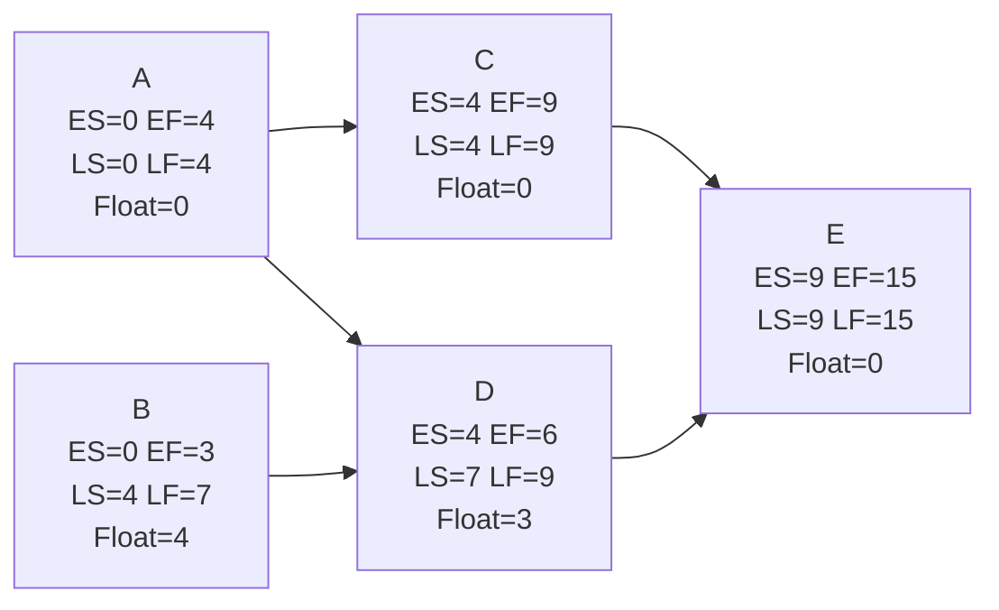

## Late Start and Late Finish Calculation

### Definition

Late Finish (LF) is the latest possible time an activity can be completed without delaying the overall project completion date. Late Start (LS) is the latest possible time an activity can begin without delaying the project, calculated by subtracting the activity's duration from its Late Finish.

These values are computed during the **backward pass** of the Critical Path Method (CPM), which traverses the network diagram from the project end node back to the project start node — the reverse direction of the forward pass used for Early Start (ES) and Early Finish (EF).

### Core Formulas

$$LS = LF - Duration$$

For an activity with a single successor:

$$LF = LS_{successor}$$

For an activity with multiple successors:

$$LF = \min(LS_{s1}, LS_{s2}, \ldots, LS_{sn})$$

**Key Points**

- The Late Finish of any activity equals the **smallest** (minimum) Late Start among all its immediate successors — not the largest.
- The terminal activity (or activities) in a network, with no successors, is assigned $LF = EF_{project}$, where $EF_{project}$ is the project's overall minimum duration determined by the forward pass (the maximum EF among all ending activities).
- Backward pass calculations flow right-to-left through the network diagram, moving against the direction of the dependency arrows.
- The backward pass **cannot begin** until the forward pass is complete, since the terminal LF value is seeded directly from the forward pass's project-duration result.

### Prerequisite: Forward Pass Must Be Complete

Before calculating LS/LF, the ES and EF values for every activity must already be known, and the project's overall duration must be established. The backward pass initializes by setting the LF of the last activity (or activities) equal to that project duration, then works backward.

### Step-by-Step Calculation Procedure

1. **Identify the end node(s)** — activities with no successors. Set $LF = EF_{project}$ (the project's minimum duration from the forward pass) for these.
2. **Calculate LS** for each end activity: $LS = LF - Duration$.
3. **Move to predecessor activities.** For each predecessor, look at all of its successors' LS values.
4. **Take the minimum LS** among the successors to determine the predecessor's LF.
5. **Calculate LS** for the predecessor using $LS = LF - Duration$.
6. **Repeat** steps 3–5 until every activity in the network has been processed and you reach the starting node(s).
7. **Verify:** the LS of the starting activity/activities should equal its ES (typically 0) if the network has at least one critical path running through it.

### Worked Example

Using the same five-activity network from the forward pass:

| Activity | Duration | Predecessors | ES | EF |
| --- | --- | --- | --- | --- |
| A | 4 | — | 0 | 4 |
| B | 3 | — | 0 | 3 |
| C | 5 | A | 4 | 9 |
| D | 2 | A, B | 4 | 6 |
| E | 6 | C, D | 9 | 15 |

Project duration = 15 (from Activity E's EF).

**Backward pass calculation:**

- **Activity E** (no successors, terminal activity): $LF = 15$, $LS = 15 - 6 = 9$
- **Activity D** (successor: E): $LF = LS_E = 9$, $LS = 9 - 2 = 7$
- **Activity C** (successor: E): $LF = LS_E = 9$, $LS = 9 - 5 = 4$
- **Activity B** (successor: D): $LF = LS_D = 7$, $LS = 7 - 3 = 4$
- **Activity A** (successors: C, D): $LF = \min(LS_C, LS_D) = \min(4, 7) = 4$, $LS = 4 - 4 = 0$

**Result:** Activity A's LS = 0, which matches its ES = 0 — confirming the network calculation is internally consistent and that Activity A lies on the critical path.

### Full Comparison Table

| Activity | Duration | ES | EF | LS | LF | Total Float |
| --- | --- | --- | --- | --- | --- | --- |
| A | 4 | 0 | 4 | 0 | 4 | 0 |
| B | 3 | 0 | 3 | 4 | 7 | 4 |
| C | 5 | 4 | 9 | 4 | 9 | 0 |
| D | 2 | 4 | 6 | 7 | 9 | 3 |
| E | 6 | 9 | 15 | 9 | 15 | 0 |

### Network Diagram (svg_diagram)

### Divergence Rule (Burst Activities)

Activities with multiple outgoing dependencies (like Activity A above, feeding both C and D) are called **burst activities**. The governing rule is:

> An activity's Late Finish is constrained by the **earliest** deadline among everything that depends on it.

This is why LF is calculated using the **minimum** LS among successors, not the maximum. If the maximum were used instead, the schedule would allow that activity to finish later than one of its successors could tolerate, violating the dependency and silently delaying the project.

### Relationship to Total Float and the Critical Path

Once both the forward pass (ES/EF) and backward pass (LS/LF) are complete, **Total Float** (also called Total Slack) is calculated as:

$$\text{Total Float} = LS - ES = LF - EF$$

- Activities with **Total Float = 0** lie on the **critical path** — any delay to these activities delays the entire project.
- Activities with **Total Float > 0** have scheduling flexibility; they can be delayed by up to their float value without affecting the project finish date, though delaying them beyond that float can consume float on other paths or create a new critical path.

[Inference] In the worked example, Activities A, C, and E form the critical path (float = 0), while B and D have slack of 4 and 3 units respectively — this follows directly from the arithmetic shown, but real-world schedules may show multiple concurrent critical paths or near-critical paths that warrant equal attention during risk analysis.

### Handling Different Precedence Relationships

The basic $LF = \min(LS_{successors})$ formula assumes standard **Finish-to-Start (FS)** relationships with zero lag. Other relationship types modify the calculation for the backward pass:

- **Finish-to-Start with lag:** $LF = LS_{successor} - Lag$
- **Start-to-Start (SS):** $LF$ derived from $LS = LS_{successor} - Lag$, then $LF = LS + Duration$
- **Finish-to-Finish (FF):** $LF = LF_{successor} - Lag$
- **Start-to-Finish (SF):** rare in practice; requires careful sign handling of lag

When multiple relationship types converge (diverge) on one activity during the backward pass, each successor's contribution must be calculated according to its own relationship type, and the **earliest resulting LF** still governs.

### Common Errors and Pitfalls

**Key Points**

- Taking the maximum instead of minimum LS at burst points — the mirror-image error of the forward-pass mistake, and equally common.
- Starting the backward pass before the forward pass is fully validated, which propagates errors throughout the entire late-date chain.
- Seeding the terminal LF with an arbitrary or contractual deadline instead of the calculated project duration (EF of the last activity), unless intentionally performing constraint analysis against an imposed finish date — a valid but distinct use case (see next section).
- Forgetting that float can become **negative** if an imposed finish-date constraint is earlier than the calculated project duration, which indicates the schedule is not achievable without compression (crashing, fast-tracking, or scope reduction).

### Constraint-Driven Backward Pass (Imposed Finish Dates)

In practice, project schedules are sometimes bound by a contractual or imposed deadline rather than the calculated minimum duration. In this variant:

$$LF_{terminal} = \text{Imposed Finish Date} \quad (\text{instead of } EF_{project})$$

If the imposed finish date is **earlier** than the calculated EF, the resulting Total Float across the network becomes **negative**, signaling that the project cannot meet the deadline under current logic and durations without intervention (schedule compression, resequencing, or added resources). [Unverified] — how individual scheduling tools display, flag, or color-code negative float varies by software (Primavera P6, Microsoft Project, etc.); consult the specific tool's documentation for exact behavior.

### Practical Notes for Software Implementations

Scheduling software (Primavera P6, Microsoft Project, and open-source alternatives) automates the backward pass, but manual understanding remains essential for:

- Auditing automatically generated float values, especially on schedules with multiple calendars or constraint types.
- Interpreting near-critical paths during risk workshops.
- Supporting delay-claim analysis in construction and engineering projects, where LS/LF values are often scrutinized line-by-line.
- Recognizing when negative float indicates an infeasible baseline schedule requiring corrective action before contract execution.

**Next Steps**

- Total Float and Free Float calculation in depth
- Critical Path identification and multiple critical paths
- Negative float and schedule compression (crashing vs. fast-tracking)
- Precedence Diagramming Method (PDM) relationship types and lag in backward pass
- Resource leveling effects on late dates
- Schedule constraint types (Start No Earlier Than, Finish No Later Than, Mandatory Finish)