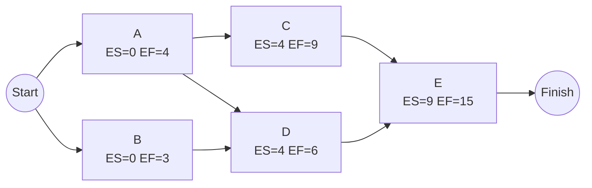

## Forward Pass Methodology


### Definition

The forward pass is the network analysis procedure in the Critical Path Method (CPM) that calculates the Early Start (ES) and Early Finish (EF) of every activity in a project schedule by traversing the network diagram from the start node to the end node. It establishes the earliest possible timeline on which the project can be executed given the logical dependencies between activities.

### Purpose Within CPM

**Key Points**

- Determines the theoretical minimum project duration.
- Establishes the ES and EF baseline required before the backward pass (Late Start/Late Finish) can be performed.
- Reveals which paths through the network are longest, forming the basis for critical path identification once combined with the backward pass results.
- Provides the earliest feasible dates for resource planning, procurement scheduling, and milestone forecasting.

### Prerequisites

Before performing a forward pass, the following must be defined:

1. **Complete activity list** with unique identifiers.
2. **Duration estimates** for every activity (in consistent time units — days, weeks, etc.).
3. **Logical dependencies (predecessor relationships)** between activities, typically expressed as Finish-to-Start (FS), Start-to-Start (SS), Finish-to-Finish (FF), or Start-to-Finish (SF), with optional lag or lead time.
4. **A validated network diagram** (Activity-on-Node/Precedence Diagramming Method is the modern standard; Activity-on-Arrow is a legacy alternative) with no open-ended dependencies (every non-start activity has at least one predecessor, and every non-end activity has at least one successor).

### Core Methodology

The forward pass proceeds in topological order — each activity is processed only after all of its predecessors have been calculated.

**General procedure:**

1. **Initialize start activities.** Any activity with no predecessors is assigned $ES = 0$.
2. **Calculate EF for each activity:**


   $$EF = ES + Duration$$
3. **Propagate to successors.** For each successor activity, examine the EF of every predecessor feeding into it.
4. **Apply the convergence rule at merge points:**


   $$ES = \max(EF_{p1}, EF_{p2}, \ldots, EF_{pn})$$

   The ES of an activity with multiple predecessors is the **maximum** EF among them — because an activity cannot begin until *all* its predecessors are finished.
5. **Continue left to right** through the network until every activity, including all terminal (end) activities, has an ES and EF.
6. **Determine project duration:**


   $$\text{Project Duration} = \max(EF_{end\ activities})$$

### Handling Non-Standard Dependency Types

Standard Finish-to-Start with zero lag is the default assumption, but real schedules often include other relationship types. Each modifies how ES is derived from a predecessor:

| Relationship | Formula for Successor's Start Constraint |
| --- | --- |
| Finish-to-Start (FS) | $ES = EF_{pred} + Lag$ |
| Start-to-Start (SS) | $ES = ES_{pred} + Lag$ |
| Finish-to-Finish (FF) | $EF = EF_{pred} + Lag$, then $ES = EF - Duration$ |
| Start-to-Finish (SF) | $EF = ES_{pred} + Lag$ (rare in practice) |

When an activity has multiple predecessors using different relationship types, each predecessor's contribution is calculated according to its own rule, and the constraint that produces the **latest** feasible start still governs the activity's final ES.

### Worked Example

Given a network of five activities:

| Activity | Duration | Predecessors |
| --- | --- | --- |
| A | 4 | — |
| B | 3 | — |
| C | 5 | A |
| D | 2 | A, B |
| E | 6 | C, D |

**Forward pass trace:**

- A: $ES=0$, $EF=0+4=4$
- B: $ES=0$, $EF=0+3=3$
- C: $ES=EF_A=4$, $EF=4+5=9$
- D: $ES=\max(EF_A, EF_B)=\max(4,3)=4$, $EF=4+2=6$
- E: $ES=\max(EF_C, EF_D)=\max(9,6)=9$, $EF=9+6=15$

**Project duration = 15 time units** (from Activity E's EF, the only terminal activity).

### Network Diagram (svg_diagram)



### Algorithmic Implementation (Pseudocode)

The forward pass is naturally implemented as a **topological sort** followed by dynamic-programming-style propagation:

```plaintext
function forwardPass(activities):
    # activities: list of nodes with duration, predecessors[], successors[]
    sortedActivities = topologicalSort(activities)

    for activity in sortedActivities:
        if activity.predecessors is empty:
            activity.ES = 0
        else:
            activity.ES = max(pred.EF for pred in activity.predecessors)
        activity.EF = activity.ES + activity.duration

    projectDuration = max(activity.EF for activity in activities if activity.successors is empty)
    return projectDuration
```

**Key Points**

- Time complexity is $O(V + E)$, where $V$ is the number of activities (vertices) and $E$ is the number of dependency links (edges) — equivalent to standard topological sort complexity.
- A valid forward pass requires the network to be a **Directed Acyclic Graph (DAG)**; any circular dependency (a loop) makes the forward pass undefined and must be detected and resolved before calculation.
- [Inference] Most commercial scheduling tools detect circular logic automatically and flag it as an error during schedule validation, though the specific error messaging and detection method varies by software.

### Detecting and Handling Circular Dependencies

Because the forward pass depends on topological ordering, a cycle (e.g., Activity A depends on B, B depends on C, C depends on A) makes it impossible to determine which activity to calculate first. Standard practice:

1. Run cycle detection (e.g., depth-first search tracking the recursion stack) before attempting the forward pass.
2. If a cycle is found, the scheduling logic must be corrected — typically by removing or restructuring one of the offending dependency links — before proceeding.

### Common Errors and Pitfalls

**Key Points**

- Using the **minimum** EF instead of the maximum at merge/convergence points — the most frequent manual calculation error.
- Processing activities out of topological order, leading to calculations based on incomplete predecessor data.
- Ignoring lag/lead time on non-FS relationships, which shifts ES/EF values silently.
- Treating duration units inconsistently (e.g., mixing working days and calendar days) without a clear calendar-mapping convention.
- Failing to identify all terminal activities when a network has multiple parallel end points, resulting in an understated project duration.

### Relationship to the Backward Pass

The forward pass output feeds directly into the **backward pass**:

- The maximum EF among terminal activities becomes the seed value for the terminal activity's Late Finish (LF) in the backward pass.
- Once both passes are complete, Total Float is derived as $LS - ES$ (or equivalently $LF - EF$), and activities with zero float form the **critical path**.

Without a correctly executed forward pass, neither the backward pass nor the critical path determination can proceed, making this the foundational calculation of the entire CPM technique.

### Practical Applications and Tooling

Forward pass logic is embedded in virtually all professional scheduling software (Primavera P6, Microsoft Project, and various open-source project-management libraries), which automate the traversal and recalculation whenever durations or dependencies change. Manual mastery of the methodology remains important for:

- Validating software-generated schedules and catching data-entry or logic errors.
- Performing quick manual estimates or sanity checks during planning meetings.
- Understanding schedule impact analysis when evaluating proposed changes or delay claims.
- Teaching and certification contexts (e.g., PMP, PMI-SP) where manual network calculation is a tested skill.

**Related Topics**

- Early Start and Early Finish calculation (detailed single-activity mechanics)
- Backward pass methodology (Late Start/Late Finish)
- Total Float and Free Float calculation
- Critical Path identification and multiple critical paths
- Precedence Diagramming Method (PDM) vs. Activity-on-Arrow (AOA)
- Topological sorting algorithms in scheduling software
- Schedule network analysis with lag and lead time
- Circular dependency detection in project networks