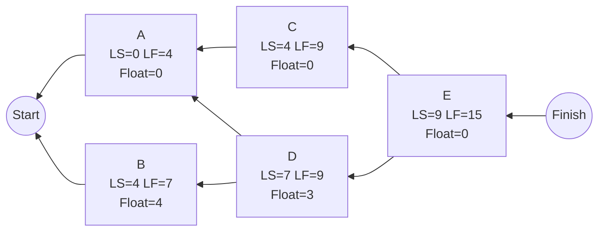

## Backward Pass Methodology


### Definition

The backward pass is the network analysis procedure in the Critical Path Method (CPM) that calculates the Late Start (LS) and Late Finish (LF) of every activity by traversing the network diagram from the end node back to the start node. It establishes the latest possible timeline on which each activity can occur without delaying the overall project completion date.

### Purpose Within CPM

**Key Points**

- Determines how much scheduling flexibility (float/slack) exists for each activity.
- Combined with the forward pass results, identifies the **critical path** — the sequence of activities with zero float that directly determines project duration.
- Supports risk management by revealing which activities have little or no buffer against delay.
- Enables constraint analysis when a project must meet an imposed deadline earlier than its calculated natural duration.

### Prerequisites

The backward pass **cannot be performed** until the forward pass is fully complete. It requires:

1. **ES and EF values for every activity**, calculated via the forward pass.
2. **The project's overall duration**, determined as the maximum EF among all terminal (end) activities.
3. **The same validated network diagram** (dependencies, durations, and relationship types) used in the forward pass — the logic direction is simply reversed for traversal, not redefined.

### Core Methodology

The backward pass proceeds in **reverse topological order** — each activity is processed only after all of its successors have been calculated.

**General procedure:**

1. **Initialize end activities.** Any activity with no successors is assigned:


   $$LF = EF_{project}$$

   where $EF_{project}$ is the project's overall duration from the forward pass.
2. **Calculate LS for each activity:**


   $$LS = LF - Duration$$
3. **Propagate to predecessors.** For each predecessor activity, examine the LS of every successor it feeds into.
4. **Apply the divergence rule at burst points:**


   $$LF = \min(LS_{s1}, LS_{s2}, \ldots, LS_{sn})$$

   The LF of an activity with multiple successors is the **minimum** LS among them — because the activity must finish early enough to satisfy the *most restrictive* downstream deadline.
5. **Continue right to left** through the network until every activity, including all starting activities, has an LS and LF.
6. **Validate consistency:** the LS of the starting activity/activities should equal its ES (typically 0) if at least one critical path runs through the network without imposed constraints.

### Handling Non-Standard Dependency Types

Standard Finish-to-Start with zero lag is the default assumption, but the backward pass must account for other relationship types when present:

| Relationship | Formula for Predecessor's Finish Constraint |
| --- | --- |
| Finish-to-Start (FS) | $LF = LS_{succ} - Lag$ |
| Start-to-Start (SS) | $LS = LS_{succ} - Lag$, then $LF = LS + Duration$ |
| Finish-to-Finish (FF) | $LF = LF_{succ} - Lag$ |
| Start-to-Finish (SF) | rare in practice; requires careful sign handling of lag |

When an activity has multiple successors using different relationship types, each successor's constraint is calculated according to its own rule, and the constraint producing the **earliest** required finish still governs the activity's final LF.

### Worked Example

Continuing the same five-activity network (forward pass already complete):

| Activity | Duration | ES | EF |
| --- | --- | --- | --- |
| A | 4 | 0 | 4 |
| B | 3 | 0 | 3 |
| C | 5 | 4 | 9 |
| D | 2 | 4 | 6 |
| E | 6 | 9 | 15 |

Project duration = 15.

**Backward pass trace:**

- E (no successors, terminal): $LF=15$, $LS=15-6=9$
- D (successor: E): $LF=LS_E=9$, $LS=9-2=7$
- C (successor: E): $LF=LS_E=9$, $LS=9-5=4$
- B (successor: D): $LF=LS_D=7$, $LS=7-3=4$
- A (successors: C, D): $LF=\min(LS_C, LS_D)=\min(4,7)=4$, $LS=4-4=0$

**Validation:** Activity A's $LS=0$ matches its $ES=0$, confirming consistency and that A lies on the critical path.

### Full Results Table

| Activity | Duration | ES | EF | LS | LF | Total Float |
| --- | --- | --- | --- | --- | --- | --- |
| A | 4 | 0 | 4 | 0 | 4 | 0 |
| B | 3 | 0 | 3 | 4 | 7 | 4 |
| C | 5 | 4 | 9 | 4 | 9 | 0 |
| D | 2 | 4 | 6 | 7 | 9 | 3 |
| E | 6 | 9 | 15 | 9 | 15 | 0 |

### Network Diagram (svg_diagram)



### Algorithmic Implementation (Pseudocode)

```plaintext
function backwardPass(activities, projectDuration):
    # activities: list of nodes with duration, predecessors[], successors[]
    reverseSortedActivities = reverse(topologicalSort(activities))

    for activity in reverseSortedActivities:
        if activity.successors is empty:
            activity.LF = projectDuration
        else:
            activity.LF = min(succ.LS for succ in activity.successors)
        activity.LS = activity.LF - activity.duration

    return activities  # now populated with LS and LF
```

**Key Points**

- Time complexity is $O(V + E)$, identical to the forward pass, since it is the same topological traversal run in reverse.
- The backward pass depends on the same DAG (Directed Acyclic Graph) validity requirement as the forward pass — no circular dependencies.
- [Inference] Scheduling software typically computes the forward and backward pass together in a single recalculation cycle whenever the schedule changes, though the internal sequencing and caching strategy varies by tool.

### Constraint-Driven Backward Pass (Imposed Finish Dates)

When a project has a contractual or imposed deadline instead of using the calculated project duration, the terminal LF is seeded differently:

$$LF_{terminal} = \text{Imposed Finish Date} \quad (\text{instead of } EF_{project})$$

**Effects:**

- If the imposed date **equals** the calculated $EF_{project}$, results are identical to the standard backward pass.
- If the imposed date is **later**, all activities gain additional float (positive slack beyond the natural critical path float).
- If the imposed date is **earlier**, Total Float becomes **negative** across the network, signaling the schedule is infeasible as planned and requires compression (crashing, fast-tracking) or rescoping.

[Unverified] The exact display convention for negative float (e.g., red highlighting, numeric sign, separate "Negative Float" report) differs across scheduling platforms; consult the specific tool's documentation.

### Common Errors and Pitfalls

**Key Points**

- Using the **maximum** LS instead of the minimum at burst/divergence points — the mirror-image of the forward pass's convergence error, and equally common.
- Attempting the backward pass before the forward pass results are finalized or validated.
- Seeding the terminal LF incorrectly — using an arbitrary date instead of either the calculated project duration or a deliberately chosen imposed constraint.
- Forgetting to reverse the direction of lag/lead adjustments for non-FS relationships (the sign and direction of the offset differs from the forward pass).
- Overlooking that a network with multiple terminal activities requires each terminal LF to be independently seeded from the same overall project duration, not calculated separately per branch.

### Relationship to Total Float and Critical Path Identification

The backward pass's core output — LS and LF — combines with the forward pass's ES and EF to produce:

$$\text{Total Float} = LS - ES = LF - EF$$

- **Total Float = 0**: the activity lies on the **critical path**.
- **Total Float > 0**: the activity has scheduling slack.
- **Total Float < 0**: the schedule is infeasible against an imposed constraint (see constraint-driven variant above).

The backward pass is therefore the second and final calculation required before critical path determination; **Free Float** (a related but distinct metric measuring flexibility without affecting the *immediate* successor) is typically calculated afterward using both ES and LS/LF data.

### Practical Applications and Tooling

Backward pass logic is embedded in all major scheduling platforms (Primavera P6, Microsoft Project, and open-source scheduling libraries), which recalculate LS/LF automatically as durations, dependencies, or constraints change. Manual mastery remains valuable for:

- Auditing software-calculated float, especially on schedules with mixed calendars or multiple constraint types.
- Supporting delay-claim and forensic schedule analysis, where late dates are scrutinized activity-by-activity.
- Identifying near-critical paths during risk workshops (activities with small but nonzero float).
- Certification and academic contexts (PMP, PMI-SP) where manual backward pass calculation is a core tested competency.

**Related Topics**

- Late Start and Late Finish calculation (detailed single-activity mechanics)
- Forward pass methodology (Early Start/Early Finish)
- Total Float and Free Float calculation
- Critical Path identification and multiple critical paths
- Negative float and schedule compression (crashing vs. fast-tracking)
- Precedence Diagramming Method (PDM) lag handling in reverse traversal
- Schedule constraint types (Finish No Later Than, Mandatory Finish, Start No Earlier Than)