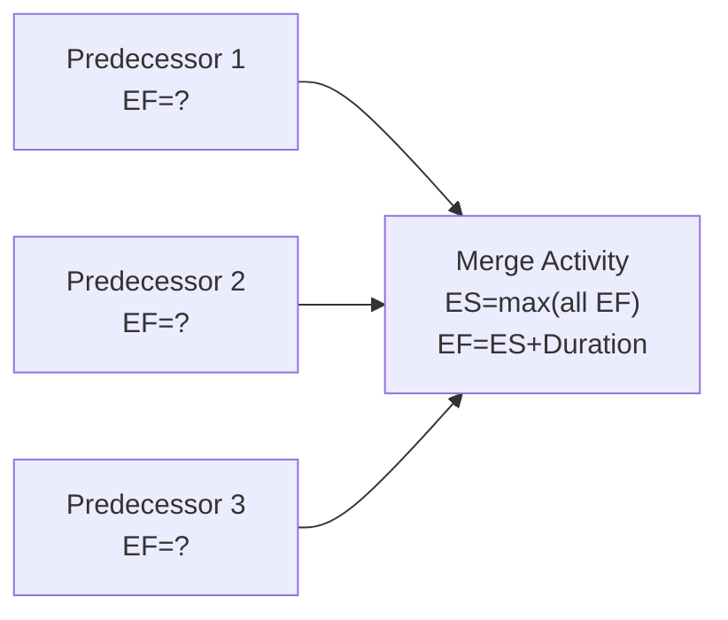

## Manual Network Calculation Practice Problems

### Purpose

This section provides a graduated set of practice problems for manually performing forward pass (ES/EF), backward pass (LS/LF), and float calculations on CPM networks. Each problem includes the network data, a step-by-step solution, and the final results table so calculations can be self-checked.

### Problem 1: Simple Linear Chain

**Setup**

| Activity | Duration | Predecessors |
| --- | --- | --- |
| A | 3 | — |
| B | 5 | A |
| C | 2 | B |
| D | 4 | C |

**Task:** Calculate ES, EF, LS, LF, and Total Float for all activities. Identify the critical path.

**Solution — Forward Pass:**

- A: $ES=0$, $EF=0+3=3$
- B: $ES=EF_A=3$, $EF=3+5=8$
- C: $ES=EF_B=8$, $EF=8+2=10$
- D: $ES=EF_C=10$, $EF=10+4=14$

Project duration = 14.

**Solution — Backward Pass:**

- D (terminal): $LF=14$, $LS=14-4=10$
- C: $LF=LS_D=10$, $LS=10-2=8$
- B: $LF=LS_C=8$, $LS=8-5=3$
- A: $LF=LS_B=3$, $LS=3-3=0$

**Results Table**

| Activity | Duration | ES | EF | LS | LF | Float |
| --- | --- | --- | --- | --- | --- | --- |
| A | 3 | 0 | 3 | 0 | 3 | 0 |
| B | 5 | 3 | 8 | 3 | 8 | 0 |
| C | 2 | 8 | 10 | 8 | 10 | 0 |
| D | 4 | 10 | 14 | 10 | 14 | 0 |

**Critical Path:** A → B → C → D (all activities have zero float, since this is a purely sequential chain with no parallel paths).

### Problem 2: Simple Convergence (Merge Point)

**Setup**

| Activity | Duration | Predecessors |
| --- | --- | --- |
| A | 6 | — |
| B | 4 | — |
| C | 3 | A, B |

**Task:** Calculate ES, EF, LS, LF, and Total Float. Identify the critical path.

**Solution — Forward Pass:**

- A: $ES=0$, $EF=6$
- B: $ES=0$, $EF=4$
- C: $ES=\max(EF_A, EF_B)=\max(6,4)=6$, $EF=6+3=9$

Project duration = 9.

**Solution — Backward Pass:**

- C (terminal): $LF=9$, $LS=9-3=6$
- A (successor: C): $LF=LS_C=6$, $LS=6-6=0$
- B (successor: C): $LF=LS_C=6$, $LS=6-4=2$

**Results Table**

| Activity | Duration | ES | EF | LS | LF | Float |
| --- | --- | --- | --- | --- | --- | --- |
| A | 6 | 0 | 6 | 0 | 6 | 0 |
| B | 4 | 0 | 4 | 2 | 6 | 2 |
| C | 3 | 6 | 9 | 6 | 9 | 0 |

**Critical Path:** A → C. Activity B has 2 units of float — it can be delayed up to 2 time units without affecting the project finish date.

**Key Points**

- This problem tests correct application of the **convergence rule**: ES of C uses $\max$, not $\min$ or average, of its predecessors' EF values.
- The activity with the longer path into the merge point (A, at 6 units) is critical; the shorter path (B, at 4 units) carries slack.

### Problem 3: Convergence and Divergence Combined

**Setup**

| Activity | Duration | Predecessors |
| --- | --- | --- |
| A | 4 | — |
| B | 3 | — |
| C | 5 | A |
| D | 2 | A, B |
| E | 6 | C, D |

*(This is the same network used in the Forward Pass and Backward Pass methodology sections — solving it independently here reinforces the technique.)*

**Task:** Calculate ES, EF, LS, LF, and Total Float. Identify the critical path.

**Solution — Forward Pass:**

- A: $ES=0$, $EF=4$
- B: $ES=0$, $EF=3$
- C: $ES=EF_A=4$, $EF=4+5=9$
- D: $ES=\max(EF_A,EF_B)=\max(4,3)=4$, $EF=4+2=6$
- E: $ES=\max(EF_C,EF_D)=\max(9,6)=9$, $EF=9+6=15$

Project duration = 15.

**Solution — Backward Pass:**

- E (terminal): $LF=15$, $LS=15-6=9$
- D (successor: E): $LF=LS_E=9$, $LS=9-2=7$
- C (successor: E): $LF=LS_E=9$, $LS=9-5=4$
- B (successor: D): $LF=LS_D=7$, $LS=7-3=4$
- A (successors: C, D): $LF=\min(LS_C,LS_D)=\min(4,7)=4$, $LS=4-4=0$

**Results Table**

| Activity | Duration | ES | EF | LS | LF | Float |
| --- | --- | --- | --- | --- | --- | --- |
| A | 4 | 0 | 4 | 0 | 4 | 0 |
| B | 3 | 0 | 3 | 4 | 7 | 4 |
| C | 5 | 4 | 9 | 4 | 9 | 0 |
| D | 2 | 4 | 6 | 7 | 9 | 3 |
| E | 6 | 9 | 15 | 9 | 15 | 0 |

**Critical Path:** A → C → E.

### Problem 4: Multiple Terminal Activities

**Setup**

| Activity | Duration | Predecessors |
| --- | --- | --- |
| A | 5 | — |
| B | 3 | A |
| C | 7 | A |
| D | 2 | B |

*(Both C and D are terminal activities — neither has a successor.)*

**Task:** Calculate ES, EF, LS, LF, and Total Float. Identify the critical path.

**Solution — Forward Pass:**

- A: $ES=0$, $EF=5$
- B: $ES=EF_A=5$, $EF=5+3=8$
- C: $ES=EF_A=5$, $EF=5+7=12$
- D: $ES=EF_B=8$, $EF=8+2=10$

Project duration $=\max(EF_C, EF_D) = \max(12, 10) = 12$ (C is the governing terminal activity).

**Solution — Backward Pass:**

- C (terminal): $LF=12$, $LS=12-7=5$
- D (terminal): $LF=12$, $LS=12-2=10$
- B (successor: D): $LF=LS_D=10$, $LS=10-3=7$
- A (successors: B, C): $LF=\min(LS_B, LS_C)=\min(7,5)=5$, $LS=5-5=0$

**Results Table**

| Activity | Duration | ES | EF | LS | LF | Float |
| --- | --- | --- | --- | --- | --- | --- |
| A | 5 | 0 | 5 | 0 | 5 | 0 |
| B | 3 | 5 | 8 | 7 | 10 | 2 |
| C | 7 | 5 | 12 | 5 | 12 | 0 |
| D | 2 | 8 | 10 | 10 | 12 | 2 |

**Critical Path:** A → C.

**Key Points**

- This problem tests correct handling of **multiple terminal activities**: project duration is the maximum EF across *all* end activities (12 from C, not 10 from D).
- Every non-critical terminal activity (D here) still needs its own LF seeded from the overall project duration — a common source of error is seeding each terminal branch independently instead of using the same global project duration.

### Problem 5: Network with Lag

**Setup**

| Activity | Duration | Predecessor | Relationship | Lag |
| --- | --- | --- | --- | --- |
| A | 5 | — | — | — |
| B | 4 | A | Finish-to-Start | 2 |
| C | 3 | B | Finish-to-Start | 0 |

**Task:** Calculate ES, EF, LS, LF, and Total Float, accounting for the lag between A and B.

**Solution — Forward Pass:**

- A: $ES=0$, $EF=0+5=5$
- B: $ES=EF_A+Lag=5+2=7$, $EF=7+4=11$
- C: $ES=EF_B=11$, $EF=11+3=14$

Project duration = 14.

**Solution — Backward Pass:**

- C (terminal): $LF=14$, $LS=14-3=11$
- B: $LF=LS_C=11$, $LS=11-4=7$
- A: $LF=LS_B - Lag=7-2=5$, $LS=5-5=0$

**Results Table**

| Activity | Duration | ES | EF | LS | LF | Float |
| --- | --- | --- | --- | --- | --- | --- |
| A | 5 | 0 | 5 | 0 | 5 | 0 |
| B | 4 | 7 | 11 | 7 | 11 | 0 |
| C | 3 | 11 | 14 | 11 | 14 | 0 |

**Critical Path:** A → B → C (with a 2-unit gap between A's finish and B's start absorbed as lag, not as float).

**Key Points**

- Lag time is **not** the same as float — it is a mandatory gap built into the dependency itself (e.g., concrete curing time, approval waiting periods) and does not indicate scheduling flexibility.
- In the backward pass, the lag is **subtracted again** when computing the predecessor's LF from the successor's LS: $LF_A = LS_B - Lag$.

### Problem 6: Diagnostic — Spot the Error

**Setup:** A student calculated the following for a network but made an error. Identify and correct it.

| Activity | Duration | Predecessors | Given ES | Given EF |
| --- | --- | --- | --- | --- |
| A | 4 | — | 0 | 4 |
| B | 6 | — | 0 | 6 |
| C | 3 | A, B | 4 | 7 |

**Task:** Find the error in Activity C's calculation.

**Solution:**

The student calculated $ES_C = EF_A = 4$, using only predecessor A and ignoring predecessor B. The correct application of the convergence rule requires:

$$ES_C = \max(EF_A, EF_B) = \max(4, 6) = 6$$

$$EF_C = 6 + 3 = 9$$

**Corrected Table**

| Activity | Duration | Predecessors | ES | EF |
| --- | --- | --- | --- | --- |
| A | 4 | — | 0 | 4 |
| B | 6 | — | 0 | 6 |
| C | 3 | A, B | 6 | 9 |

**Key Points**

- This diagnostic problem targets the single most common manual-calculation error: selecting only one predecessor's EF instead of the maximum across all predecessors at a merge point.
- A useful self-check: at any merge activity, count the number of incoming arrows and confirm every one was considered before selecting the maximum.

### Self-Check Diagram Template (svg_diagram)

### Recommended Practice Approach

**Key Points**

- Always complete the **entire forward pass** before starting the backward pass — do not interleave them, since the backward pass requires the finalized project duration.
- After each problem, verify internal consistency: the LS of every starting activity should equal its ES if the network has no imposed constraints.
- Recompute Total Float as both $LS - ES$ and $LF - EF$ for every activity; the two values must match. A mismatch indicates an arithmetic error in either pass.
- Practice networks with at least one merge point, one burst point, and one activity with lag to build fluency across all common convergence/divergence patterns before attempting exam-style or real-world schedules.

**Next Steps**

- Total Float and Free Float calculation
- Critical Path identification with multiple concurrent critical paths
- Practice problems involving negative float and imposed constraints
- Schedule compression exercises (crashing and fast-tracking scenarios)
- Precedence Diagramming Method (PDM) practice with Start-to-Start and Finish-to-Finish relationships