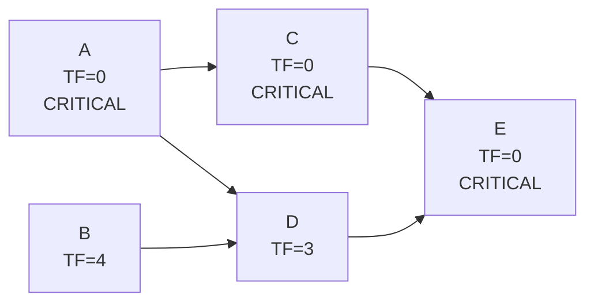

## Total Float Calculation

### Definition

Total Float (also called Total Slack) is the amount of time an activity can be delayed from its Early Start date without delaying the overall project completion date. It represents the scheduling flexibility available to an activity while still respecting the project's calculated (or imposed) finish date.

### Core Formula

Total Float is calculated using either of two equivalent formulas, both of which must produce the same result for a given activity:

$$\text{Total Float} = LS - ES$$

$$\text{Total Float} = LF - EF$$

Where:

- $LS$ = Late Start
- $ES$ = Early Start
- $LF$ = Late Finish
- $EF$ = Early Finish

**Key Points**

- Both formulas are mathematically guaranteed to produce identical results, since $LF - EF = (LS + Duration) - (ES + Duration) = LS - ES$. Calculating both is a standard error-check: a mismatch indicates an arithmetic mistake in the forward or backward pass.
- Total Float is a property of a **path segment through an activity**, not an intrinsic, isolated property of the activity alone — using float on one activity can reduce or eliminate float available to other activities sharing the same non-critical path.
- Total Float requires both the forward pass (ES, EF) and backward pass (LS, LF) to be fully completed first.

### Prerequisites

Before calculating Total Float, the following must already be known for every activity:

1. Early Start (ES) and Early Finish (EF) — from the forward pass.
2. Late Start (LS) and Late Finish (LF) — from the backward pass.

### Step-by-Step Calculation Procedure

1. Complete the forward pass for the entire network, recording ES and EF for every activity.
2. Complete the backward pass for the entire network, recording LS and LF for every activity.
3. For each activity, subtract ES from LS (or EF from LF).
4. Verify both formulas agree for each activity.
5. Identify activities where Total Float equals zero — these lie on the critical path.

### Worked Example

Using the five-activity network from the CPM forward/backward pass examples:

| Activity | Duration | ES | EF | LS | LF |
| --- | --- | --- | --- | --- | --- |
| A | 4 | 0 | 4 | 0 | 4 |
| B | 3 | 0 | 3 | 4 | 7 |
| C | 5 | 4 | 9 | 4 | 9 |
| D | 2 | 4 | 6 | 7 | 9 |
| E | 6 | 9 | 15 | 9 | 15 |

**Total Float calculation for each activity:**

- A: $TF = LS - ES = 0 - 0 = 0$ (check: $LF-EF = 4-4=0$ ✓)
- B: $TF = LS - ES = 4 - 0 = 4$ (check: $LF-EF = 7-3=4$ ✓)
- C: $TF = LS - ES = 4 - 4 = 0$ (check: $LF-EF = 9-9=0$ ✓)
- D: $TF = LS - ES = 7 - 4 = 3$ (check: $LF-EF = 9-6=3$ ✓)
- E: $TF = LS - ES = 9 - 9 = 0$ (check: $LF-EF = 15-15=0$ ✓)

**Results Table**

| Activity | ES | EF | LS | LF | Total Float | On Critical Path? |
| --- | --- | --- | --- | --- | --- | --- |
| A | 0 | 4 | 0 | 4 | 0 | Yes |
| B | 0 | 3 | 4 | 7 | 4 | No |
| C | 4 | 9 | 4 | 9 | 0 | Yes |
| D | 4 | 6 | 7 | 9 | 3 | No |
| E | 9 | 15 | 9 | 15 | 0 | Yes |

**Critical Path:** A → C → E (Total Float = 0 for all three activities).

### Interpreting Total Float Values

**Key Points**

- **Total Float = 0**: The activity is on the critical path. Any delay to this activity delays the project finish date by the same amount.
- **Total Float > 0**: The activity has slack. It can be delayed by up to its Total Float value without affecting the project finish date — though consuming this float may reduce or eliminate float available to other activities on the same non-critical path.
- **Total Float < 0**: The schedule is infeasible against an imposed constraint date. This occurs when the backward pass is seeded with a required finish date earlier than the calculated project duration, indicating that meeting the deadline is not achievable under current logic and durations without intervention.

### Total Float on Shared (Non-Critical) Paths

When multiple activities share a single non-critical path (i.e., they are in series between the same merge and burst points), the Total Float calculated for each individual activity often represents the float available to the **entire path segment**, not to each activity independently.

**Example:** If activities X and Y are in series (X → Y) on a non-critical path with 5 units of Total Float each, using 3 units of float to delay X's start means Y's *remaining* float is reduced from 5 to 2 — the float is a shared resource along that path segment, not duplicated for each activity.

[Inference] This shared-float behavior is why Total Float alone can be misleading for day-to-day schedule management on paths with multiple sequential non-critical activities; **Free Float** (the float available to an activity without affecting the ES of its immediate successor) is often tracked alongside Total Float for more granular delay analysis, though the specific reporting convention varies across scheduling methodologies and organizations.

### Network Diagram (svg_diagram)

### Total Float vs. Free Float vs. Project Float

| Float Type | Definition | Formula |
| --- | --- | --- |
| **Total Float** | Delay allowed to an activity without delaying the project finish date | $LS - ES$ or $LF - EF$ |
| **Free Float** | Delay allowed to an activity without delaying the **Early Start** of its immediate successor(s) | $\min(ES_{successors}) - EF$ |
| **Project Float** | Difference between an imposed project completion date and the calculated project completion date | Imposed Finish − Calculated Finish |

Total Float is the most commonly referenced float metric in CPM discussions and is the metric used to identify the critical path; Free Float provides a more conservative, activity-local view of flexibility.

### Common Errors and Pitfalls

**Key Points**

- Calculating Total Float before completing both the forward and backward passes, resulting in incomplete or incorrect ES/EF/LS/LF inputs.
- Using only one of the two formulas ($LS-ES$ or $LF-EF$) without cross-checking — a discrepancy between them signals an upstream calculation error that should be resolved, not ignored.
- Treating Total Float as independently available to every activity on a shared non-critical path, without recognizing that consuming float on one activity reduces the float remaining for other activities in that same path segment.
- Misinterpreting negative Total Float as a data-entry error rather than a legitimate signal that an imposed deadline cannot be met without schedule compression or rescoping.
- Assuming an activity with Total Float > 0 can never affect the critical path — delaying it beyond its float value, or delaying it enough to consume float shared with other paths, can shift or create a new critical path.

### Practical Applications

**Key Points**

- **Critical path identification**: Total Float = 0 is the standard test for determining which activities form the critical path.
- **Risk prioritization**: Activities with low (but nonzero) Total Float are often flagged as "near-critical" and monitored closely, since minor delays or estimation errors can make them critical.
- **Resource leveling**: Activities with high Total Float are often the best candidates for shifting to smooth resource demand without impacting the project finish date.
- **Schedule health checks**: Widespread negative Total Float across many activities is a strong indicator that a schedule baseline is unrealistic against its imposed deadline.

[Inference] Most scheduling software automatically calculates and displays Total Float as a standard schedule field, often color-coding critical (zero-float) activities for visual identification, though the exact visual convention and float threshold for "near-critical" flagging varies by tool and organizational configuration.

**Next Steps**

- Free Float calculation and its distinction from Total Float
- Critical Path identification and multiple concurrent critical paths
- Near-critical path analysis and risk prioritization
- Negative float and schedule compression (crashing and fast-tracking)
- Resource leveling using float as a scheduling lever
- Project Float and constraint-driven schedule analysis