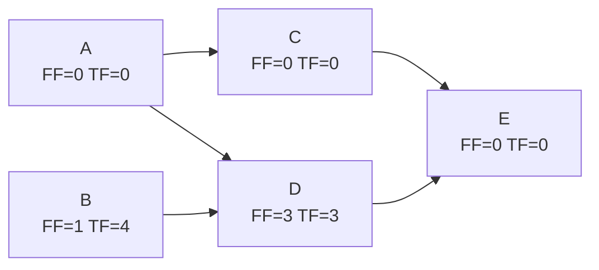

## Free Float Calculation

### Definition

Free Float is the amount of time an activity can be delayed from its Early Finish without delaying the Early Start of any of its immediate successor activities. Unlike Total Float, which measures delay tolerance relative to the overall project finish date, Free Float measures delay tolerance relative only to the activity's direct downstream neighbors.

### Core Formula

$$\text{Free Float} = \min(ES_{successors}) - EF$$

For an activity with a single successor:

$$\text{Free Float} = ES_{successor} - EF$$

For a terminal activity (no successors), Free Float is typically defined as equal to its Total Float, since there is no successor ES to constrain against; some methodologies instead measure it against the project's overall completion date.

**Key Points**

- Free Float uses the **minimum** ES among successors, not the maximum — the activity can only be delayed as far as the *most restrictive* (earliest-starting) successor allows without pushing that successor's start.
- Free Float is always **less than or equal to** Total Float for any given activity: $FF \leq TF$. This follows because Free Float is a more conservative, locally-scoped measure.
- Free Float requires only forward pass data (ES and EF values) — the backward pass (LS/LF) is not needed to calculate Free Float, unlike Total Float.
- Free Float belongs to the individual activity being delayed and does not need to be shared or apportioned among activities on the same path, in contrast to how Total Float often behaves along a shared non-critical path segment.

### Prerequisites

Free Float requires only the forward pass results:

1. Early Finish (EF) of the activity in question.
2. Early Start (ES) of every immediate successor of that activity.

Note that this is a narrower data requirement than Total Float, which additionally needs LS and LF from the backward pass.

### Step-by-Step Calculation Procedure

1. Complete the forward pass for the network, recording ES and EF for every activity.
2. For each non-terminal activity, identify all of its immediate successors.
3. Find the **minimum ES** among those successors.
4. Subtract the activity's own EF from that minimum ES.
5. For terminal activities, set Free Float equal to Total Float (requires the backward pass) or to zero, depending on the convention adopted — see the terminal-activity note below.

### Worked Example

Using the same five-activity network from the CPM forward/backward pass examples:

| Activity | Duration | ES | EF | Successors |
| --- | --- | --- | --- | --- |
| A | 4 | 0 | 4 | C, D |
| B | 3 | 0 | 3 | D |
| C | 5 | 4 | 9 | E |
| D | 2 | 4 | 6 | E |
| E | 6 | 9 | 15 | — (terminal) |

**Free Float calculation for each activity:**

- **A** (successors: C, D): $FF = \min(ES_C, ES_D) - EF_A = \min(4, 4) - 4 = 4 - 4 = 0$
- **B** (successor: D): $FF = ES_D - EF_B = 4 - 3 = 1$
- **C** (successor: E): $FF = ES_E - EF_C = 9 - 9 = 0$
- **D** (successor: E): $FF = ES_E - EF_D = 9 - 6 = 3$
- **E** (terminal): $FF = TF_E = 0$ (using the Total-Float convention for terminal activities; see note below)

**Results Table (Free Float vs. Total Float)**

| Activity | ES | EF | Free Float | Total Float | Notes |
| --- | --- | --- | --- | --- | --- |
| A | 0 | 4 | 0 | 0 | FF = TF here (critical) |
| B | 0 | 3 | 1 | 4 | FF < TF: delaying B by more than 1 pushes D's start |
| C | 4 | 9 | 0 | 0 | FF = TF here (critical) |
| D | 4 | 6 | 3 | 3 | FF = TF here (D's only successor, E, is not delayed until float is exhausted) |
| E | 9 | 15 | 0 | 0 | Terminal activity |

### Interpreting the Difference Between Free Float and Total Float

**Key Points**

- Activity B has **Total Float = 4** but **Free Float = 1**. This means B could theoretically shift up to 4 units without delaying the *project*, but shifting it by more than 1 unit would delay the Early Start of its successor, D — even though D itself still has enough of its own float (3 units) to absorb that delay without affecting the project finish date.
- This illustrates a key principle: **Total Float can be shared across a chain of activities on the same non-critical path**, while **Free Float belongs entirely to the individual activity** and never needs to be "borrowed" from or "returned" to a successor.
- When $FF = TF$ for an activity (as with A, C, and D here), delaying that activity up to its float value has no ripple effect on any successor's start date at all.

### Network Diagram (svg_diagram)



### Handling Terminal Activities

There is no universally fixed convention for Free Float on terminal (no-successor) activities, since the formula's denominator — a successor's ES — does not exist. Two common approaches:

1. **Set Free Float equal to Total Float** for terminal activities (the approach used in the worked example above), since there is no downstream successor to constrain against and the only remaining limit is the project finish date itself.
2. **Define Free Float relative to the overall project completion date** or an imposed contractual finish date, functionally treating the project's end as a virtual successor.

[Unverified] Different scheduling textbooks and software platforms may adopt either convention, or a hybrid; always confirm which definition a specific tool, course, or contract specification uses before comparing Free Float values across sources.

### Free Float in Networks with Convergence (Merge Points)

At a merge point, an activity's Free Float is governed by the successor with the **earliest** Early Start among all activities it feeds into — the minimum, not the maximum.

**Example illustration:** If Activity X feeds into both Activity Y ($ES_Y = 10$) and Activity Z ($ES_Z = 15$), and X's own EF is 8:

$$FF_X = \min(10, 15) - 8 = 10 - 8 = 2$$

Even though Z would tolerate a much larger delay (up to $15 - 8 = 7$ units) before its own start were affected, X's Free Float is constrained to 2 units by the more restrictive successor, Y.

### Algorithmic Implementation (Pseudocode)

```plaintext
function calculateFreeFloat(activities):
    # activities: list of nodes with EF, successors[] (each successor has ES)
    for activity in activities:
        if activity.successors is empty:
            activity.freeFloat = activity.totalFloat  # or project-end convention
        else:
            minSuccessorES = min(succ.ES for succ in activity.successors)
            activity.freeFloat = minSuccessorES - activity.EF

    return activities
```

**Key Points**

- Time complexity is $O(V + E)$ — a single pass over all activities and their successor links, since it relies only on forward-pass data already computed.
- Free Float can be calculated **before** the backward pass is performed, since it depends only on ES and EF values — making it useful as an early flexibility indicator even before full float analysis (Total Float) is available.

### Common Errors and Pitfalls

**Key Points**

- Using the **maximum** successor ES instead of the minimum — this would overstate Free Float and incorrectly suggest more flexibility than actually exists without impacting a successor's start.
- Confusing Free Float with Total Float and assuming they are always equal — they coincide only when an activity's successor is not itself constrained by a more restrictive parallel predecessor.
- Applying the standard formula to terminal activities without first deciding which convention (Total Float equivalence vs. project-end reference) is being used, leading to inconsistent results across a schedule.
- Assuming Free Float, like Total Float, must be "shared" across a chain of sequential activities — Free Float does not carry this shared-resource behavior between an activity and its immediate successor, since by definition using it up to its own Free Float never affects that successor's start.

### Practical Applications

**Key Points**

- **Fine-grained delay tolerance**: Free Float tells a scheduler exactly how much an individual activity can slip without triggering any recalculation or renegotiation with its immediate successor's team or resource plan.
- **Resource conflict resolution**: When two activities compete for the same resource, Free Float helps identify which one can be shifted without cascading effects on dependent work.
- **Progress reporting granularity**: Free Float is often used in status reporting to flag activities that, while not critical, have very limited slip tolerance (low Free Float) and warrant closer monitoring than their Total Float alone might suggest.
- **Distinguishing local vs. global impact**: Free Float answers "will this affect the next activity?" while Total Float answers "will this affect the project finish date?" — both questions matter for different stakeholders (e.g., the immediate successor's task owner vs. the overall project sponsor).

[Inference] Most commercial scheduling software (Primavera P6, Microsoft Project) computes and displays Free Float alongside Total Float as standard schedule fields, though the exact terminology (e.g., "Free Slack" vs. "Free Float") and terminal-activity convention used may vary by platform.

**Next Steps**

- Total Float calculation (comparison and relationship to Free Float)
- Critical Path identification and multiple concurrent critical paths
- Independent Float (a further-refined, less commonly used float metric)
- Near-critical path analysis using Free Float thresholds
- Resource leveling techniques that exploit Free Float
- Free Float behavior in networks with Start-to-Start and Finish-to-Finish relationships