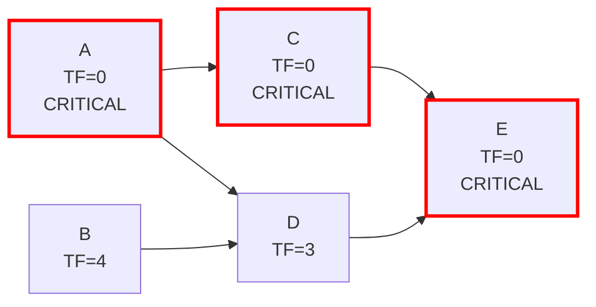
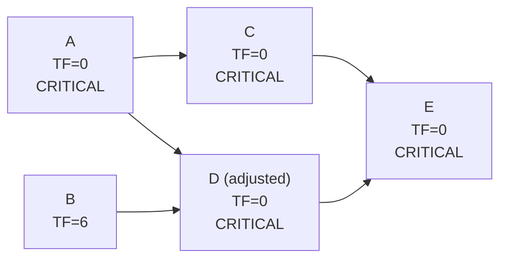

## Identifying the Critical Path

### Definition

The critical path is the longest continuous sequence of dependent activities through a project network, from start to finish, that determines the shortest possible duration in which the project can be completed. Any delay to an activity on the critical path directly delays the project's completion date by the same amount.

### Core Identification Rule

The standard, universally applicable test for critical path membership is:

$$\text{Total Float} = 0$$

An activity is on the critical path **if and only if** its Total Float equals zero (in a schedule with no imposed finish-date constraint earlier than the calculated project duration).

$$\text{Total Float} = LS - ES = LF - EF = 0$$

**Key Points**

- Total Float = 0 is the definitive test; Free Float = 0 is **not** sufficient on its own, since an activity can have zero Free Float (it constrains its immediate successor) while still having positive Total Float (it does not constrain the overall project finish date).
- The critical path is not necessarily a single, unique path — networks commonly have **multiple concurrent critical paths** sharing the same total duration.
- The critical path can **change** over the life of a project as actual progress deviates from the baseline, activities are added or removed, or durations are re-estimated.

### Prerequisites

Identifying the critical path requires:

1. A completed **forward pass** (ES and EF for every activity).
2. A completed **backward pass** (LS and LF for every activity).
3. **Total Float** calculated for every activity ($LS - ES$ or $LF - EF$).

### Step-by-Step Identification Procedure

1. Complete the forward pass across the entire network.
2. Complete the backward pass across the entire network.
3. Calculate Total Float for every activity.
4. Flag every activity with Total Float = 0.
5. Trace the flagged activities from the start node to the end node, following the dependency arrows — this traced sequence is the critical path.
6. Verify the path is **continuous** (unbroken) from start to finish; a set of zero-float activities that does not form an unbroken chain indicates a calculation error, not multiple disconnected critical segments.

### Worked Example

Using the five-activity network from prior CPM sections:

| Activity | Duration | ES | EF | LS | LF | Total Float |
| --- | --- | --- | --- | --- | --- | --- |
| A | 4 | 0 | 4 | 0 | 4 | 0 |
| B | 3 | 0 | 3 | 4 | 7 | 4 |
| C | 5 | 4 | 9 | 4 | 9 | 0 |
| D | 2 | 4 | 6 | 7 | 9 | 3 |
| E | 6 | 9 | 15 | 9 | 15 | 0 |

**Identification:**

- Activities with Total Float = 0: A, C, E.
- Tracing these from start to finish: A → C → E forms a continuous, unbroken chain.
- Activities B and D have positive float (4 and 3 respectively) and are **not** on the critical path.

**Critical Path: A → C → E, with a total duration of 15 time units** (matching the project's overall calculated duration, as it must — by definition, the critical path's total duration always equals the project duration).

### Network Diagram (svg_diagram)

### Alternative Identification Method: Longest Path Comparison

A second, complementary method for identifying the critical path — useful as a cross-check against the Total Float method — is to enumerate **every path** through the network from start to finish, sum each path's activity durations, and identify the path(s) with the **maximum total duration**.

**Applying this to the worked example:**

| Path | Activities | Sum of Durations |
| --- | --- | --- |
| Path 1 | A → C → E | $4+5+6=15$ |
| Path 2 | A → D → E | $4+2+6=12$ |
| Path 3 | B → D → E | $3+2+6=11$ |

Path 1 (A → C → E) has the maximum duration of 15, confirming it as the critical path — matching the Total Float method's result.

**Key Points**

- Both methods (Total Float = 0, and longest path by summed duration) must agree; a discrepancy indicates a calculation error in one of the passes.
- The longest-path method becomes computationally impractical for large networks with many parallel branches, since the number of distinct start-to-finish paths can grow combinatorially. The Total Float method scales linearly with the number of activities and is the standard approach in practice and in scheduling software.

### Multiple Concurrent Critical Paths

**Key Points**

- A network can have **more than one critical path** simultaneously if two or more distinct paths through the network share the exact same maximum total duration.
- When multiple critical paths exist, the project carries **greater schedule risk**, since a delay to *any* of the critical paths — not just one — will delay the project.
- Multiple critical paths often emerge naturally in networks with balanced parallel branches, or can be artificially introduced through schedule compression techniques (e.g., crashing one path until it matches the duration of another).

**Illustrative example:** If, in the worked network above, Activity D's duration were increased from 2 to 5 units, the path A → D → E would total $4+5+6=15$ — identical to A → C → E. Both paths would then be critical simultaneously, and Activities A, D, and E (and separately, C) would all show Total Float = 0.

### Near-Critical Paths

Activities and paths with **small but nonzero Total Float** (commonly a threshold such as 1–5 time units, though the specific cutoff is organization- or project-specific) are often designated **near-critical**. These warrant close monitoring because:

- Minor delays, re-estimation, or resource constraints can push them to zero float, making them critical.
- They represent latent schedule risk that a simple critical-path-only view can miss.

[Inference] Many organizations formalize a "near-critical threshold" (e.g., flagging any path within 10% of the project duration, or within a fixed number of days of zero float) as part of schedule risk management practice, though the specific threshold and methodology is not standardized industry-wide and varies by organizational policy or contract requirements.

### Critical Path Stability and Change Over Time

**Key Points**

- The critical path identified at schedule baseline is **not guaranteed to remain the critical path** as the project progresses.
- Actual progress that is faster or slower than planned on any activity can shift float values throughout the network, potentially making a previously non-critical path become critical (or vice versa).
- Scope changes, added activities, removed activities, or re-sequenced dependencies can all alter which path is critical.
- Best practice involves **recalculating the critical path regularly** (e.g., at each schedule update cycle) rather than treating the baseline critical path as fixed for the project's duration.

### Common Errors and Pitfalls

**Key Points**

- Using Free Float = 0 as the critical path test instead of Total Float = 0 — these are not equivalent, and Free Float = 0 does not guarantee an activity affects the project finish date.
- Assuming the critical path is always a single unique path, and stopping the search after finding the first zero-float chain without checking for additional concurrent critical paths elsewhere in the network.
- Failing to re-verify the critical path after schedule updates, changes to durations, or the addition/removal of activities and dependencies.
- Confusing "near-critical" activities (small positive float) with truly critical activities (exactly zero float) in risk reporting, which can understate or overstate genuine schedule risk depending on the direction of the error.
- Treating a set of zero-float activities that do **not** form a continuous, unbroken start-to-finish chain as a valid critical path — this pattern typically indicates a forward/backward pass calculation error rather than a legitimate disconnected critical segment.

### Practical Applications

**Key Points**

- **Schedule risk management**: The critical path identifies exactly which activities require the tightest monitoring, since they have zero buffer against delay.
- **Resource prioritization**: Critical path activities are typically prioritized for resource allocation, since delays here directly extend the project timeline.
- **Schedule compression targeting**: When a project must be shortened (crashing or fast-tracking), only critical path activities can reduce overall project duration — compressing a non-critical activity has no effect on the finish date unless it eventually becomes critical.
- **Stakeholder communication**: The critical path provides a clear, defensible basis for explaining which delays matter and which do not, particularly relevant in contractual delay-claim analysis.
- **Progress tracking**: Comparing actual progress against the critical path (rather than the full activity list) focuses status reviews on the activities that most directly threaten the finish date.

[Inference] Scheduling software typically automates critical path identification and highlights it visually (often in red), recalculating it automatically whenever the underlying schedule data changes, though the specific highlighting convention and near-critical threshold configuration varies by platform.

**Next Steps**

- Total Float and Free Float calculation (prerequisite mechanics)
- Multiple critical paths and their risk implications
- Schedule compression: crashing and fast-tracking the critical path
- Near-critical path monitoring and threshold-setting practices
- Critical path method limitations (resource constraints, probabilistic durations — see PERT)
- Schedule updates and critical path recalculation cadence
- Delay claim analysis using critical path methodology (CPM-based forensic scheduling)