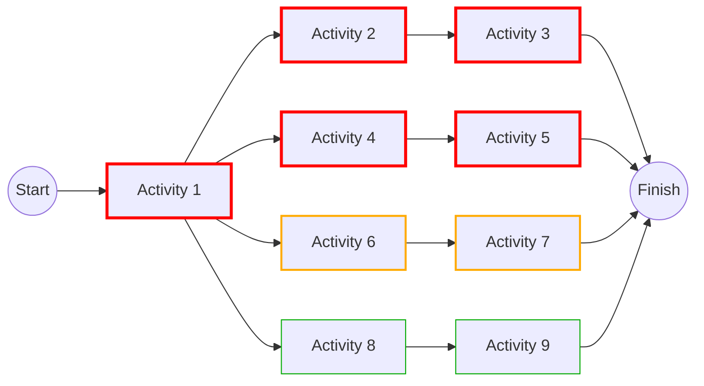

## Near Critical and Multiple Critical Paths

### Definitions and Conceptual Foundations

The **critical path** in a Critical Path Method (CPM) network is the longest continuous chain of dependent activities from project start to finish, determining the minimum possible project duration. Any activity on this path has zero total float, meaning any delay to it delays the entire project.

**Near-critical paths** are chains of activities whose total float is small but nonzero — they are not currently critical, but sit close enough to zero float that they carry meaningful risk of becoming critical during execution. **Multiple critical paths** occur when two or more distinct paths through the network share the exact same longest duration, so more than one chain simultaneously has zero total float.

Both phenomena reflect the same underlying reality: project schedules are rarely governed by a single, isolated critical path. Real networks typically contain several paths bunched near the top of the duration distribution, and the "criticality" of any one of them is a property that can shift as the project progresses.

### Mathematical Basis: Total Float and Path Duration

Total float (TF) for any activity is calculated as:

$$TF = LS - ES = LF - EF$$

where $LS$ is Late Start, $ES$ is Early Start, $LF$ is Late Finish, and $EF$ is Early Finish, all derived from the forward and backward pass.

For a given path $P$ composed of activities $\{A_1, A_2, ..., A_n\}$, the path float is:

$$PF = ProjectDuration - PathDuration(P)$$

A path is **critical** when $PF = 0$. A path is conventionally defined as **near-critical** when:

$$0 < PF \leq T$$

where $T$ is a user-defined float threshold (commonly expressed in days or as a percentage of project duration — e.g., 5 days, or 5-10% of total duration). This threshold is not standardized by any single body; it is a project-specific policy decision, often documented in the project's Schedule Management Plan.

**Multiple critical paths** exist when:

$$PF(P_1) = PF(P_2) = ... = PF(P_k) = 0$$

for $k \geq 2$ distinct paths $P_1, ..., P_k$ through the network.

### Why Multiple Critical Paths Arise

**Key Points**

- **Balanced network design**: When a network is built from parallel work packages (e.g., multiple building wings, multiple procurement streams) sized to finish around the same time, near-simultaneous completion is common.
- **Resource leveling side effects**: Leveling algorithms that shift non-critical activities to resolve overallocation frequently consume float on formerly non-critical paths, pulling them up to zero float and creating new critical paths without extending the original one.
- **Imposed finish constraints**: A hard deadline (e.g., "Finish-No-Later-Than") applied at a milestone that multiple paths feed into can force several paths to compute zero float relative to that constraint, even if their natural durations differ.
- **Lag and lead adjustments**: Adding lag to a non-critical path's relationship can consume exactly enough float to make it converge with the original critical path's duration.
- **Coincidental network topology**: In large, complex networks (hundreds or thousands of activities), it is statistically common for several paths to sum to identical or near-identical durations purely by construction, especially in symmetric or templated schedules.

### Why Near-Critical Paths Matter

A path with only a few days of float is a **latent risk**, not a safe path. [Inference] Practitioners generally treat near-critical paths as high-priority monitoring targets because:

- **Float erosion is common and often invisible**: Approved changes, minor delays on predecessor activities, or optimistic duration estimates being revised can consume float without triggering an obvious alarm until the path becomes critical.
- **Merge bias**: At any point where multiple paths converge into a single successor activity (a "merge point"), the actual finish date of that successor is statistically driven toward the latest of the converging paths, not the average. This is the foundation of the **merge event bias** studied in schedule risk analysis — even paths with modest float can statistically dominate outcomes at merge points because delay probability compounds.
- **Resource contention**: A near-critical path competing for the same resources as the critical path may become critical the moment resource leveling is applied or a resource is pulled for a higher-priority task elsewhere.
- **False sense of security**: Teams that fixate exclusively on "the" critical path may under-resource or under-monitor near-critical work, allowing it to become critical unnoticed — sometimes called the **secondary critical path trap**.

### Identifying Near-Critical and Multiple Critical Paths

**Key Points**

- **Float sorting/filtering**: List all paths (or all activities) sorted by total float ascending; apply the chosen threshold $T$ to flag near-critical activities/paths.
- **Path-based float threshold reporting**: Most scheduling software (Primavera P6, Microsoft Project, Asta Powerproject) allows filtering the Gantt view or a tabular report to show only activities/paths with float ≤ $T$, typically color-coded (e.g., critical = red, near-critical = orange/yellow, non-critical = green).
- **Total Float Consumption Trend**: Tracking how a path's float changes update-to-update (a declining trend even while still positive is an early warning sign, independent of the threshold snapshot at any single update).
- **Longest Path filter vs. zero-float filter**: Some tools (notably Microsoft Project) define "critical" strictly by zero total float, which can misclassify paths in schedules containing constraints, deadlines, or negative float; the "Longest Path" filter is the more reliable method for true criticality in constrained schedules, since it traces the actual longest logical chain rather than relying solely on the float calculation, which constraints can distort.

### Worked Example

Consider a small network with a project duration of 30 days, computed via forward/backward pass:

| Path | Activities | Duration | Path Float | Status |
| --- | --- | --- | --- | --- |
| A | Start-1-2-3-Finish | 30 days | 0 | Critical |
| B | Start-1-4-5-Finish | 30 days | 0 | Critical (multiple) |
| C | Start-1-6-7-Finish | 27 days | 3 | Near-critical (if T=5) |
| D | Start-1-8-9-Finish | 20 days | 10 | Non-critical |

Here, Paths A and B are **both critical** — a classic multiple-critical-path condition, likely arising from parallel scopes of equal duration sharing a common start activity. Path C, at 3 days of float against a 5-day threshold, is flagged **near-critical**: a 3-day slip anywhere on that chain (or a 3-day increase to any activity duration on it) makes it critical too, joining A and B.

### Mermaid Diagram: Network with Near-Critical and Multiple Critical Paths

### SVG Illustration: Float Distribution Across Paths

<svg xmlns="http://www.w3.org/2000/svg" viewBox="0 0 700 320">
<text x="350" y="25" text-anchor="middle" font-size="16" font-weight="bold" fill="#222">Path Float Distribution (svg_diagram)</text>
<line x1="80" y1="270" x2="650" y2="270" stroke="#333" stroke-width="2" />
<line x1="80" y1="60" x2="80" y2="270" stroke="#333" stroke-width="2" />
<text x="20" y="275" font-size="12" fill="#333">0</text>
<text x="10" y="70" font-size="12" fill="#333">Duration</text>
<rect x="120" y="70" width="60" height="200" fill="#e74c3c" />
<text x="150" y="290" text-anchor="middle" font-size="12">Path A</text>
<text x="150" y="65" text-anchor="middle" font-size="11">30d, TF=0</text>
<rect x="220" y="70" width="60" height="200" fill="#e74c3c" />
<text x="250" y="290" text-anchor="middle" font-size="12">Path B</text>
<text x="250" y="65" text-anchor="middle" font-size="11">30d, TF=0</text>
<rect x="320" y="90" width="60" height="180" fill="#f39c12" />
<text x="350" y="290" text-anchor="middle" font-size="12">Path C</text>
<text x="350" y="85" text-anchor="middle" font-size="11">27d, TF=3</text>
<rect x="420" y="140" width="60" height="130" fill="#27ae60" />
<text x="450" y="290" text-anchor="middle" font-size="12">Path D</text>
<text x="450" y="135" text-anchor="middle" font-size="11">20d, TF=10</text>
<line x1="80" y1="70" x2="650" y2="70" stroke="#999" stroke-width="1" stroke-dasharray="4,4" />
<text x="560" y="65" font-size="11" fill="#666">Project Duration (30d)</text>
<rect x="500" y="60" width="14" height="14" fill="#e74c3c" />
<text x="520" y="72" font-size="11">Critical (TF=0)</text>
<rect x="500" y="82" width="14" height="14" fill="#f39c12" />
<text x="520" y="94" font-size="11">Near-critical (0&lt;TF≤T)</text>
<rect x="500" y="104" width="14" height="14" fill="#27ae60" />
<text x="520" y="116" font-size="11">Non-critical (TF&gt;T)</text>
</svg>

### Relationship to Earned Value Management (EVM)

CPM float analysis and EVM are complementary but distinct: EVM measures cost and schedule *performance to date* using Schedule Variance (SV) and Schedule Performance Index (SPI), while near-critical path analysis is a *forward-looking* network diagnostic. A project can show a healthy SPI overall while a near-critical path is quietly eroding — because SPI aggregates performance across all activities and can mask localized float consumption on a single at-risk chain. Integrated analysis, sometimes called **Schedule Risk Analysis (SRA)** or **Critical Path Drag/EVM integration**, combines:

- **Drag** (a concept from the Critical Path Drag Method) — the amount of time an activity on the critical path is adding to the project duration — computed as:

$$Drag = \min(ActivityDuration, TF_{nextPath})$$

for activities with no other predecessors' float constraining them, used alongside near-critical path tracking to prioritize corrective action where it has the most schedule impact per unit of management effort.

- **True Cost of an Activity**, combining Drag with cost data, to determine whether accelerating a near-critical path (crashing) is economically justified relative to the SPI/CPI trends reported by EVM.

### Management Implications and Risk Response

**Key Points**

- **Monitor thresholds dynamically**: Recompute near-critical status at every schedule update rather than relying on a snapshot from the baseline; float thresholds should be tightened as the project progresses since remaining float has less time to be "absorbed" without becoming critical.
- **Assign single-point accountability across all critical/near-critical paths**: When multiple paths are critical, treat each independently for status reporting and risk ownership — do not assume mitigating one automatically protects the others.
- **Schedule Risk Analysis (Monte Carlo simulation)**: Running probabilistic duration simulations (e.g., in tools implementing PERT-based or triangular/beta distributions) frequently reveals that paths which are not critical in the deterministic CPM calculation have a high probability of becoming the *actual* longest path once uncertainty is modeled — this is the practical manifestation of merge bias and is why organizations doing high-stakes scheduling (defense, EPC/construction, aerospace) commonly supplement CPM with SRA.
- **Resource-driven criticality shifts**: In resource-constrained schedules, the "critical path" computed by pure logic (Critical Path Method) can differ from the **critical chain** (per Critical Chain Project Management) once resource dependencies are layered in; near-critical logical paths often become the actual bottleneck once resources are leveled.
- **Contractual and claims relevance**: In construction and EPC contexts, near-critical and concurrent critical paths are central to delay-claims analysis (e.g., under SCL Protocol or AACE Recommended Practices), since demonstrating which path(s) were actually critical at the time of a delay event determines compensability.

### Common Pitfalls

- **Relying solely on software's default "critical" flag**: Default critical flags in tools like Microsoft Project use a float threshold that may be misconfigured (e.g., set to a nonzero default), silently changing what counts as "critical" versus "near-critical" without the scheduler's awareness. [Unverified: exact default behavior varies by software version and configuration]
- **Ignoring near-critical paths in reporting**: Status reports that only list "the" critical path give false confidence; best practice is to report the top 3-5 paths by ascending float.
- **Treating float as a buffer to be freely consumed**: Float belongs to the project, not to any single party or activity owner; uncoordinated consumption of float on a near-critical path by one team can silently endanger the schedule for all downstream stakeholders.
- **Failing to re-baseline path identification after logic changes**: Adding, removing, or resequencing dependencies can change which paths are critical or near-critical; schedulers must recompute path float after any logic change, not just after duration changes.

**Related Topics**

- Schedule Risk Analysis (SRA) and Monte Carlo Simulation
- Critical Path Drag and the Critical Path Drag Method
- Critical Chain Project Management (CCPM) and resource-constrained scheduling
- Merge Bias and Merge Point Risk
- Free Float versus Total Float
- Schedule Compression Techniques (Crashing and Fast-Tracking)
- Delay Analysis and Concurrent Delay in Construction Claims
- Integrating CPM Schedule Risk with EVM Schedule Performance Index (SPI)