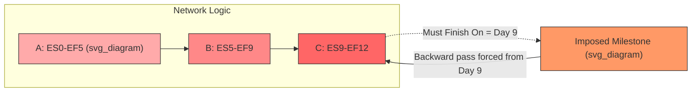

## Negative Float and Its Implications

### Definition

Total float is calculated as:

$$TF = LS - ES = LF - EF$$

where $LS$ = Late Start, $ES$ = Early Start, $LF$ = Late Finish, $EF$ = Early Finish.

Negative float occurs when $TF < 0$, meaning the late dates of an activity occur *before* its early dates. This is a mathematically valid but schedule-abnormal condition indicating that, based on current logic and durations, an activity (or path) cannot finish by its constraint date even if started at the earliest possible moment.

**Key Points**

- Negative float signals a schedule that is behind an imposed deadline or contractual milestone.
- It is distinct from zero float (critical path, no slack) and positive float (slack available).
- Negative float propagates backward through predecessor logic along the driving path.

### How Negative Float Arises

Negative float is not an inherent property of unconstrained CPM networks. A "pure" forward/backward pass without imposed constraints never produces negative float — the backward pass simply starts from the project's calculated finish (equal to the latest $EF$). Negative float appears only when an external constraint forces the late dates earlier than what the logic/duration network would otherwise allow.

**Common causes:**

- **Mandatory finish constraint** ("Must Finish On" / "Finish On or Before") applied to the project or a milestone, set earlier than the calculated early finish.
- **Contractual milestone dates** imposed on interim deliverables that the network cannot logically achieve.
- **Interim constraints** on individual activities (Start No Later Than, Finish No Later Than) that conflict with logic-driven early dates.
- **Schedule slippage** during progress updates — as-built delays consume float until the remaining float goes negative relative to a fixed target finish.
- **External predecessor/successor links** in multi-project or resource-loaded schedules where an imposed handoff date is earlier than achievable.

### Calculation Example

Assume a simple three-activity chain with a mandatory project finish constraint:

| Activity | Duration | ES | EF | LS | LF | TF |
| --- | --- | --- | --- | --- | --- | --- |
| A | 5 | 0 | 5 | -3 | 2 | -3 |
| B | 4 | 5 | 9 | 2 | 6 | -3 |
| C | 3 | 9 | 12 | 6 | 9 | -3 |

Here the network's calculated early finish is day 12, but a "Must Finish On" constraint fixes the project finish at day 9. The backward pass is forced to start from day 9 instead of day 12, so:

$$LF_C = 9,\quad LS_C = 9 - 3 = 6$$

$$TF_C = LF_C - EF_C = 9 - 12 = -3$$

The $-3$ propagates backward through B and A because they share the same driving logic path. This path is now "worse than critical" — it requires acceleration, not just protection from delay.

### Diagram: Float Propagation with a Mandatory Constraint

### Interpretation and Severity

Negative float quantifies *how far behind* an activity or path is relative to a required date, in the same units as duration (days, hours, etc.).

- $TF = -3$ days means the path must be compressed by at least 3 days (via crashing, fast-tracking, or logic revision) to meet the imposed date.
- The magnitude of negative float is a direct measure of the schedule recovery effort required.
- Multiple paths can carry negative float simultaneously, each with different magnitudes — the most negative path represents the greatest risk exposure.

### Implications for Project Control

**Key Points**

- **Schedule health indicator**: Negative float is often treated as a contractual and performance red flag, distinct from ordinary critical-path (zero-float) risk.
- **Driving vs. non-driving distinction**: Activities on a negative-float path are "driving" the delay to the constrained milestone; they require priority in recovery planning.
- **Float ownership disputes**: In contracts, negative float caused by owner-directed changes may support time-impact analysis (TIA) and delay claims, whereas negative float from contractor-caused slippage typically does not.
- **Masking of true float**: If negative float is allowed to exist unmanaged, it can obscure the real criticality of adjacent paths once the constraint is removed or renegotiated.
- **Resequencing pressure**: Planners may be forced into schedule compression techniques (see Next Steps) rather than normal float-consuming adjustments.

### Negative Float vs. Zero and Positive Float

| Float Value | Condition | Typical Management Response |
| --- | --- | --- |
| Positive ($TF > 0$) | Activity has slack | Can be delayed without affecting constrained date |
| Zero ($TF = 0$) | Critical path, on target | Must not slip; monitor closely |
| Negative ($TF < 0$) | Behind imposed date | Requires active recovery action (crash/fast-track/re-baseline) |

### Recovery Strategies

- **Crashing**: Adding resources to driving activities to shorten duration, typically prioritizing the lowest cost-per-day-saved options.
- **Fast-tracking**: Overlapping sequential activities (converting Finish-to-Start to Start-to-Start with lag) at increased execution risk.
- **Scope or logic revision**: Removing unnecessary constraints/dependencies discovered during logic review.
- **Constraint renegotiation**: Requesting relief on the imposed milestone date where contractually and commercially feasible.
- **Re-baselining**: If recovery is infeasible, formally revising the baseline (subject to contract change-control procedures).

[Inference] The specific recovery approach selected in practice depends on contract terms, cost constraints, and resource availability, which vary by project and are not determinable from the float calculation alone.

### Software Behavior Note

Most CPM scheduling tools (e.g., Primavera P6, Microsoft Project) calculate and display negative float automatically once a constraint earlier than the calculated early finish is applied. Behavior around how negative float interacts with calendars, constraint types (e.g., "Mandatory Finish" vs. "Finish On or Before"), and multiple calendars may vary slightly between software versions and configuration settings. [Unverified: exact UI labeling and default constraint-handling behavior differ across specific software versions and should be confirmed against the current vendor documentation in use.]

### Related Topics

- Total float vs. free float calculation methods
- Constraint types and their effect on CPM backward pass (Mandatory vs. Soft constraints)
- Schedule compression: crashing vs. fast-tracking trade-off analysis
- Time Impact Analysis (TIA) for delay claims
- Multiple critical paths and near-critical path management
- Resource leveling effects on float values
- Baseline schedule vs. re-baselined schedule governance