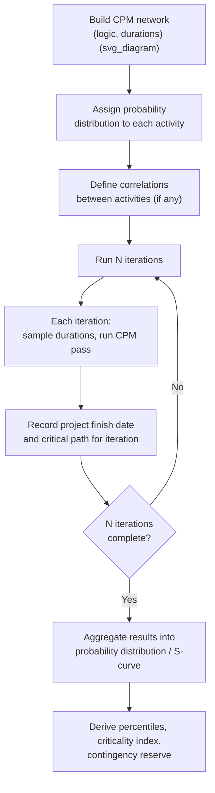
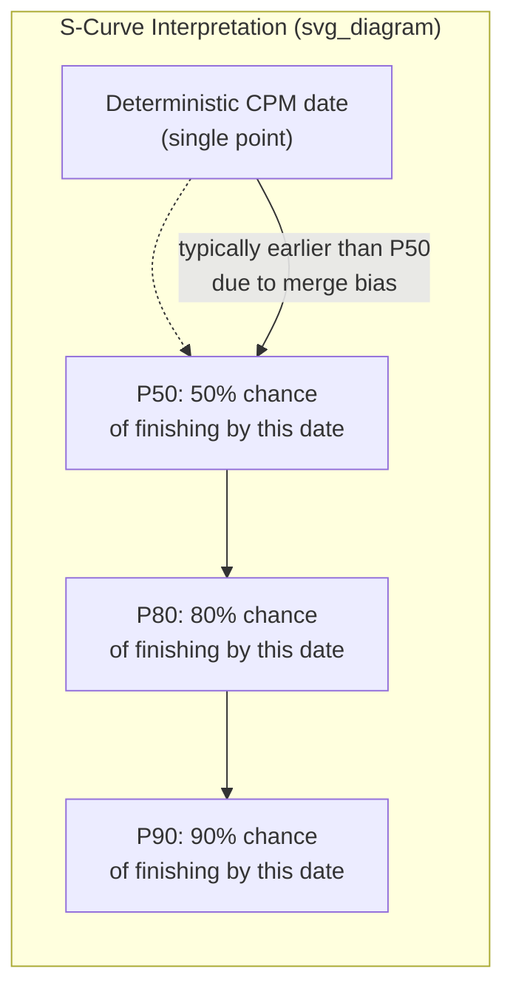

## Monte Carlo Simulation Fundamentals

### Core Concept

Monte Carlo simulation is a computational technique that models schedule uncertainty by running the CPM network calculation thousands of times, each time using randomly sampled durations drawn from each activity's probability distribution instead of a single fixed duration. The aggregated results across all iterations produce a probability distribution of possible project outcomes (finish dates, costs) rather than one deterministic answer.

**Key Points**

- Named after the Monte Carlo casino, referencing the role of random sampling.
- Converts a deterministic CPM schedule into a probabilistic forecast.
- Addresses a fundamental weakness of deterministic CPM: it treats the single "most likely" path as certain and ignores the statistical effect of parallel paths and variability.

### Why Deterministic CPM Understates Risk

Deterministic CPM calculates the critical path using fixed durations and identifies zero-float activities as "the" risk drivers. This approach has a structural bias: at any point where multiple paths merge into a successor activity, that successor cannot start until the *latest* of all predecessor finishes — not the average. This is known as **merge bias** (or "merge event bias").

$$EF_{\text{successor start}} = \max(EF_{P_1}, EF_{P_2}, \dots, EF_{P_n})$$

Because $\max()$ of several random variables has an expected value greater than or equal to any single one of them, near-critical paths systematically pull the actual expected finish date later than the deterministic single-path calculation suggests. Monte Carlo simulation captures this effect naturally because every iteration recalculates which path governs; deterministic CPM cannot.

### Simulation Workflow

### Step-by-Step Mechanics

**Key Points**

1. **Network construction**: A standard CPM logic network (activities, dependencies, constraints) is the starting structure — simulation does not replace CPM logic, it adds a probabilistic layer on top of it.
2. **Distribution assignment**: Each activity receives a distribution (Triangular, PERT/Beta, Normal, Uniform, Lognormal) parameterized typically from three-point estimates ($O$, $M$, $P$).
3. **Random sampling**: For each iteration, a random duration is drawn for every activity according to its assigned distribution, typically via inverse transform sampling on a pseudo-random or quasi-random number generator.
4. **Full network recalculation**: A complete forward and backward pass is performed using the sampled durations for that iteration, yielding an iteration-specific early/late date set and critical path.
5. **Result capture**: The iteration's project finish date, and which activities were critical during that iteration, are recorded.
6. **Iteration and convergence**: Steps 3–5 repeat for a large number of iterations (commonly 1,000–10,000+) until output distributions stabilize (converge) within an acceptable tolerance.
7. **Aggregation and reporting**: All iteration results are compiled into a cumulative probability distribution (S-curve) of finish dates, plus derived statistics.

### Example Calculation (Simplified Two-Path Network)

Consider two parallel paths merging into a final milestone:

- Path 1: PERT($O=8, M=10, P=16$) → mean ≈ 10.67 days
- Path 2: PERT($O=6, M=9, P=18$) → mean ≈ 10.0 days

Deterministic CPM (using most-likely values) would select Path 1 (10 days) as marginally critical over Path 2 (9 days), reporting a milestone at day 10.

In simulation, across thousands of iterations, Path 2's wider spread (higher $P$) means it *sometimes* samples a duration exceeding Path 1's sampled value, becoming the governing path in that iteration. The simulated milestone date is therefore later on average than the deterministic day-10 estimate, and both paths show non-zero **Criticality Index** values (see below) — reflecting that either could drive the finish.

### Key Output Metrics

**Key Points**

- **S-curve (cumulative probability distribution)**: Plots cumulative probability against project finish date; used to read off percentile dates.
- **Percentile dates (P50, P80, P90)**: The date by which the project has an $X\%$ probability of finishing. P50 is the median simulated outcome; P80/P90 are common contingency planning thresholds.
- **Criticality Index (CI)**: The percentage of iterations in which a given activity fell on the critical path.

$$CI_i = \frac{\text{iterations where activity } i \text{ was critical}}{\text{total iterations}} \times 100\%$$

- **Schedule Sensitivity Index (SSI)**: A correlation-based measure of how strongly an activity's duration variability correlates with total project duration variability — distinguishes "often critical but low-impact" from "high-impact" activities.
- **Contingency reserve**: The buffer between the deterministic (or P50) finish date and a chosen confidence level (e.g., P80), often expressed in the same duration units.

$$\text{Reserve} = \text{Date}_{P80} - \text{Date}_{\text{deterministic}}$$

### Interpreting the S-Curve

[Inference] The deterministic CPM date is commonly observed to fall below the P50 simulated date due to merge bias, though the exact gap depends on network topology (number of parallel/near-critical paths) and variance assigned to each activity, so this is not a fixed or universal offset.

### Correlation Between Activities

**Key Points**

- Treating all activities as statistically independent is a common simplification that understates true risk.
- Common-cause factors (weather, a shared subcontractor, a common material/equipment supply chain, labor productivity trends) can cause multiple activities to be simultaneously delayed or accelerated together.
- Most simulation software allows explicit correlation coefficients between selected activities to model this dependency; omitting correlation generally narrows the simulated output distribution compared to a more realistic correlated model.

### Convergence and Iteration Count

**Key Points**

- Too few iterations produce unstable, noisy percentile estimates that change meaningfully between simulation runs.
- Convergence is typically checked by observing whether key output statistics (e.g., mean, P80) stabilize as iteration count increases.
- [Unverified: Specific "typical" iteration counts (e.g., 1,000 vs. 10,000) needed for convergence vary by network size, complexity, and the tail behavior of chosen distributions, and are usually determined empirically per model rather than by a fixed universal rule.]

### Common Pitfalls

**Key Points**

- **Garbage in, garbage out**: Simulation results are only as credible as the underlying three-point estimates; poorly calibrated $O$/$M$/$P$ values produce misleading confidence bands.
- **Ignoring correlation**: Understates the true spread of outcomes, producing falsely narrow confidence intervals.
- **Over-reliance on a single percentile**: Reporting only P50 without context on the full distribution shape can mask significant tail risk.
- **Static risk register disconnect**: Simulations that don't incorporate discrete risk events (e.g., probability-weighted risk register items layered onto activity durations) may understate total schedule risk exposure.
- **Confusing Criticality Index with Total Float**: An activity with low deterministic float can still show a low Criticality Index if its distribution is narrow, while a high-float activity with a wide distribution can show a surprisingly high Criticality Index.

### Related Topics

- Probability distributions for activity durations (Triangular, PERT/Beta, Normal, Lognormal)
- Merge bias and near-critical path management
- Criticality Index vs. Schedule Sensitivity Index interpretation
- Contingency reserve derivation and reporting (P50/P80/P90)
- Correlation modeling between activity durations
- Risk register integration with quantitative schedule risk analysis
- Software tools (Primavera Risk Analysis, @RISK, Safran Risk, Polaris)