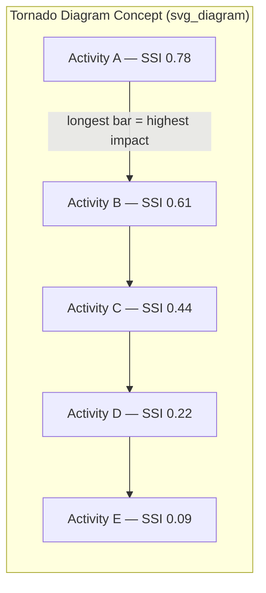

## Schedule Risk Drivers and Sensitivity Analysis

### Purpose

Sensitivity analysis identifies *which* activities or risk factors have the greatest influence on overall project schedule outcome variability. While Monte Carlo simulation produces an aggregate probability distribution of finish dates, sensitivity analysis answers the follow-up management question: where should risk mitigation effort and monitoring attention be concentrated to have the greatest effect on that distribution.

**Key Points**

- Not all activities that appear on the critical path deterministically are the strongest drivers of overall schedule risk.
- Sensitivity analysis reallocates attention from "what is critical today" to "what most affects the range of possible finish dates."
- Typically performed as a direct output of Monte Carlo schedule risk simulation.

### Categories of Schedule Risk Drivers

**Key Points**

- **Estimating uncertainty**: Variability inherent in duration estimates themselves (captured via $O$/$M$/$P$ three-point ranges and assigned distributions).
- **Discrete risk events**: Binary or probabilistic occurrences (e.g., permit denial, equipment failure, weather event) with a probability of occurrence and a schedule impact if triggered — distinct from continuous duration uncertainty.
- **Logic/sequencing risk**: Uncertainty in whether planned dependencies (e.g., Finish-to-Start vs. an assumed Start-to-Start overlap) will hold as planned.
- **Resource risk**: Availability, productivity, or competing-priority risk affecting activity duration indirectly through resource constraints.
- **External/common-cause risk**: Factors affecting multiple activities simultaneously (weather seasons, regulatory approval cycles, supply chain disruption) — see correlation modeling.
- **Merge bias structural risk**: Network topology itself (number of paths converging at key milestones) amplifies sensitivity even without any single activity being unusually risky.

### Criticality Index

The most direct sensitivity metric from simulation output — the percentage of simulation iterations in which an activity fell on the critical path:

$$CI_i = \frac{\text{iterations where activity } i \text{ was critical}}{\text{total iterations}} \times 100\%$$

**Key Points**

- $CI = 100\%$ means the activity was critical in every iteration — a true structural driver regardless of sampled duration.
- Low deterministic float does not guarantee a high Criticality Index if the activity's duration distribution is narrow (low variability).
- Conversely, an activity with substantial deterministic float can show a non-trivial Criticality Index if its distribution is wide (high variability), because in some iterations its sampled duration consumes all available float.

### Schedule Sensitivity Index (SSI)

SSI measures the correlation between an individual activity's sampled duration and the overall project finish date across all iterations, typically calculated as a rank correlation coefficient (e.g., Spearman's rank correlation):

$$SSI_i = \rho(\text{Duration}_i, \text{ProjectFinish})$$

**Key Points**

- Ranges from $-1$ to $+1$; values near $+1$ indicate the activity's duration strongly drives project finish variability.
- Distinguishes "frequently critical, low variance" activities (high CI, low SSI impact) from "occasionally critical, high variance, high impact" activities (potentially lower CI but higher SSI).
- Some tools normalize or combine CI and correlation-based sensitivity into a single "Sensitivity Index" weighting both frequency and magnitude of impact.

[Unverified: The exact formula and normalization used for "Sensitivity Index" varies between software vendors (e.g., Primavera Risk Analysis, @RISK); practitioners should confirm the specific calculation method documented by the tool in use.]

### Tornado Diagram

The standard visualization for sensitivity analysis output, ranking risk drivers by magnitude of correlation/impact on project finish date, typically displayed as horizontal bars in descending order (creating a tornado-like funnel shape).

**Key Points**

- Bars are sorted longest (top) to shortest (bottom), visually resembling a tornado funnel.
- Used directly by project controls teams to prioritize risk response planning and monitoring frequency.
- Distinguished from a standard bar chart by the deliberate descending-magnitude sort order, which is the convention's defining visual feature.

### Worked Example: Interpreting Combined CI and SSI

| Activity | Deterministic Float | Criticality Index | SSI (Correlation) | Interpretation |
| --- | --- | --- | --- | --- |
| Foundation Pour | 0 days | 98% | 0.81 | True structural driver — near-always critical and strongly correlated with finish date |
| Permit Approval | 12 days | 34% | 0.55 | Occasionally critical but high impact when it is — wide distribution, worth risk mitigation despite float |
| Interior Finishes | 3 days | 41% | 0.12 | Frequently critical but low correlation — narrow distribution, limited overall impact |
| Steel Erection | 0 days | 100% | 0.29 | Always critical deterministically, but low variability caps its contribution to overall finish uncertainty |

**Example**

Permit Approval has substantial deterministic float (12 days) and would not appear on a traditional critical-path report, yet its wide pessimistic tail ($P$ far exceeds $M$) means it drives project finish variability in over half the simulated scenarios where it governs — making it a priority for risk mitigation (e.g., early permit submission, parallel-path contingency) despite looking "safe" under deterministic CPM.

### Sensitivity Analysis Beyond Duration: Discrete Risk Events

Sensitivity analysis often extends beyond continuous duration distributions to discrete risk events layered onto the schedule from a risk register:

**Key Points**

- Each discrete risk is modeled with a probability of occurrence (e.g., 20% chance) and a conditional schedule impact if it occurs (e.g., +15 days to a specific activity).
- Simulation samples whether the risk occurs (Bernoulli trial) in each iteration, and if so, applies the impact.
- Sensitivity output can then rank discrete risks alongside continuous duration uncertainty, giving a unified prioritized risk response list.

$$\text{Expected Impact} = P(\text{occurrence}) \times \text{Impact if occurs}$$

### Using Sensitivity Results for Risk Response

**Key Points**

- **Mitigation prioritization**: Focus schedule risk mitigation budget and management attention on top-ranked tornado diagram drivers first.
- **Monitoring cadence**: High-SSI activities warrant more frequent progress tracking and earlier escalation triggers.
- **Contingency allocation**: Some organizations allocate schedule contingency proportionally to sensitivity ranking rather than uniformly across all activities.
- **Communication tool**: Tornado diagrams and CI rankings are commonly used in stakeholder reporting to justify where schedule risk reserves and management focus are directed.

### Common Pitfalls

**Key Points**

- **Conflating deterministic float with risk priority**: Zero-float activities are not automatically the highest sensitivity drivers; high-float, high-variance activities can outrank them.
- **Ignoring discrete risk events**: Sensitivity analysis based solely on continuous duration uncertainty omits potentially significant binary risks (permitting, regulatory, force majeure).
- **Stale sensitivity rankings**: Sensitivity results reflect the model and estimates at the time of analysis; as the schedule progresses and actual data replaces estimates, rankings should be refreshed rather than treated as static.
- **Over-indexing on a single metric**: Relying on Criticality Index alone (frequency) without SSI (magnitude) can misdirect mitigation effort toward frequently-but-mildly critical activities.

[Inference] Whether CI or SSI is the more decision-useful metric in a given context depends on organizational risk tolerance and reporting conventions; neither is universally prescribed as primary across all methodologies or software platforms.

### Related Topics

- Monte Carlo simulation fundamentals
- Probability distributions for activity durations
- Merge bias and near-critical path management
- Risk register development and qualitative risk ranking (probability-impact matrix)
- Contingency reserve derivation from simulation percentiles
- Correlation modeling between activities
- Risk response planning (avoid, mitigate, transfer, accept)