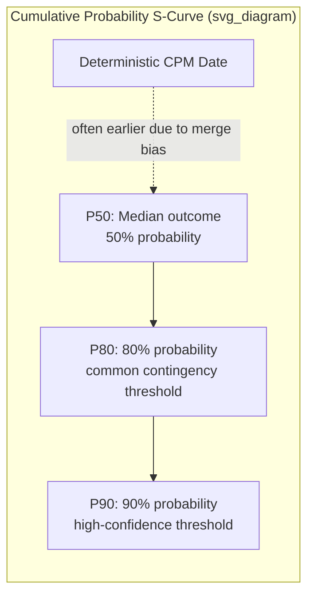

## Confidence Levels and P50/P80 Completion Dates

### Definition

A confidence level (or percentile date) expresses the probability, derived from Monte Carlo schedule risk simulation, that a project will finish on or before a specific date. It reframes the single deterministic CPM finish date into a probabilistic statement of likelihood.

**Key Points**

- $P50$ = the date by which there is a 50% probability of finishing (the median of the simulated outcome distribution).
- $P80$ = the date by which there is an 80% probability of finishing.
- $P90$ = the date by which there is a 90% probability of finishing.
- These are read directly off the cumulative probability distribution (S-curve) generated by simulation.

### Mathematical Basis

For a simulated finish date distribution with cumulative distribution function $F(t)$, the percentile date $P_x$ satisfies:

$$F(P_x) = x\%$$

That is, $P_x$ is the value such that $x\%$ of all simulation iterations produced a finish date at or before that value.

$$P_x = F^{-1}(x\%)$$

Practically, this is computed by sorting all $N$ simulated finish dates in ascending order and selecting the value at rank $\lceil x\% \times N \rceil$.

**Example**

For $N = 5{,}000$ simulation iterations, the $P80$ date is the finish date value at the 4,000th position ($80\% \times 5{,}000$) in the sorted list of all simulated finish dates.

### The S-Curve

The S-curve plots cumulative probability (0–100% on the y-axis) against possible project finish dates (x-axis). It is characteristically S-shaped: shallow at the extremes (very early or very late outcomes are rare) and steep through the middle (most outcomes cluster near the mean/median).

### Why P50 Rarely Equals the Deterministic CPM Date

**Key Points**

- Deterministic CPM calculates a single finish date using most-likely (or fixed) durations along one identified critical path.
- Simulation accounts for merge bias — at points where multiple paths converge, the *governing* path varies iteration to iteration, and the successor activity must wait for whichever path finishes latest in that specific iteration.
- Because the expected value of a maximum of several random variables is generally greater than or equal to any single one of them, the simulated distribution's center of mass (and therefore P50) is commonly observed to sit later than the deterministic date.

[Inference] The magnitude of this shift depends on network topology — specifically the number of near-critical parallel paths and the variance assigned to each — so no fixed universal offset between deterministic date and P50 can be assumed without running the simulation.

### Choosing a Confidence Level for Commitments

| Confidence Level | Typical Use Case | Risk Posture |
| --- | --- | --- |
| P50 | Internal planning target, "most likely" case | Balanced — 50% chance of missing this date |
| P80 | Common external/contractual commitment threshold | Conservative — buffer against most adverse scenarios |
| P90 | High-stakes milestones, regulatory or contractual penalty exposure | Highly conservative — minimal tolerance for lateness |

**Key Points**

- Selecting a higher confidence level (P90 vs. P50) results in a later, more conservative committed date but reduces the probability of missing it.
- The choice of confidence level for external commitments is a risk-tolerance decision, not a purely technical calculation — it balances competitive/contractual pressure to commit early against the cost of missing a committed date.
- Organizations frequently standardize on P80 as a common reporting convention for external schedule commitments, though this is a convention rather than a universal rule. [Unverified: The specific percentile threshold treated as "standard practice" varies by industry, contract type, and organizational policy.]

### Deriving Contingency Reserve from Confidence Levels

The schedule contingency (time buffer) is often defined as the gap between a lower-confidence baseline (commonly the deterministic date or P50) and a higher target confidence level:

$$\text{Schedule Contingency} = \text{Date}_{P_x} - \text{Date}_{\text{baseline}}$$

**Example**

If deterministic CPM projects completion on Day 180, and simulation shows $P50 = $ Day 188 and $P80 = $ Day 202:

- Contingency to reach P50 confidence from the deterministic date: $188 - 180 = 8$ days
- Contingency to reach P80 confidence from the deterministic date: $202 - 180 = 22$ days
- Contingency to move from P50 to P80 confidence: $202 - 188 = 14$ days

This structure allows management to make an explicit, quantified trade-off: committing to Day 180 (deterministic) carries substantial risk of overrun, while committing to Day 202 (P80) embeds a 22-day buffer against that risk.

### Reading and Reporting Confidence Levels

**Key Points**

- Percentile dates should always be reported alongside the iteration count and model assumptions (distributions used, correlation modeling, discrete risks included) since these materially affect the resulting S-curve shape.
- A P80 date from a model excluding discrete risk events and correlation will generally understate true schedule risk compared to a fully specified model.
- Percentile dates are frequently re-run periodically (e.g., monthly) as the project progresses, since actual progress and updated estimates shift the underlying distribution.
- Confidence levels are sometimes also applied to cost (P50/P80 cost estimates) using the same statistical logic, often as part of an integrated cost-schedule risk analysis.

### Common Pitfalls

**Key Points**

- **Treating P50 as "the" answer**: A single percentile without the surrounding distribution context loses information about the shape and tail risk of possible outcomes.
- **Comparing percentile dates across models with different assumptions**: A P80 date from one simulation run is not comparable to another run's P80 if distributions, correlation, or included risks differ.
- **Confusing P80 with "80% complete"**: P80 refers to probability of on-time finish, not project progress percentage — a common terminology confusion in status reporting.
- **Static reporting**: Presenting a single P50/P80 figure without periodic re-simulation can give false confidence as actual project conditions diverge from the original model inputs.
- **Under-communicating uncertainty range**: Reporting only point percentiles (e.g., "P80 = March 15") without the full S-curve can obscure how wide or narrow the underlying confidence band actually is.

### Related Topics

- Monte Carlo simulation fundamentals
- Probability distributions for activity durations
- Schedule risk drivers and sensitivity analysis
- Merge bias and near-critical path effects
- Contingency reserve management and drawdown tracking
- Integrated cost-schedule risk analysis