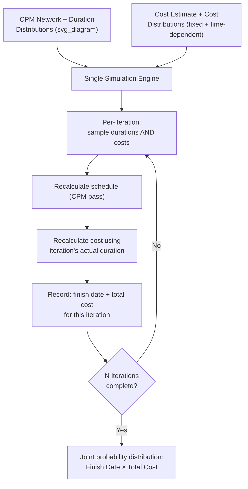

## Joint Schedule and Cost Risk Analysis

### Definition

Joint schedule and cost risk analysis (often called Integrated Cost-Schedule Risk Analysis, ICSRA) is a Monte Carlo simulation methodology that models schedule and cost uncertainty together in a single simulation run, rather than analyzing each independently. Because schedule delays typically drive cost overruns (extended duration means extended resource, overhead, and indirect costs), analyzing them separately produces disconnected — and often understated — risk estimates.

**Key Points**

- Addresses the fact that time and cost risk are not independent: schedule slippage is a primary driver of cost growth.
- Produces a joint probability distribution across both finish date and total cost, rather than two separate, uncorrelated S-curves.
- Widely associated with practices published by organizations such as GAO (U.S. Government Accountability Office) and AACE International (Association for the Advancement of Cost Engineering) for major capital projects.

### Why Separate Analyses Understate Risk

**Key Points**

- A standalone cost risk analysis (e.g., applying contingency percentages to line-item cost estimates) typically treats cost uncertainty as independent of schedule outcome, ignoring time-dependent costs entirely.
- A standalone schedule risk analysis produces a probabilistic finish date but does not translate that into cost impact.
- In reality, activities that run long consume additional time-dependent resources (labor, equipment rental, field overhead, escalation) — meaning cost distributions are *conditional* on the sampled schedule outcome in each iteration.
- Running the two analyses independently and simply summing standalone contingencies (schedule contingency + cost contingency) tends to either double-count or miss the correlation between the two, producing a less defensible combined estimate than a jointly modeled distribution.

### Core Architecture

### Cost Components in the Joint Model

**Key Points**

- **Fixed (time-independent) costs**: Costs that do not vary with duration — materials, fixed-price subcontracts, equipment purchases. Modeled with their own probability distributions (Triangular, PERT, etc.) independent of schedule outcome.
- **Time-dependent (duration-driven) costs**: Costs that scale directly with how long an activity or the project takes — labor, equipment rental, field supervision, general conditions, escalation/inflation exposure. These are calculated *within* each iteration based on that iteration's sampled duration.

$$\text{Iteration Cost} = \text{Fixed Cost (sampled)} + \left(\text{Rate}_{\text{time-dependent}} \times \text{Duration}_{\text{sampled}}\right)$$

**Example**

An activity with a time-dependent field overhead rate of $3,000/day and a PERT-distributed duration of $O=10, M=14, P=24$ days: if a given iteration samples a duration of 19 days (above the most-likely 14 due to the wide pessimistic tail), that iteration's cost contribution includes an additional $19 \times \$3{,}000 = \$57{,}000$ beyond the fixed-cost component — automatically linking that iteration's schedule outcome to its cost outcome.

### Correlation Structures

Beyond the direct duration-to-cost link for time-dependent costs, a full ICSRA model incorporates explicit correlation between:

- **Cost line items sharing a common driver** (e.g., steel price escalation affecting multiple procurement packages simultaneously).
- **Schedule risk events with cost consequences** (e.g., a permitting delay risk event that has both a duration impact and an associated legal/administrative cost impact, sampled together in the same iteration).
- **Productivity factors** affecting both the pace of work (schedule) and labor cost (cost) concurrently — a single sampled productivity factor can drive both outputs in a given iteration rather than treating them as separately random.

[Unverified: The specific correlation coefficients used between cost and schedule elements are project-specific and typically derived from historical data, expert judgment, or industry benchmarks rather than a fixed standard value.]

### Output: Joint Probability Distribution

The primary output is a scatter of (finish date, total cost) pairs across all iterations, from which several derived views are typically generated:

**Key Points**

- **Marginal S-curves**: The cost-only and schedule-only cumulative distributions, each derivable from the joint dataset (equivalent to what standalone analyses would produce, but now internally consistent with each other).
- **Joint confidence levels**: A statement such as "80% probability of finishing by Date X *and* within Cost Y" — distinct from independently stating an 80% schedule confidence and an 80% cost confidence, since achieving both simultaneously at 80% joint confidence generally requires a higher combined buffer than either margin alone.
- **Scatter/correlation plot**: Visualizes the relationship between simulated finish date and simulated cost, typically showing a positive correlation (later finish dates cluster with higher costs) driven by the time-dependent cost linkage.

### Joint vs. Independent Confidence: Illustrative Comparison

| Approach | Schedule Confidence | Cost Confidence | Combined Reliability |
| --- | --- | --- | --- |
| Independent schedule P80 + Independent cost P80 | 80% | 80% | Not equal to 80% joint — likely lower, since two independent 80% events co-occurring is less than 80% probable unless perfectly correlated |
| Joint ICSRA model, read at 80% joint confidence | Consistent with cost outcome in same iteration | Consistent with schedule outcome in same iteration | Explicitly 80% joint probability of achieving both together |

**Key Points**

- This distinction is the central practical value of joint analysis: management commitments based on independently derived P80 schedule and P80 cost figures can overstate the actual joint probability of hitting both targets simultaneously.

### Application Workflow

**Key Points**

1. Build the CPM schedule network with duration distributions per activity (as in standard schedule risk analysis).
2. Build the cost estimate, tagging each cost element as fixed or time-dependent, with associated distributions and rates.
3. Define correlation relationships between schedule and cost risk drivers where a common cause exists.
4. Incorporate discrete risk events from the risk register with both a probability of occurrence and dual schedule/cost impacts where applicable.
5. Run the joint simulation (shared random number streams per iteration ensure the sampled duration and its cost consequence are drawn from the *same* iteration, preserving the correlation).
6. Analyze marginal S-curves, joint confidence levels, and sensitivity (tornado) outputs for both schedule and cost drivers.
7. Report combined contingency (time and cost) at a selected joint confidence level to decision-makers.

### Common Pitfalls

**Key Points**

- **Running separate models and combining results post-hoc**: Loses the iteration-level correlation between sampled duration and sampled cost, understating joint risk.
- **Omitting time-dependent cost categories**: If field overhead, escalation, or extended-duration costs are not explicitly modeled as duration-driven, the cost side of the joint model fails to respond to schedule risk outcomes.
- **Assuming perfect correlation between schedule and cost**: Not all cost elements are time-dependent; treating 100% of cost as duration-driven overstates the schedule-cost linkage as much as ignoring it entirely understates it.
- **Reporting only marginal S-curves**: Presenting standalone schedule and cost percentiles from a joint model without the joint confidence statement forfeits the primary analytical benefit of the integrated approach.
- **Data and model complexity**: Joint models require more detailed cost-estimate structuring (fixed vs. time-dependent tagging) and more analyst expertise than standalone schedule or cost risk models. [Inference] This added complexity is a commonly cited practical barrier to adoption on smaller or less mature projects, though the extent of that barrier varies by organizational capability and available tooling.

### Related Topics

- Monte Carlo simulation fundamentals
- Confidence levels and P50/P80 completion dates
- Schedule risk drivers and sensitivity analysis
- Earned Value Management cost and schedule variance integration
- Contingency reserve management (schedule and cost)
- Risk register development and discrete risk event modeling
- AACE International Recommended Practices for integrated cost-schedule risk analysis