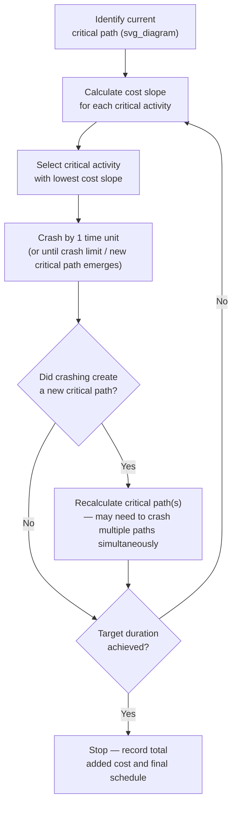
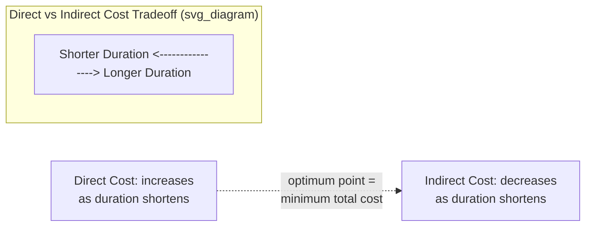

## Crashing Techniques and Cost-Time Tradeoffs

### Definition

Crashing is a schedule compression technique that shortens activity or project duration by adding additional resources (labor, equipment, shifts) to critical-path activities, typically at increased direct cost. It is a deliberate cost-time tradeoff: duration is reduced in exchange for higher expenditure, and the analysis systematically identifies the lowest-cost way to achieve a required compression.

**Key Points**

- Crashing only affects critical-path activities — compressing non-critical activities does not shorten the overall project duration.
- Distinct from fast-tracking, which overlaps sequential activities rather than adding resources.
- Assumes a time-cost relationship exists for each activity: cost increases as duration decreases, typically up to a technical/practical limit (the "crash duration").

### Time-Cost Relationship per Activity

Each activity is modeled with two reference points:

- **Normal Duration ($D_n$)** and **Normal Cost ($C_n$)**: the duration and cost under standard resourcing.
- **Crash Duration ($D_c$)** and **Crash Cost ($C_c$)**: the shortest technically achievable duration and its associated (higher) cost.

The **crash cost slope** — cost per unit time saved — is calculated as:

$$\text{Cost Slope} = \frac{C_c - C_n}{D_n - D_c}$$

This slope is assumed linear between $D_n$ and $D_c$ for planning purposes, though actual cost behavior may be non-linear in practice.

### Example Calculation

| Activity | Normal Duration | Normal Cost | Crash Duration | Crash Cost | Cost Slope |
| --- | --- | --- | --- | --- | --- |
| A | 10 days | $5,000 | 6 days | $9,000 | (9,000-5,000)/(10-6) = $1,000/day |
| B | 8 days | $4,000 | 5 days | $8,500 | (8,500-4,000)/(8-5) = $1,500/day |
| C | 6 days | $3,000 | 4 days | $3,800 | (3,800-3,000)/(6-4) = $400/day |

**Example**

If all three activities are on the critical path and the project must be compressed by 3 days, the least-cost approach crashes Activity C first (lowest slope, $400/day), consuming its full 2 days of crash capacity for $800, then crashes Activity A for the remaining 1 day at $1,000 — total added cost $1,800 for 3 days saved, rather than defaulting to whichever activity is compressed first without slope comparison.

### Crashing Procedure

**Key Points**

1. Determine the current critical path using standard CPM forward/backward pass.
2. Rank critical-path activities by cost slope (ascending — cheapest time-savings first).
3. Crash the lowest-slope activity by one time unit at a time, not all at once, because critical path composition can shift as durations change.
4. After each increment, recheck whether a parallel (previously non-critical) path has now become equally critical — if so, activities on *both* paths must be crashed simultaneously to achieve further reduction, since compressing only one no longer shortens the project.
5. Continue until either the target duration is achieved or all critical-path activities have reached their crash limits (maximum possible compression exhausted).

### Multiple Critical Paths During Crashing

**Key Points**

- Crashing a single-path bottleneck can cause a previously non-critical path to become newly critical once the original path is shortened enough that both paths have equal duration.
- Once two or more paths are simultaneously critical, compressing only one no longer reduces overall project duration — the parallel path becomes the new constraint.
- In this situation, the least-cost strategy requires crashing one activity on *each* critical path simultaneously (or a shared activity common to both paths, if one exists, which is often the most cost-efficient option since a single crash action shortens multiple paths at once).

**Example**

If Path 1 (10 days) and Path 2 (9 days) share no common activities, crashing Path 1 down to 9 days makes both paths equally critical at day 9. Any further compression below day 9 requires crashing one activity on *each* path per time unit removed, roughly doubling the marginal cost per day saved from that point forward — unless a shared or converging activity allows a single crash action to affect both.

### Cost-Duration Curve for the Project

Aggregating incremental crash decisions produces a project-level time-cost tradeoff curve:

$$\text{Total Cost}(D) = \text{Direct Cost}(D) + \text{Indirect Cost}(D)$$

**Key Points**

- **Direct cost** rises as duration decreases (crashing cost accumulates).
- **Indirect cost** (overhead, general conditions, extended field costs) typically falls as duration decreases, since less time means less accumulated time-dependent overhead.
- The theoretical **optimum crash point** is where total cost (direct + indirect) is minimized — not necessarily the shortest technically achievable duration, since direct crash costs eventually rise faster than indirect cost savings.

### Optimum Crash Duration Example

| Duration (days) | Cumulative Direct Cost | Indirect Cost (@ $500/day) | Total Cost |
| --- | --- | --- | --- |
| 24 (normal) | $50,000 | $12,000 | $62,000 |
| 22 | $52,800 | $11,000 | $63,800 |
| 20 | $56,400 | $10,000 | $66,400 |
| 18 (crash limit) | $61,800 | $9,000 | $70,800 |

[Inference] In this illustrative example, the 24-day normal duration shows the lowest total cost because indirect savings from further crashing are outpaced by rising direct crash costs; the actual optimum point is project-specific and depends on each project's real direct-cost slopes and indirect (overhead) rate, so this outcome should not be generalized without recalculating from actual project data.

### When Crashing Is Not Viable

**Key Points**

- **Non-critical activities**: Crashing them wastes cost without shortening the project — always verify critical-path membership first.
- **Activities already at crash limit**: No further compression is technically possible regardless of cost.
- **Diminishing returns / resource saturation**: Adding more labor to a space-constrained or highly sequential task (e.g., "nine women can't make a baby in one month") may have a technical floor below which further resource addition is ineffective.
- **Quality and safety risk**: Aggressive crashing can increase error rates, rework, and safety incidents, potentially offsetting or exceeding the nominal schedule gain. [Inference] The magnitude of this risk is context- and activity-dependent and is not quantified by the cost-slope model itself, which assumes cost and duration trade off cleanly without secondary quality effects.

### Crashing vs. Fast-Tracking Comparison

| Aspect | Crashing | Fast-Tracking |
| --- | --- | --- |
| Mechanism | Add resources to shorten duration | Overlap sequential activities |
| Cost Impact | Typically increases direct cost | Often minimal direct cost increase |
| Risk Impact | Resource/coordination risk, diminishing returns | Rework risk from incomplete predecessor information |
| Applies To | Critical-path activities with available crash capacity | Critical-path activities with revisable logic (FS → SS with lag) |
| Typical Use | When budget allows and time savings must be assured | When time savings are needed with limited budget flexibility |

### Common Pitfalls

**Key Points**

- **Crashing without cost-slope analysis**: Selecting activities to compress arbitrarily rather than by lowest cost slope results in unnecessarily high total crash cost.
- **Ignoring emerging parallel critical paths**: Failing to recheck the critical path after each crash increment can lead to spending money on an activity that no longer drives project duration.
- **Crashing past the optimum point**: Continuing to compress beyond where direct cost increases exceed indirect cost savings adds expense without net project benefit (unless a hard deadline, not cost optimization, is the governing constraint).
- **Overlooking resource conflicts**: Crashing multiple concurrent activities may compete for the same limited resource pool, an interaction not captured by the simple cost-slope model.

### Related Topics

- Fast-tracking and activity overlap risk
- Resource leveling and resource-constrained scheduling
- Total float and free float calculation
- Direct vs. indirect cost structures in project control
- Schedule Performance Index (SPI) and recovery schedule development
- What-if analysis and schedule optimization software tools