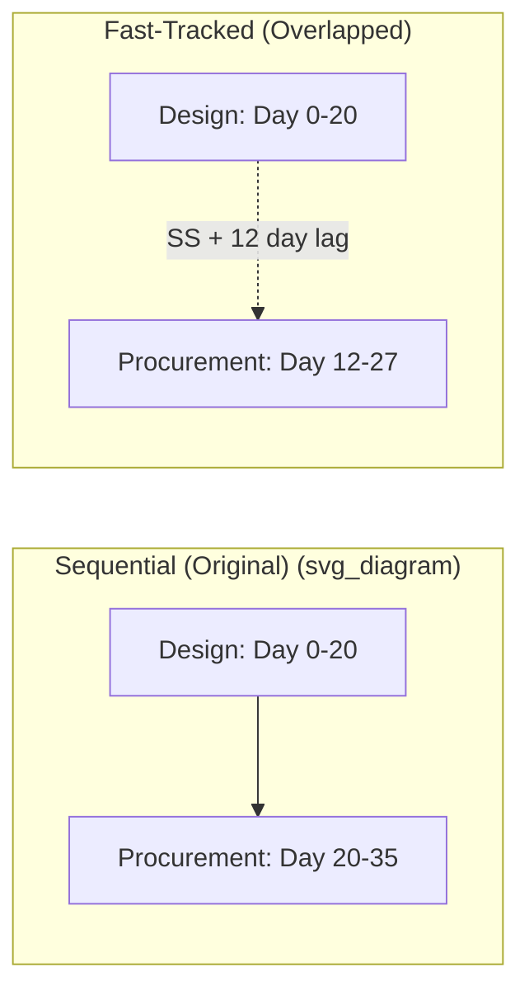

## Fast-Tracking and Associated Risks

### Definition

Fast-tracking is a schedule compression technique that shortens project duration by performing activities that would normally be sequential in parallel, or with partial overlap, rather than adding resources (as in crashing). It restructures network logic — typically converting a Finish-to-Start (FS) dependency into a Start-to-Start (SS) relationship with an appropriate lag — instead of increasing resourcing on unchanged logic.

**Key Points**

- Compresses duration primarily through logic revision, not additional cost/resources — making it attractive when budget is constrained.
- Only effective when applied to critical-path activities; overlapping non-critical activities does not shorten overall project duration.
- Trades schedule risk for time savings: overlap introduces the possibility of rework if the leading activity's output changes after the following activity has already started based on incomplete information.

### Mechanism: Logic Conversion

**Key Points**

- Standard sequential logic: Activity B starts only after Activity A finishes (Finish-to-Start, zero lag).
- Fast-tracked logic: Activity B starts before Activity A finishes, based on partial completion or preliminary information from A (Start-to-Start with a lag, or Finish-to-Start with negative lag/lead).

$$ES_B = ES_A + \text{Lag}$$

where a negative lag (a "lead") on an FS relationship, or a smaller-than-full-duration lag on an SS relationship, produces the overlap.

**Example**

If Activity A (Design, 20 days) and Activity B (Procurement, 15 days) are normally sequential (B starts on day 20, finishing on day 35), fast-tracking might allow B to start once 60% of design is complete (day 12) using an SS relationship with a 12-day lag — compressing the combined duration from 35 days to 27 days ($12 + 15$), a savings of 8 days, assuming the first 60% of design is sufficiently stable to begin procurement without rework risk.

### Fast-Tracking Diagram

### Where Fast-Tracking Is Applied

**Key Points**

- Design-to-construction overlap (beginning construction of early-released design packages before full design completion).
- Procurement overlap with engineering (ordering long-lead items based on preliminary specifications before final design freeze).
- Testing overlap with development (beginning integration testing on completed modules while remaining modules are still in development).
- Any FS relationship where the successor activity does not strictly require 100% of the predecessor's output to begin meaningful work.

### Associated Risks

**Key Points**

- **Rework risk**: If the leading activity's output changes after the following activity has started (e.g., a late-stage design change after procurement has already ordered based on preliminary specs), the overlapping activity may require partial or full rework — potentially erasing the time saved or worsening the schedule beyond the original sequential plan.
- **Increased coordination burden**: Overlapping activities require tighter communication and more frequent interface management between teams working concurrently on interdependent scopes.
- **Quality risk**: Working from incomplete or preliminary information increases the likelihood of errors, omissions, or interface mismatches that would not occur under a fully sequential approach.
- **Resource contention**: Teams that would normally work sequentially (and could share personnel) may now require concurrent, separate resourcing, increasing peak resource demand.
- **Reduced schedule visibility**: Overlap can obscure the true state of predecessor completion, since the successor is proceeding on partial/assumed information rather than confirmed final output.
- **Compounding risk with multiple overlaps**: Fast-tracking several sequential pairs simultaneously multiplies the interface and rework risk exposure across the network, rather than isolating it to a single relationship.

### Risk-Reward Tradeoff by Overlap Depth

| Overlap Percentage | Time Savings | Rework Risk | Typical Application |
| --- | --- | --- | --- |
| Light (10-20% of predecessor) | Modest | Low | Early, stable portions of predecessor scope only |
| Moderate (30-50%) | Significant | Moderate | Common in design-construction overlap on time-critical projects |
| Aggressive (>50%) | Maximum | High | Reserved for schedule-critical situations where cost of delay clearly outweighs rework risk |

[Inference] The specific risk-to-reward ratio at each overlap depth is activity- and industry-dependent (e.g., software integration testing tolerates deeper overlap than structural design-to-construction sequencing), so the percentages above are illustrative categories rather than fixed thresholds applicable to every project type.

### Managing Fast-Tracking Risk

**Key Points**

- **Overlap only stable scope**: Begin the successor activity only on the portion of the predecessor's output that is unlikely to change (e.g., foundation design typically stabilizes earlier and more reliably than interior finishes design).
- **Formal interface management**: Establish explicit checkpoints, change-control triggers, and communication protocols between the overlapping teams.
- **Contingency for rework**: Budget schedule and cost reserves explicitly for the possibility that overlap-driven rework occurs, rather than assuming the compressed duration as a guaranteed outcome.
- **Staged/rolling wave overlap**: Release predecessor output in controlled increments (e.g., issued-for-construction drawings by discipline or area) rather than a single ambiguous "60% complete" milestone, giving the successor clearer, verifiable triggers.
- **Reversion planning**: Maintain a documented fallback sequential plan in case overlap-driven rework materializes and the fast-tracked approach must be partially unwound.

### Fast-Tracking vs. Crashing

| Aspect | Fast-Tracking | Crashing |
| --- | --- | --- |
| Mechanism | Overlap sequential activities (logic change) | Add resources to shorten duration (unchanged logic) |
| Direct Cost Impact | Typically low/minimal | Typically increases direct cost (cost slope) |
| Primary Risk | Rework from incomplete predecessor information | Diminishing returns, resource saturation, coordination cost |
| Best Suited When | Budget-constrained, logic has genuine overlap potential | Budget available, activities have real crash capacity |
| Combinable | Often used together with crashing for maximum compression | Often used together with fast-tracking |

**Key Points**

- The two techniques are frequently applied in combination: fast-track the logic first (lower cost), then crash remaining critical-path activities if further compression is still required.
- Combining both techniques compounds risk exposure (rework risk from overlap plus resource-saturation risk from crashing) and requires more intensive schedule and risk monitoring than applying either alone.

### Suitability Assessment Before Fast-Tracking

**Key Points**

- Evaluate whether the predecessor activity produces genuinely separable, sequenceable outputs (some activities are logically indivisible and cannot be meaningfully overlapped regardless of schedule pressure).
- Assess the volatility/maturity of the predecessor's early output — high-change-probability early stages are poor overlap candidates.
- Consider contractual and regulatory constraints — some approval or permitting sequences cannot be legally or contractually overlapped regardless of technical feasibility.
- Weigh the cost of potential rework against the value of time saved; fast-tracking is generally justified only when the cost of delay clearly exceeds the expected cost of rework risk. [Inference] This threshold judgment depends on project-specific delay costs (e.g., liquidated damages, market timing, financing costs) and is not derivable from the schedule logic alone.

### Common Pitfalls

**Key Points**

- **Overlapping unstable scope**: Beginning successor work based on predecessor output likely to change invites the highest rework risk.
- **No interface management plan**: Overlapping activities without formal coordination protocols increases miscommunication-driven errors.
- **Applying fast-tracking to non-critical activities**: Provides no schedule benefit since non-critical path compression does not shorten the overall project.
- **Ignoring compounding risk**: Fast-tracking multiple relationships simultaneously without reassessing cumulative risk exposure across the network.
- **Treating time savings as guaranteed**: Failing to hold contingency against the realistic possibility that overlap-driven rework partially or fully offsets the intended schedule gain.

### Related Topics

- Crashing techniques and cost-time tradeoffs
- Total float and free float calculation
- Network logic relationships (FS, SS, FF, SF) and lag/lead application
- Rolling wave planning and progressive elaboration
- Risk register development and discrete risk event modeling
- Resource leveling and resource-constrained scheduling