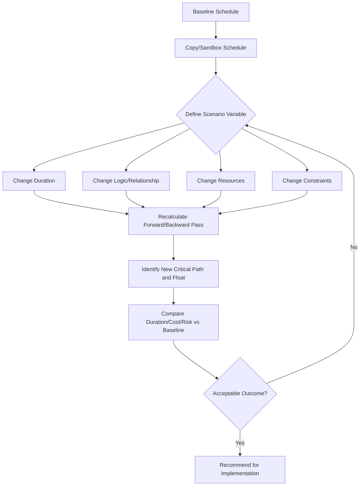

## What-If Scenario Analysis

### Definition and Purpose

**What-if scenario analysis** is a schedule optimization technique in which a project schedule's logic, durations, resources, or constraints are deliberately modified in a copied or sandboxed version of the schedule to observe the resulting impact on project duration, cost, critical path composition, and resource utilization — without altering the approved baseline. It answers questions of the form: "What happens to the finish date if X occurs or is changed?"

Unlike deterministic forward/backward-pass CPM calculations (which compute a single set of dates from fixed inputs), what-if analysis is an *exploratory, comparative* technique: the scheduler runs multiple alternative versions of the network and compares outcomes side by side to support decision-making under schedule compression, risk mitigation, or optimization efforts.

### Position Within Schedule Compression and Optimization

What-if analysis is the evaluative layer that sits above the mechanical compression techniques (crashing and fast-tracking). Rather than compressing the schedule and hoping for the best, practitioners use what-if analysis to:

- Test multiple crashing or fast-tracking combinations before committing resources
- Evaluate the schedule impact of external risks (permit delays, weather windows, supplier lead-time slips)
- Compare resource-leveling strategies against their effect on the critical path
- Validate contingency plans before a risk event actually occurs
- Support trade-off (time-cost-scope-risk) decisions requested by stakeholders

### Core Mechanics

**Key Points**

- **Baseline preservation**: The original approved schedule (the baseline) is never directly edited; what-if analysis is always performed on a copy, snapshot, or separate schedule file/version.
- **Single-variable vs. multi-variable scenarios**: A simple what-if changes one variable (e.g., "what if Activity 12 takes 5 extra days?"); a compound scenario changes several simultaneously (e.g., "what if the permit is delayed 10 days AND the crew size is reduced by 2?").
- **Recalculation via forward/backward pass**: Once variables are changed, the CPM engine recomputes Early Start (ES), Early Finish (EF), Late Start (LS), Late Finish (LF), and Total Float (TF) for the modified network, exactly as in standard CPM, using the same governing equations:

$$ES_{successor} = \max(EF_{predecessors})$$

$$LF_{predecessor} = \min(LS_{successors})$$

$$TF = LS - ES = LF - EF$$

- **Comparison against baseline**: The modified schedule's project finish date, critical path, and total float profile are compared against the original to quantify the delta (schedule variance in days, cost variance if resource costs are attached, and any shift in which path is critical).

### Common What-If Scenario Categories

**Key Points**

- **Delay scenarios**: Simulating the impact of a specific activity slipping (e.g., "if procurement of Item X slips 15 days, does the finish date move?"). Useful for testing whether float absorbs the delay or whether it propagates to the finish milestone.
- **Acceleration/compression scenarios**: Testing crashing (adding resources to shorten duration) or fast-tracking (overlapping sequential activities) on specific activities or paths to see the marginal reduction in project duration.
- **Resource scenarios**: Modeling the effect of resource unavailability, reassignment, or additional crews/shifts, particularly where resource leveling could shift which path becomes critical.
- **Logic change scenarios**: Testing alternative sequencing — e.g., converting a Finish-to-Start relationship to Start-to-Start with lag, or removing a constraint — to see if the network can be restructured for a shorter duration without added cost.
- **External event scenarios**: Weather windows, regulatory/permit delays, strikes, supply chain disruptions, or force majeure events, often informed by historical data or risk register entries.
- **Constraint relaxation scenarios**: Testing what happens if an imposed date constraint (e.g., "Must Finish By") is relaxed or tightened, revealing how much of the project's total float is being artificially consumed by the constraint itself.

### Worked Example

Baseline schedule: Project duration = 120 days, critical path = A-B-C-D (float = 0), secondary path E-F-G has 8 days of float.

**Scenario 1 — Delay of Activity F by 10 days:**

Since path E-F-G originally has only 8 days of float, a 10-day delay to F exceeds available float by 2 days. Recalculating the forward pass shows the project finish date extends by 2 days, and path E-F-G becomes the new critical path (float = 0), while the former critical path A-B-C-D now carries +2 days of float relative to the new project duration.

**Scenario 2 — Crash Activity B by 5 days (adds 2 additional resources at cost $12,000):**

Path A-B-C-D shortens to 115 days. Because path E-F-G's duration (112 days) is now within 3 days of the new critical path duration, E-F-G becomes near-critical. The what-if comparison table below summarizes both scenarios against baseline:

| Scenario | Project Duration | Critical Path | Δ vs. Baseline | Added Cost |
| --- | --- | --- | --- | --- |
| Baseline | 120 days | A-B-C-D | — | — |
| 1: Delay F +10d | 122 days | E-F-G | +2 days | $0 |
| 2: Crash B -5d | 115 days | A-B-C-D | -5 days | $12,000 |

This comparison lets decision-makers see, in a single table, the cost-benefit trade-off of intervention (Scenario 2) versus the risk exposure of inaction (Scenario 1).

### Techniques and Tools for Performing What-If Analysis

**Key Points**

- **Manual/spreadsheet reanalysis**: For small networks, recomputing the forward/backward pass by hand or in a spreadsheet after altering inputs.
- **Scheduling software "what-if mode"**: Tools such as Primavera P6 (via schedule copies or "what-if" project types) and Microsoft Project (via saved baselines and inactive tasks) support running parallel scenario versions without disturbing the live schedule.
- **Monte Carlo simulation as extended what-if analysis**: Rather than testing single discrete scenarios, Monte Carlo simulation (using tools that layer onto P6 or MS Project, such as those implementing PERT/triangular distributions) runs thousands of randomized what-if iterations simultaneously, producing a probability distribution of finish dates rather than a single deterministic answer per scenario. [Inference] This is generally considered a complementary, more statistically rigorous extension of manual what-if analysis rather than a replacement for it, since discrete scenario testing remains useful for communicating specific, named risks to stakeholders.
- **Sensitivity analysis (Tornado diagrams)**: Running a series of single-variable what-if scenarios (varying one activity's duration at a time) and ranking the resulting schedule impact produces a tornado diagram, showing which activities have the greatest schedule sensitivity — informing where schedule risk mitigation effort should concentrate.

### Mermaid Diagram: What-If Analysis Workflow

### SVG Illustration: Scenario Comparison Against Baseline

<svg xmlns="http://www.w3.org/2000/svg" viewBox="0 0 700 300">
<text x="350" y="25" text-anchor="middle" font-size="16" font-weight="bold" fill="#222">What-If Scenario Comparison (svg_diagram)</text>
<line x1="90" y1="250" x2="650" y2="250" stroke="#333" stroke-width="2" />
<line x1="90" y1="50" x2="90" y2="250" stroke="#333" stroke-width="2" />
<text x="20" y="255" font-size="12" fill="#333">Days</text>
<line x1="90" y1="130" x2="650" y2="130" stroke="#999" stroke-dasharray="4,4" />
<text x="560" y="125" font-size="11" fill="#666">Baseline: 120d</text>
<rect x="150" y="130" width="50" height="120" fill="#3498db" />
<text x="175" y="270" text-anchor="middle" font-size="12">Baseline</text>
<text x="175" y="125" text-anchor="middle" font-size="11">120d</text>
<rect x="280" y="110" width="50" height="140" fill="#e74c3c" />
<text x="305" y="270" text-anchor="middle" font-size="12">Scenario 1</text>
<text x="305" y="105" text-anchor="middle" font-size="11">122d (+2)</text>
<rect x="410" y="165" width="50" height="85" fill="#27ae60" />
<text x="435" y="270" text-anchor="middle" font-size="12">Scenario 2</text>
<text x="435" y="160" text-anchor="middle" font-size="11">115d (-5)</text>
<rect x="540" y="60" width="14" height="14" fill="#3498db" />
<text x="560" y="72" font-size="11">Baseline</text>
<rect x="540" y="82" width="14" height="14" fill="#e74c3c" />
<text x="560" y="94" font-size="11">Delay scenario</text>
<rect x="540" y="104" width="14" height="14" fill="#27ae60" />
<text x="560" y="116" font-size="11">Compression scenario</text>
</svg>

### Integration with Earned Value Management (EVM)

What-if analysis is a *forward-looking* schedule technique, while EVM measures *backward-looking* performance-to-date via metrics such as Schedule Performance Index (SPI) and Cost Performance Index (CPI). The two are linked when a current unfavorable SPI trend is used as the trigger for running what-if recovery scenarios:

$$SPI = \frac{EV}{PV}$$

If $SPI < 1$ (behind schedule), the what-if analysis models recovery scenarios — e.g., crashing the remaining critical path activities — and each candidate scenario's added cost can be evaluated against the **To-Complete Performance Index (TCPI)**:

$$TCPI = \frac{BAC - EV}{BAC - AC}$$

comparing whether the recovery scenario's implied cost efficiency is achievable given the project's remaining budget (Budget at Completion, BAC) and cumulative actual cost (AC). A what-if scenario that would require a CPI beyond what the project has historically achieved signals the recovery plan may not be realistic without a budget or scope change.

### Common Pitfalls

- **Editing the live/baseline schedule directly**: Running what-if changes without first copying the schedule risks permanently corrupting the approved baseline and losing the ability to measure variance.
- **Testing only the current critical path**: Ignoring near-critical paths when modeling delay scenarios can miss cases where a secondary path becomes critical under the tested condition (see Near-Critical and Multiple Critical Paths).
- **Single-scenario tunnel vision**: Relying on one "most likely" what-if scenario instead of a range (best case, most likely, worst case) understates the true schedule risk exposure.
- **Ignoring resource feasibility**: A what-if scenario that shortens the logical critical path may be practically infeasible if it assumes resource availability that does not exist (e.g., assuming an unlimited crew size for crashing).
- **Failing to document scenario assumptions**: Without a clear record of what was changed and why, stakeholders may confuse a what-if projection with a committed forecast.

**Related Topics**

- Schedule Compression: Crashing and Fast-Tracking
- Monte Carlo Simulation and Probabilistic Schedule Risk Analysis
- Near-Critical and Multiple Critical Paths
- Resource Leveling and Resource-Constrained Scheduling
- To-Complete Performance Index (TCPI) and Recovery Planning
- Sensitivity Analysis and Tornado Diagrams
- Schedule Baseline Management and Change Control